# DAY 1: Module 1 - PV_D1SK1: Introduction to SkyWater PDKs and Open-Source EDA Tools

## Overview
Day 1 covers **Module 1 (Part 1: PV_D1SK1 - Lectures L1 to L6)**. This comprehensive module introduces the SkyWater SKY130 open-source Process Design Kit (PDK), open-source EDA tool integration, layer stack architecture, device primitives, library structures, naming conventions, and open-source manual IC design flows.

---

## Table of Contents
1. [PV_D1SK1_L1: Introduction to Skywater PDK](#pv_d1sk1_l1-introduction-to-skywater-pdk)
2. [PV_D1SK1_L2: Open-Source EDA Tools](#pv_d1sk1_l2-open-source-eda-tools)
3. [PV_D1SK1_L3: Understanding Skywater PDK - Layers](#pv_d1sk1_l3-understanding-skywater-pdk---layers)
4. [PV_D1SK1_L4: Understanding Skywater PDK - Devices](#pv_d1sk1_l4-understanding-skywater-pdk---devices)
5. [PV_D1SK1_L5: Understanding Skywater PDK Libraries](#pv_d1sk1_l5-understanding-skywater-pdk-libraries)
6. [PV_D1SK1_L6: Open-Source Tools and Flows](#pv_d1sk1_l6-open-source-tools-and-flows)

---

## PV_D1SK1_L1: Introduction to Skywater PDK

The SkyWater SKY130 is an open-source 130nm CMOS technology process created through a collaboration between SkyWater Technology and Google.

* **Technology Node:** 130 nm
* **Feature Size:** 130 nm transistor length (with a physical minimum device dimension caveat of 150 nm in the SKY130 process).
* **Open-Source PDK Goal:** Enables complete open silicon design by providing open access to design rules, SPICE models, cell libraries, and EDA tool setups.

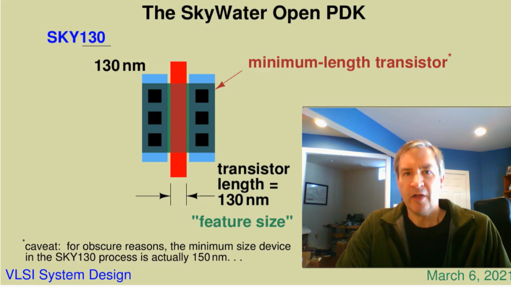

---

## PV_D1SK1_L2: Open-Source EDA Tools

The open-source IC design environment relies on `open_pdks` to convert and format foundry PDK files for compatibility with open-source EDA tools.

* **open_pdks:** Manages Makefile recipes to download, compile, and configure PDK files for specific open EDA tools.
* **Integrated Open-Source Tools:**
  * **Magic:** VLSI Layout Tool & DRC Checker
  * **Xschem:** Schematic Capture Tool
  * **Ngspice:** SPICE Circuit Simulator
  * **Netgen:** LVS (Layout vs. Schematic) Comparison Tool
  * **OpenLane:** Automated RTL-to-GDSII Digital ASIC Flow

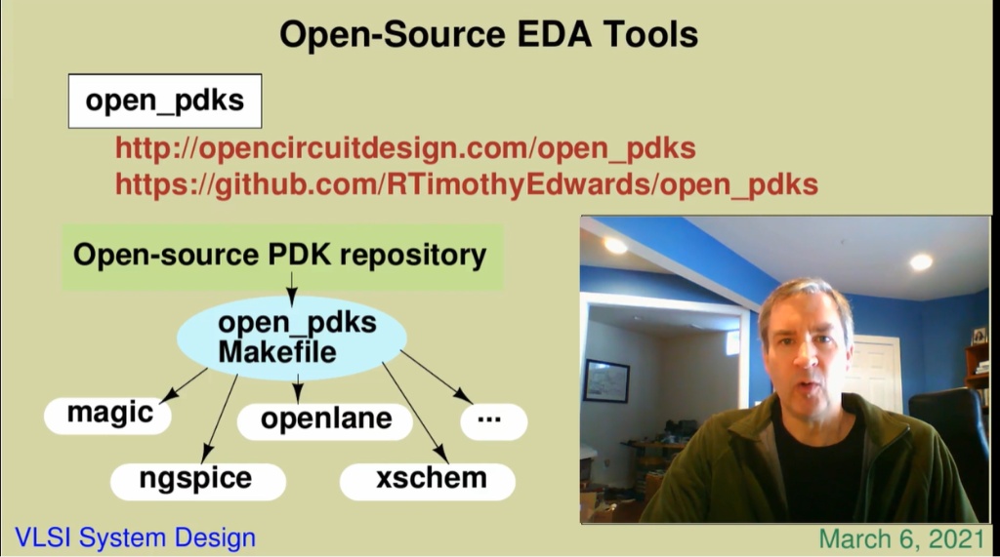

### Magic VLSI Layout Interface
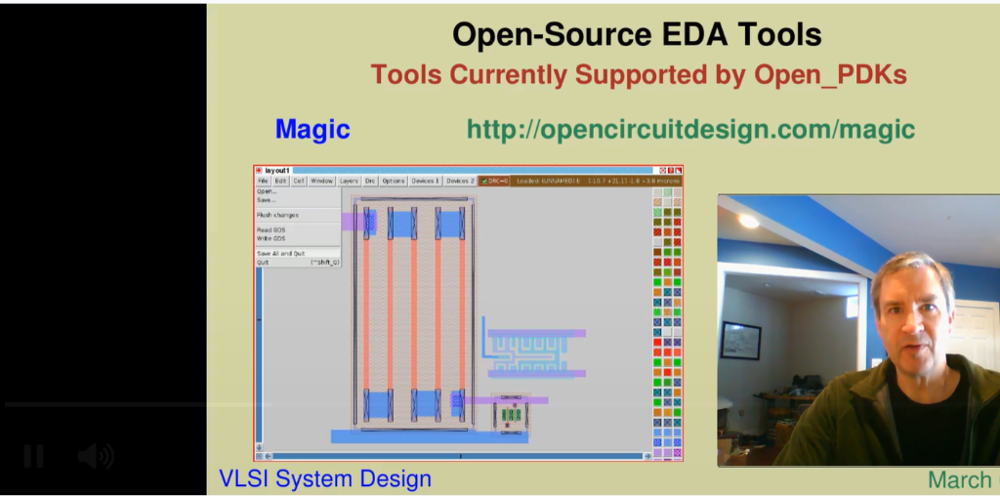

---

## PV_D1SK1_L3: Understanding Skywater PDK - Layers

### Front-End Layers Cross-Section
The front-end process layers define substrate wells, diffusion regions, contacts, and local interconnects:
* **Substrate & Wells:** `nwell` and `pwell`
* **Diffusion & Taps:** `p-diffusion`, `n-diffusion`, `p-tap`, `n-tap`
* **Contacts & Gates:** `licon` contacts, `polysilicon` gate
* **Local Interconnect (LI / `li`):** Titanium Nitride ($TiN$) layer used for local routing directly above `licon` contacts.

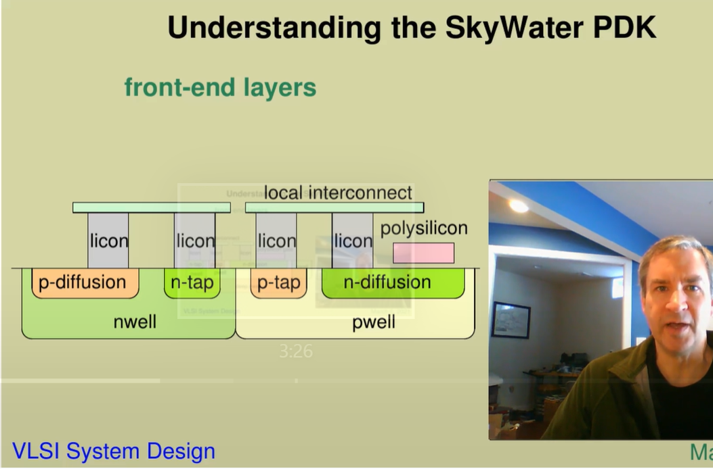

### Metal Stack Architecture (Sky130A)
The SkyWater SKY130 metal stack provides:
* **`li` (Local Interconnect):** Low-level interconnect layer above diffusion/poly.
* **Metal Layers:** `metal1` through `metal5` interconnected via `mcon` (contact to LI) and `via1` to `via4`.

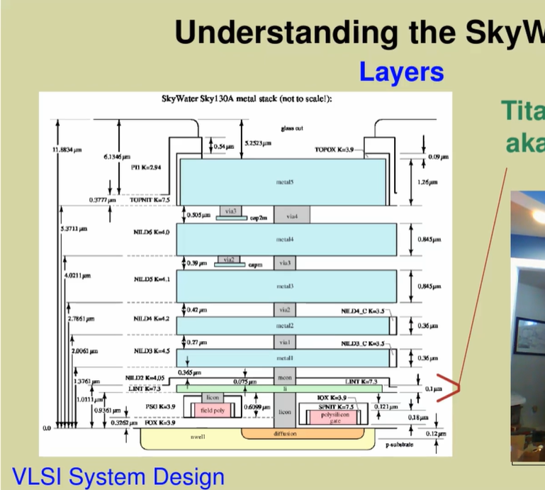

### Standard Cell Layout & Local Interconnect (`sky130_fd_sc_hd__nand2_2`)
Local Interconnect (`li` shown in blue) routes internal connections within standard cells and is strapped with `metal1` (purple) for power/ground rails (`VPWR` / `VGND`) and output pins (`Y`).

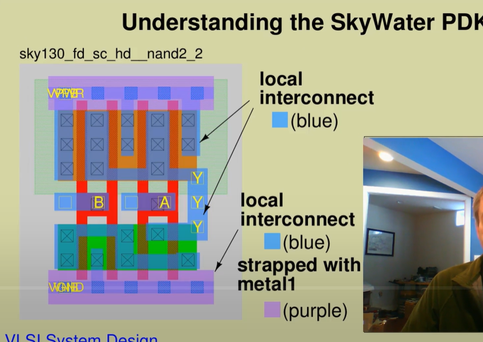

---

## PV_D1SK1_L4: Understanding Skywater PDK - Devices

The SkyWater SKY130 PDK includes various primitive device models:
* **MOSFET Devices:**
  * `nfet_01v8` & `pfet_01v8`: Core 1.8V transistors.
  * `nfet_03v3` & `pfet_05v0`: High-voltage I/O transistors (3.3V / 5.0V).
  * Threshold Voltage options: Standard $V_t$, Low $V_t$ (`lvt`), High $V_t$ (`hvt`).
* **Passive Devices:**
  * Polysilicon resistors (`res_high_po`) and precision diff resistors.
  * Metal-Insulator-Metal (MIM) capacitors (`cap2m`).
* **Diodes & ESD Devices:** Thermal and protection diodes.

---

## PV_D1SK1_L5: Understanding Skywater PDK Libraries

### Digital Standard Cell Libraries
The PDK contains multiple standard cell library variants:
* **`sky130_fd_sc_hd`:** High Density standard cell library.
* **`sky130_fd_sc_hs`:** High Speed library.
* **`sky130_fd_sc_ms`:** Medium Speed library.
* **`sky130_fd_sc_ls`:** Low Speed library.
* **`sky130_fd_sc_hdll`:** High Density Low Leakage library.

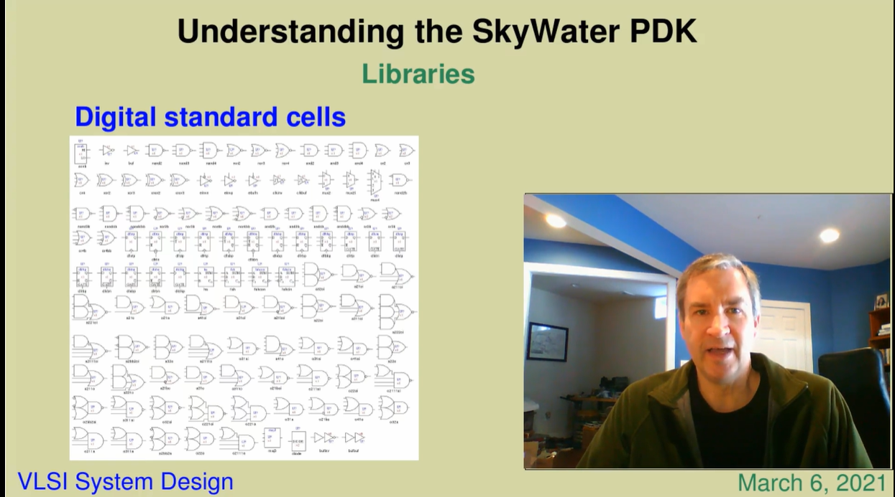

### Standard Cell Naming Conventions
Standard cell naming follows a structured format:
`sky130_<vendor>_<library-type>[_<name>]`
* **Library:** `sky130_fd_sc_hd` (SkyWater Foundry, Standard Cell, High Density)
* **Cell Name Example:** `sky130_fd_sc_hd__nor2_2` (2-input NOR gate, drive strength 2)

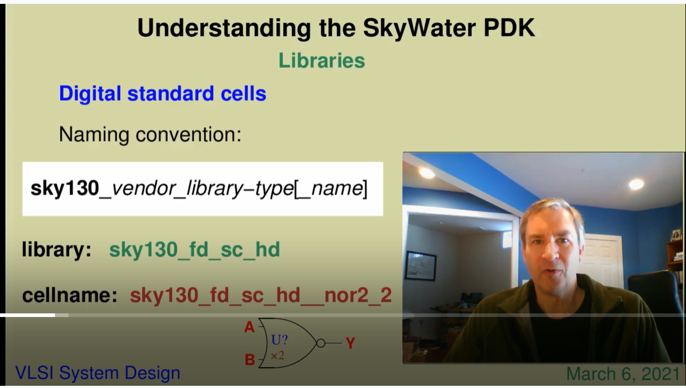

### I/O Cells (`sky130_fd_io`)
Provides I/O pad cells, ESD protection structures, and GPIO control logic (`GPIO V2 Block Diagram`).

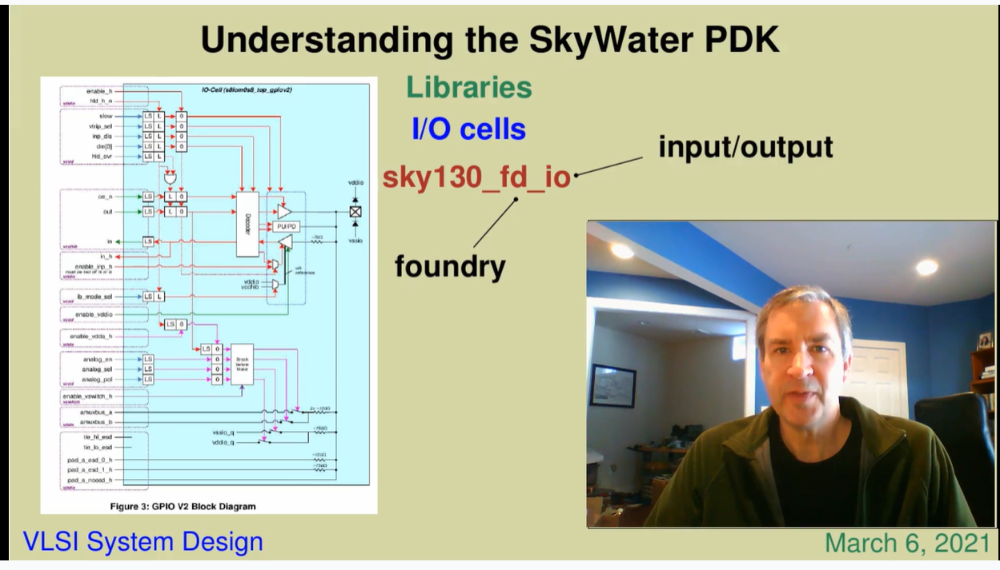

---

## PV_D1SK1_L6: Open-Source Tools and Flows

A manual IC design flow integrates schematic capture in Xschem with full layout and verification in Magic:

### 1. Schematic Capture (Xschem)
Schematic design creation, netlist generation, and symbol creation in Xschem.

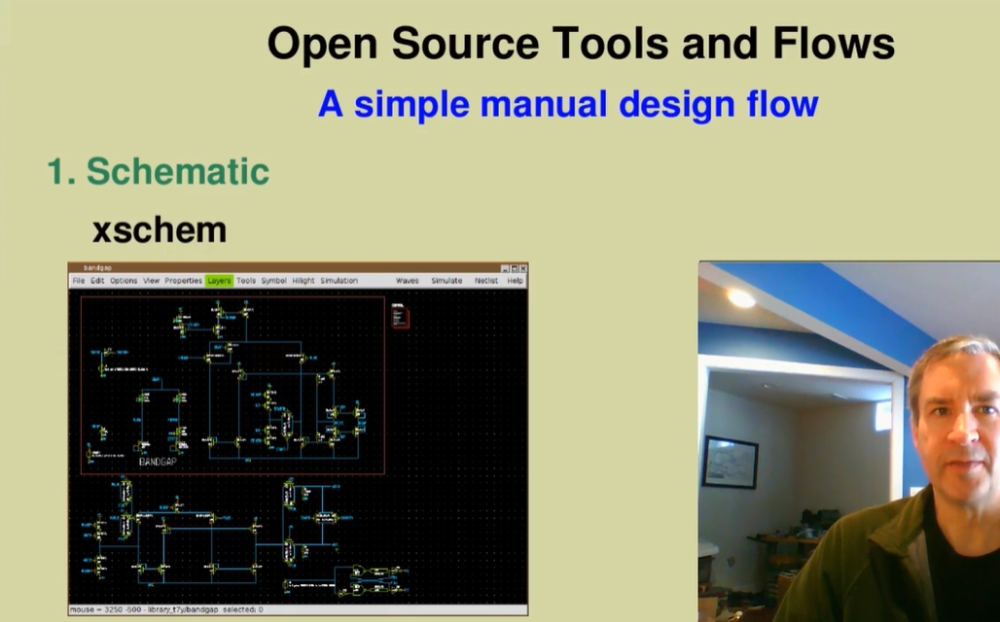

### 2. Layout Creation (Magic)
Manual layout placement of primitive devices (resistors, transistors, capacitors) and routing in Magic.

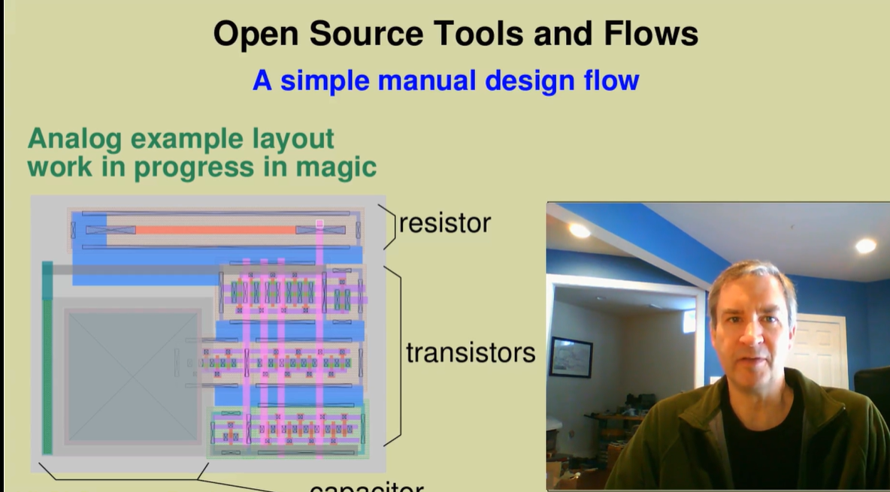
