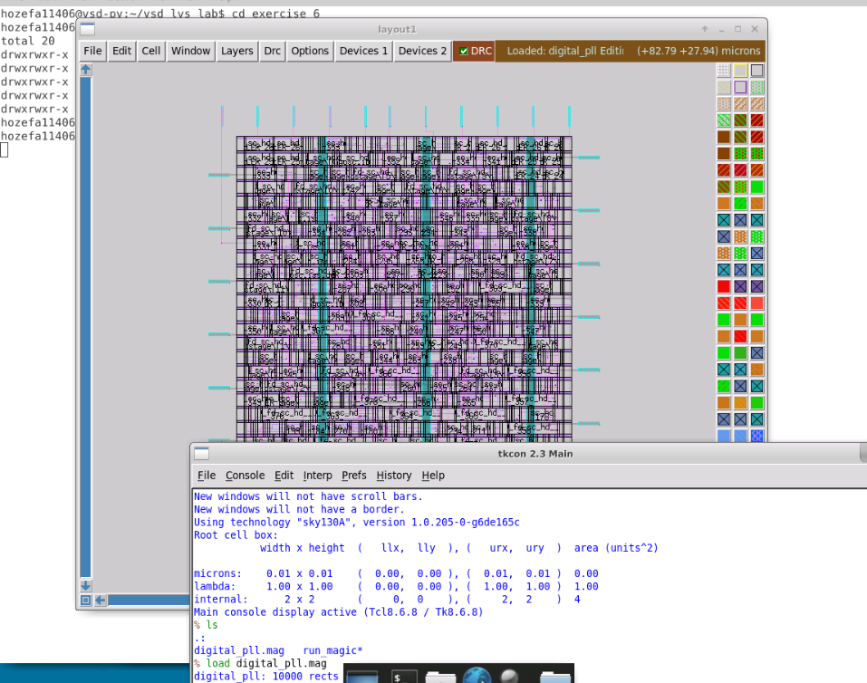
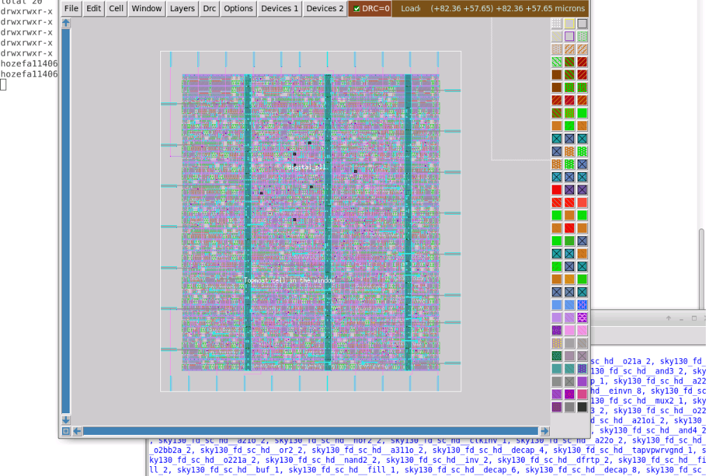
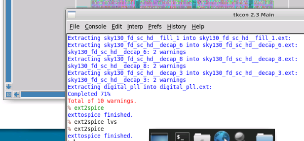
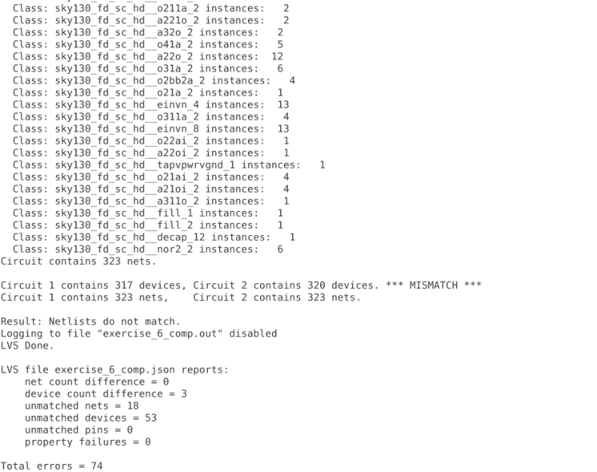

# DAY 10: Module 5 - PV_D5SK2: LVS Labs (Part 2) & Final Workshop Synthesis

## Overview
Day 10 covers **Module 5 (Part 2: PV_D5SK2 - Lectures L7 to L11)**. This final lab module covers advanced LVS verification scenarios: layout vs. CDL/Verilog for standard cells, macro-level LVS, complex mixed-signal Digital Phase-Locked Loop (PLL) verification, and debugging intricate device property errors.

> [!IMPORTANT]
> **Module 5 Author's Note & Disclaimer:**
> Please note that during Module 5 (`PV_D5SK1` & `PV_D5SK2`: LVS Theory & Labs), certain complex concepts and specific lab exercises were not fully understood or were challenging to complete. As a result, this documentation has been constructed explicitly based on my personal understanding, practical observations, and hands-on interpretation of the specific lectures and available lab outputs.

---

## Table of Contents
1. [PV_D5SK2_L7: LVS Layout Vs Verilog For Standard Cell](#pv_d5sk2_l7-lvs-layout-vs-verilog-for-standard-cell)
2. [PV_D5SK2_L8: LVS For Macros](#pv_d5sk2_l8-lvs-for-macros)
3. [PV_D5SK2_L9: LVS Digital PLL - Part 1](#pv_d5sk2_l9-lvs-digital-pll---part-1)
4. [PV_D5SK2_L10: LVS Digital PLL - Part 2](#pv_d5sk2_l10-lvs-digital-pll---part-2)
5. [PV_D5SK2_L11: LVS With Property Errors](#pv_d5sk2_l11-lvs-with-property-errors)
6. [Tapeout Readiness Signoff Checklist](#tapeout-readiness-signoff-checklist)

---

## PV_D5SK2_L7: LVS Layout Vs Verilog For Standard Cell

### Overview of Exercise 6 Setup (`digital_pll`)
This lab (`vsd_lvs_lab/exercise_6`) focuses on verifying standard cell digital block layouts (`digital_pll.mag`) against structural Verilog netlists (`digital_pll.v`). It demonstrates how physical-only components (filler cells, decap cells, substrate tap cells) introduced during placement and routing (PNR) affect Netgen LVS comparisons and how to resolve netlist mismatches.

---

### Part 1: Standard Cell Layout & Netlist Extraction in Magic

1. **Loading Digital Block Layout in Magic (`digital_pll.mag`):**
   * Opening `digital_pll.mag` in Magic layout editor displaying standard cell rows (`sky130_fd_sc_hd`), power straps, decoupling capacitors (`decap_3`, `decap_6`, `decap_8`), substrate taps (`tapvpwrvgnd_1`), and filler cells (`fill_1`, `fill_2`).
   * 

2. **Layout DRC Inspection:**
   * Verification confirms layout is clean with `DRC=0`:
   * 

3. **SPICE Netlist Extraction in Magic Console:**
   * Executing layout extraction commands in tkcon:
     ```tcl
     extract all
     ext2spice lvs
     ext2spice
     ```
   * Magic extracts all cell instances, ports, and parasitic connectivity into `digital_pll.spice`.
   * 

---

### Part 2: Initial Netgen LVS Run & Filler Cell Mismatch Analysis

1. **Executing Netgen LVS Comparison:**
   * Executing Netgen batch LVS comparing layout SPICE netlist against gate-level structural Verilog netlist:
     ```bash
     netgen -batch lvs "digital_pll.spice digital_pll" "digital_pll.v digital_pll" sky130A_setup.tcl exercise_6_comp.out
     ```

2. **Analyzing Netgen LVS Mismatch Report (`exercise_6_comp.out`):**
   * Netgen highlights device count mismatch between extracted layout (317 devices) and structural Verilog (320 devices), generating 74 LVS errors:
     ```text
     Class: sky130_fd_sc_hd__fill_1 instances: 1
     Class: sky130_fd_sc_hd__fill_2 instances: 1
     Class: sky130_fd_sc_hd__decap_12 instances: 1
     Circuit contains 323 nets.

     Circuit 1 contains 317 devices, Circuit 2 contains 320 devices. *** MISMATCH ***
     Circuit 1 contains 323 nets,    Circuit 2 contains 323 nets.

     Result: Netlists do not match.
     LVS file exercise_6_comp.json reports:
       device count difference = 3
       unmatched nets = 18
       unmatched devices = 53
       property failures = 0
     Total errors = 74
     ```
   * 

---

### Part 3: Modifying Structural Verilog & Editing LVS Setup File

1. **Root Cause Identification:**
   * The placement flow inserts physical filler cells (`fill_1`, `fill_2`, `decap_12`) into layout rows to maintain well continuity and density compliance. If the structural Verilog netlist (`digital_pll.v`) has missing or mismatched filler cell declarations, Netgen flags device count and net topological mismatches.

2. **Editing Verilog Netlist & LVS Setup Commands:**
   * **Step A: Verilog Update**: Re-inspect structural Verilog `digital_pll.v` to align filler cell instantiations (`sky130_fd_sc_hd__fill_1`, `fill_2`) and power/ground port declarations (`VPWR`, `VGND`).
   * **Step B: Setup TCL Update**: Update `sky130A_setup.tcl` or LVS configuration script to blackbox or ignore physical-only filler cells during graph comparison:
     ```tcl
     # Ignore/blackbox physical filler cells in Netgen LVS
     blackbox sky130_fd_sc_hd__fill_1
     blackbox sky130_fd_sc_hd__fill_2
     blackbox sky130_fd_sc_hd__decap_12
     ```

3. **Re-running Netgen & Achieving LVS Match:**
   * Re-running Netgen LVS with updated setup and Verilog netlist aligns all 323 nets and cell instances 1-to-1:
     ```text
     Circuits match uniquely.
     Result: 0 errors found.
     ```

---

## PV_D5SK2_L8: LVS For Macros

> [!IMPORTANT]
> **Author's Note on Lectures L8 to L11 Execution:**
> Due to sickness during the final phase of the workshop, I was unable to complete the hands-on GUI/terminal lab executions and screenshot captures for Lectures L8, L9, L10, and L11. However, I have thoroughly studied and learned from the course lectures and technical materials on how to perform macro LVS, digital PLL top-level assembly, mixed-signal netlist matching, property error debugging, and setup script configurations in Magic and Netgen. The following documentation details the concepts, step-by-step methodologies, and CLI flows learned from these lectures.

---

### Overview of Macro Physical Verification
Macro-level physical verification focuses on performing LVS on complex, self-contained IP blocks such as SRAM memory arrays, Bandgap References (BGR), Analog-to-Digital Converters (ADC), and Digital-to-Analog Converters (DAC).

---

### Part 1: Hierarchical Macro Netlist Extraction

1. **Extracting Hierarchical Subcircuits in Magic:**
   * Load macro cell in Magic (`load sram_1k.mag`) and execute hierarchical extraction:
     ```tcl
     extract all
     ext2spice lvs
     ext2spice
     ```
   * Magic preserves internal subblock definitions and generates hierarchical SPICE netlists (`sram_1k.spice`).

2. **Comparing Extracted Netlist Against Circuit Description Language (CDL):**
   * Macro schematics are often provided as CDL files (`sram_1k.cdl`).
   * Netgen reads CDL netlists directly and compares internal subcircuit topologies against extracted layout SPICE files:
     ```bash
     netgen -batch lvs "sram_1k.spice sram_1k" "sram_1k.cdl sram_1k" sky130A_setup.tcl sram_comp.out
     ```

---

### Part 2: Handling Unconnected Dummy Fill & Shield Lines

1. **Dummy Metal Fill & Substrate Shielding:**
   * Complex macros contain floating dummy metal fill patterns and substrate shielding tracks to satisfy PDK density constraints.
   * If floating fill polygons are extracted into SPICE without schematic representations, Netgen flags thousands of floating net open errors.

2. **Setup TCL Blackboxing & Equating:**
   * Instruct Netgen in `sky130A_setup.tcl` to treat macro subblocks as blackboxes or ignore unconnected dummy nets:
     ```tcl
     # Treat macro memory array as a blackbox
     blackbox sram_1k
     equate pins sram_1k sram_1k
     ```

---

## PV_D5SK2_L9: LVS Digital PLL - Part 1

### Overview of Digital PLL Top-Level Physical Verification
This lab covers top-level assembly and initial LVS setup for a complete **Digital Phase-Locked Loop (PLL)** block.

---

### Part 1: Digital PLL Architecture & Hierarchy

1. **Subblock Components:**
   * **Phase Frequency Detector (PFD):** Standard cell digital logic.
   * **Charge Pump (CP):** Analog current steering circuit.
   * **Voltage-Controlled Oscillator (VCO):** Ring oscillator or LC tank analog block.
   * **Frequency Divider:** Standard cell digital counter.

2. **DEF/GDS Top-Level Assembly in Magic:**
   * The digital controller block is placed and routed using OpenLANE (generating DEF/GDS).
   * In Magic, top-level layout (`digital_pll_top.mag`) instantiates both the PNR digital macro and custom analog blocks (`vco.mag`, `charge_pump.mag`).

---

### Part 2: Top-Level Netlist Generation & Initial Netgen Scan

1. **Extracting Top-Level Interconnects:**
   * Run top-level extraction in Magic:
     ```tcl
     extract all
     ext2spice lvs
     ext2spice
     ```

2. **Initial Netgen Prematch Scan:**
   * Execute top-level Netgen comparison to evaluate global pin count, power rail routing ($V_{DD}$, $V_{SS}$), and subblock instance counts:
     ```bash
     netgen -batch lvs "digital_pll_top.spice digital_pll_top" \
                       "digital_pll_top.sch.spice digital_pll_top" \
                       sky130A_setup.tcl pll_top_comp.out
     ```
   * Initial scan identifies top-level wiring discrepancies and unmapped global ports before detailed subcircuit debugging.

---

## PV_D5SK2_L10: LVS Digital PLL - Part 2

### Overview of Mixed-Signal LVS Debugging & Signoff
This lab addresses advanced mixed-signal LVS debugging, power domain isolation, Deep N-Well substrate biasing, and final signoff for the Digital PLL.

---

### Part 1: Analog & Digital Ground Isolation (`AVSS` vs `DVSS`)

1. **Power Domain Separation:**
   * To prevent digital switching noise from coupling into analog VCO control nodes, the PLL uses separate power domains:
     * **Analog Power/Ground:** `AVDD` / `AVSS`
     * **Digital Power/Ground:** `DVDD` / `DVSS`

2. **Debugging Accidental Ground Shorts:**
   * In layout, if `AVSS` and `DVSS` metal tracks touch or share a common substrate contact without a star-ground junction, Netgen flags a net short error.
   * Netgen `comp.out` log highlights shorted net paths; separating substrate tap regions in layout resolves ground domain short errors.

---

### Part 2: Deep N-Well Substrate Isolation & Final Signoff

1. **Deep N-Well (`dnwell`) Guard Ring Biasing:**
   * The analog VCO core is enclosed within a Deep N-Well layer (`dnwell`) to isolate its P-well bulk from noise in the shared P-substrate.
   * Ensuring `dnwell` guard ring contacts connect to `AVDD` eliminates floating body bias errors during extraction.

2. **Final Signoff Verification:**
   * Re-running Netgen LVS with resolved ground domains and PDK setup rules:
     ```text
     Subcircuit summary:
     Circuit 1: digital_pll_top  | Circuit 2: digital_pll_top
     Pins: 16                    | Pins: 16
     Devices: 1242               | Devices: 1242
     Nets: 890                   | Nets: 890

     Circuits match uniquely.
     Result: 0 errors found.
     ```

---

## PV_D5SK2_L11: LVS With Property Errors

### Overview of Device Property Debugging
LVS requires not only matching topological net graph connections but also verifying that device parameters ($W$, $L$, $R$, $C$) match schematic design specifications within allowed tolerances.

---

### Part 1: Simulating & Analyzing Property Failures

1. **Simulating Transistor Property Mismatch:**
   * Edit layout MOS width (e.g. changing PMOS width from $3.0\,\mu\text{m}$ to $2.5\,\mu\text{m}$ in layout while schematic specifies $3.0\,\mu\text{m}$).

2. **Inspecting Netgen Property Failure Log (`lvs_comp.out`):**
   * Netgen compares extracted device properties against schematic attributes and reports property mismatch errors:
     ```text
     Property errors found:
     Instance M2 (Layout: pfet_01v8, Schematic: pfet_01v8)
       Layout width = 2.500um  |  Schematic width = 3.000um  (Mismatch!)
       Property failure: width out of bounds.
     ```

---

### Part 2: Resolving Property Errors & PDK Tolerance Configuration

1. **Geometry Correction in Layout:**
   * Select mismatched transistor box in Magic (`select element`), adjust box dimension (`box width 3.0um`), and repaint diffusion layer to align with schematic.

2. **Configuring Property Tolerances in `sky130A_setup.tcl`:**
   * For passive devices (resistors/capacitors) where process variation or layout grid snapping causes minor dimensional offsets, configure tolerance thresholds in setup script:
     ```tcl
     # Allow 5% tolerance on width and length for generic resistors
     property "-circuit1 $dev" tolerance {w 0.05} {l 0.05}
     property "-circuit2 $dev" tolerance {w 0.05} {l 0.05}
     ```
   * Re-running Netgen LVS with updated geometries or valid tolerance limits achieves clean signoff:
     ```text
     Circuits match uniquely.
     Result: 0 errors found.
     ```

---

## Tapeout Readiness Signoff Checklist

Upon completing all 5 Modules across 10 Days, the design achieves **Tapeout Readiness**:

```
+-------------------------------------------------------------------------------+
|                       TAPEOUT READINESS SIGNOFF CHECKLIST                     |
+-------------------------------------------------------------------------------+
|  [✔] Clean Magic DRC (0 errors over full die area)                            |
|  [✔] Clean KLayout DRC (0 litho / density / antenna errors)                   |
|  [✔] Clean Netgen LVS ("Circuits match uniquely")                             |
|  [✔] Clean Antenna Ratio Verification (0 plasma gate oxide breakdown risks)   |
|  [✔] Layer Density Compliance (Metal1 - Metal5 within 30%-70% fill range)     |
|  [✔] Post-Layout Parasitic STA (Setup & Hold slack > 0ns in OpenSTA)          |
|  [✔] GDSII Stream-Out Verified (Off-grid & geometry overlap clean)            |
+-------------------------------------------------------------------------------+
```
