# DAY 2: Module 1 - PV_D1SK2: Tool Installations & Basic DRC/LVS Design Flow

## Overview
Day 2 covers **Module 1 (Part 2: PV_D1SK2 - Lectures L1 to L6)**. This hands-on lab module documents environment setup, PDK linking, primitive layout creation in Magic, schematic capture and symbol generation in Xschem, testbench assembly, transient SPICE simulations in Ngspice, and physical verification (DRC & LVS).

---

## Table of Contents
1. [PV_D1SK2_L1: Check Tool Installations](#pv_d1sk2_l1-check-tool-installations)
2. [PV_D1SK2_L2: Creating Sky130 Device Layout In Magic](#pv_d1sk2_l2-creating-sky130-device-layout-in-magic)
3. [PV_D1SK2_L3: Creating Simple Schematic In Xschem](#pv_d1sk2_l3-creating-simple-schematic-in-xschem)
4. [PV_D1SK2_L4: Creating Symbol and Exporting Schematic In Xschem](#pv_d1sk2_l4-creating-symbol-and-exporting-schematic-in-xschem)
5. [PV_D1SK2_L5: Importing Schematic To Layout & Inverter Layout Steps](#pv_d1sk2_l5-importing-schematic-to-layout--inverter-layout-steps)
6. [PV_D1SK2_L6: Final DRC/LVS Checks & Post Layout Simulations](#pv_d1sk2_l6-final-drclvs-checks--post-layout-simulations)

---

## PV_D1SK2_L1: Check Tool Installations

### 1. Magic Initial Environment Check
Launching Magic from terminal. Initially, Magic starts with the default `minimum` technology file.

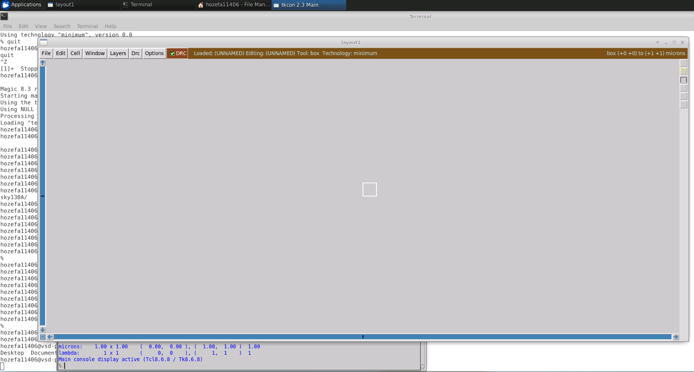

### 2. Workspace Directory Setup & PDK File Linking
* Create project directory `inverter` with subdirectories `xschem`, `mag`, and `netgen`.
* Create symbolic links (`ln -s`) linking system PDK files (`/usr/share/pdk/sky130A/libs.tech/...`).
* Verify executable paths for `magic`, `xschem`, and `netgen`.

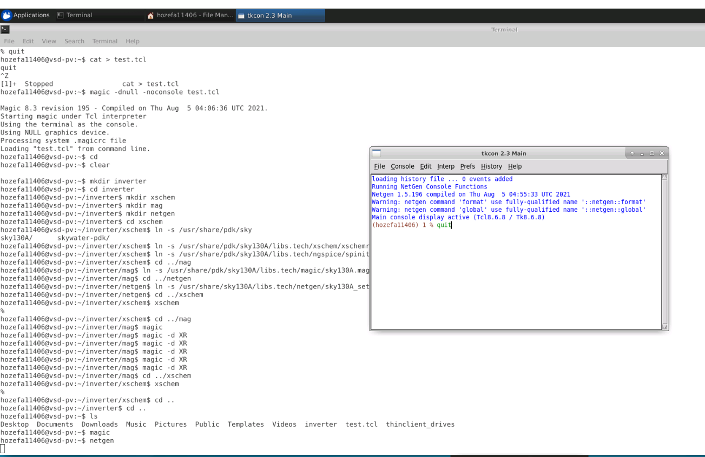

### 3. Xschem Configuration Check
Launching Xschem to verify configuration script loading (`xschemrc`).

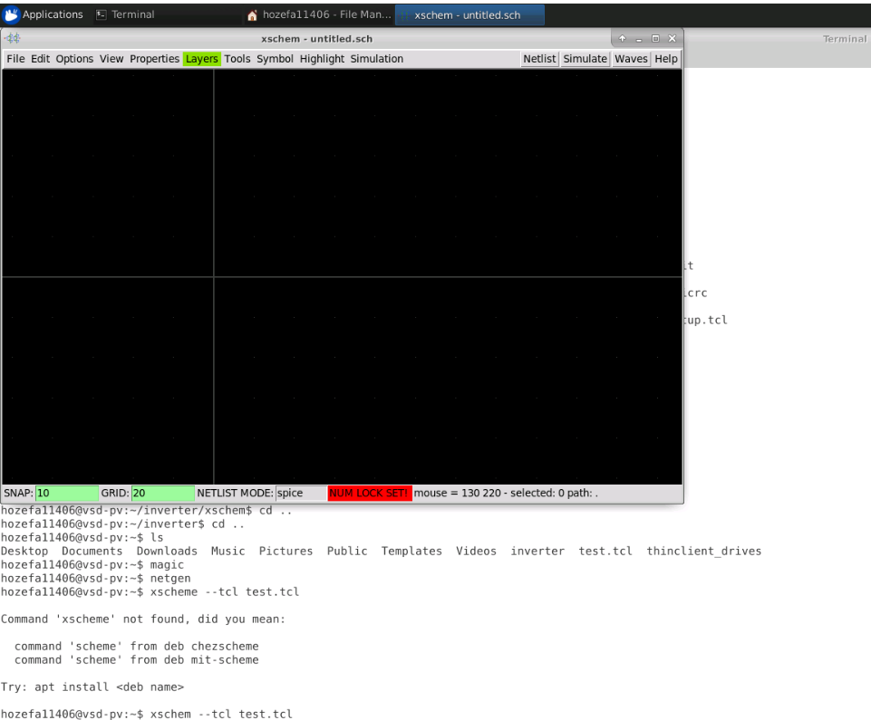

---

## PV_D1SK2_L2: Creating Sky130 Device Layout In Magic

### 1. Workspace Structure Verification
Organized working directory structure under `inverter/` containing `mag`, `netgen`, and `xschem`.

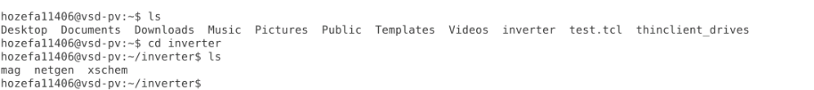

### 2. Xschem Sky130 Primitives Top Schematic
Inspecting `sky130_tests/top.sch` showcasing primitive devices available in the PDK: MIM capacitors, 3-pin PFET/NFET transistors, resistors, diodes, and PNPs.

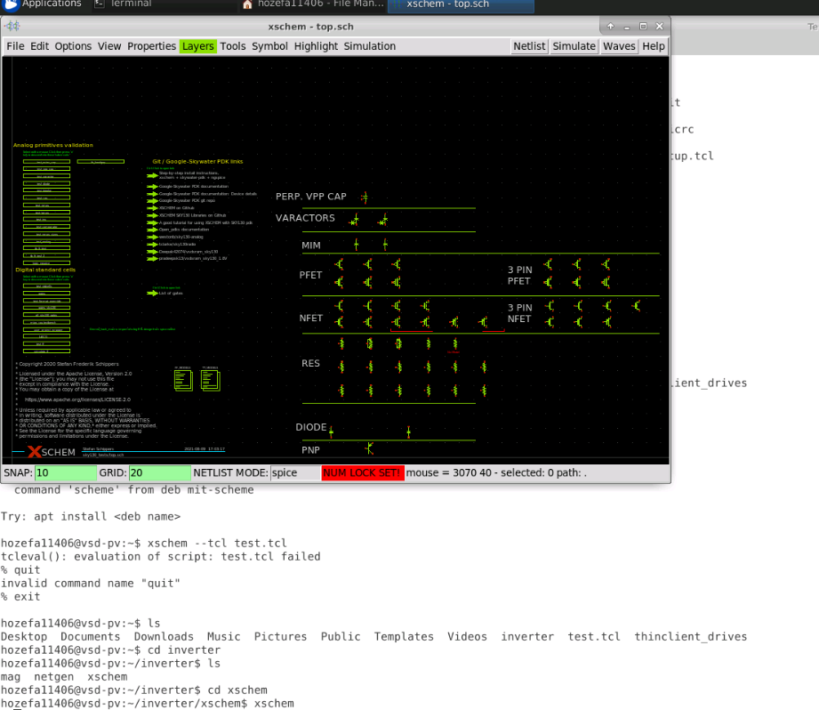

### 3. Loading SKY130 Technology File in Magic
Launching Magic inside `mag/` directory with `sky130A` technology loaded (`magic -T sky130A.tech`). The title bar displays `Technology: sky130A` and activates device menus (`Devices 1` / `Devices 2`).

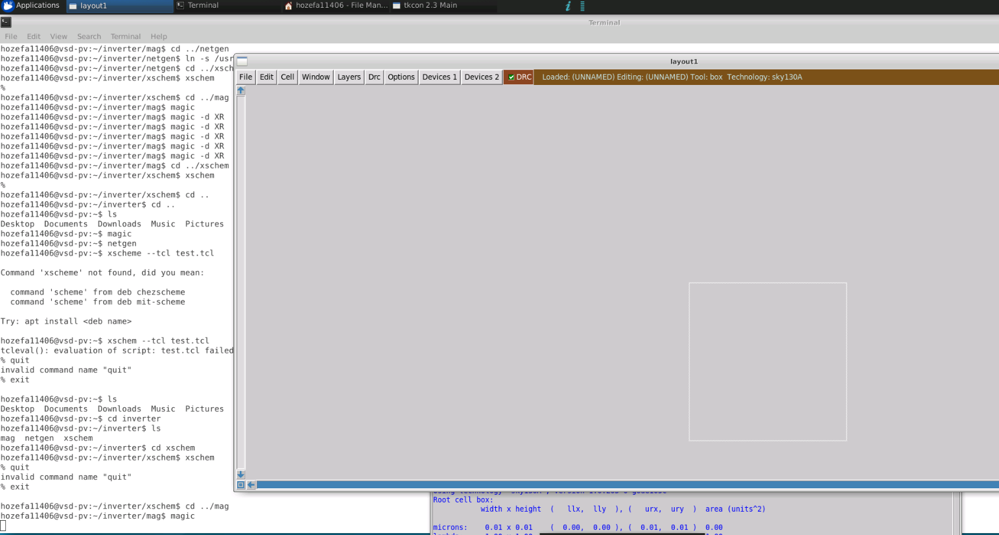

### 4. Creating Transistor Device Layout
* Instantiate `sky130_fd_pr__nfet_01v8` transistor device.
* Configure multi-finger layout and surrounding guard rings (`top/right/left guard ring`).
* Real-time DRC status confirms **DRC=0 errors**.

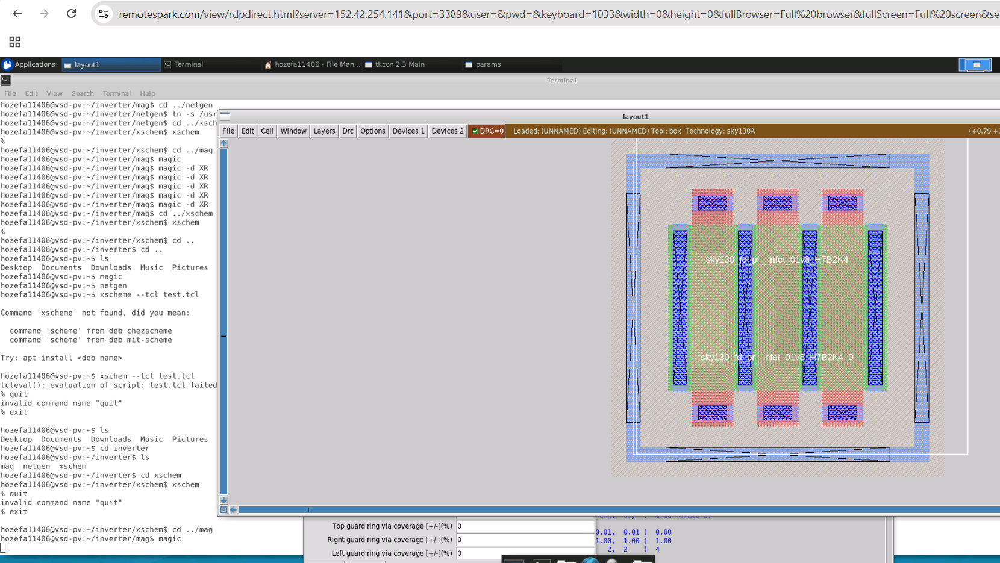

---

## PV_D1SK2_L3: Creating Simple Schematic In Xschem

### 1. Placing Transistors in Xschem
* Place `pfet_01v8` ($M2$) and `nfet_01v8` ($M1$) transistors.
* Connect gates and drains together; insert I/O pins (`iopin.sym`).

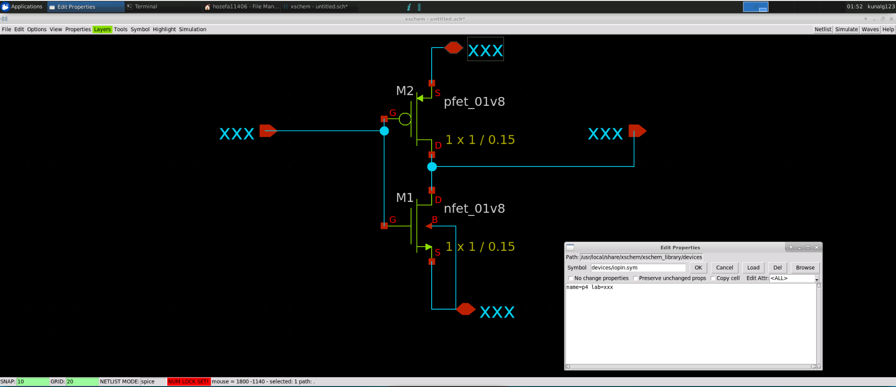

### 2. Completed Inverter Schematic
* Configure transistor width ($W$) and length ($L$):
  * PMOS (`pfet_01v8`): $W/L = 1 \times 3\,\mu\text{m} / 0.18\,\mu\text{m}$
  * NMOS (`nfet_01v8`): $W/L = 1 \times 4.5\,\mu\text{m} / 0.18\,\mu\text{m}$
* Define input pin `in`, output pin `out`, supply `vdd`, and ground `vss`.

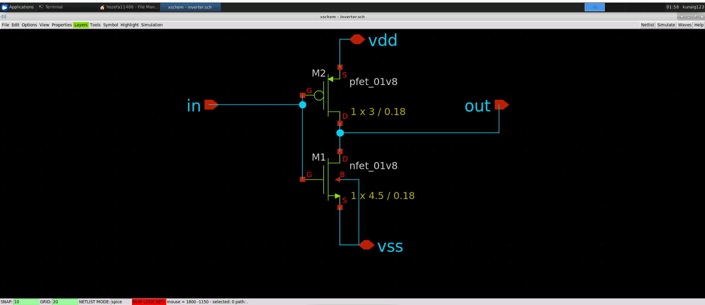

---

## PV_D1SK2_L4: Creating Symbol and Exporting Schematic In Xschem

### 1. Symbol Generation
Select `Symbol -> Make symbol from schematic` (Shortcut key `A`) in Xschem to automatically generate `inverter.sym`.

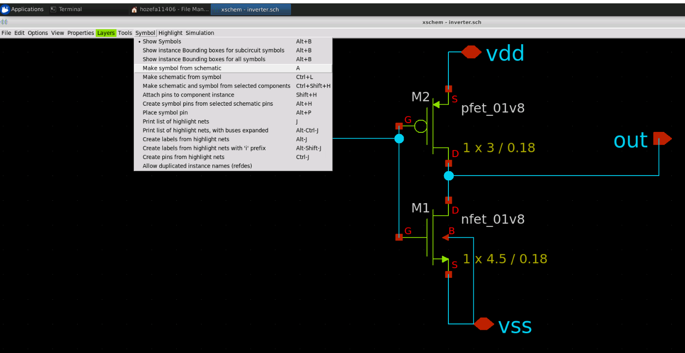

### 2. Building Inverter Testbench (`inverter_tb.sch`)
* Instantiate the generated `inverter` symbol (`x1`).
* Connect DC supply source `V2` ($1.8\text{V}$) and PWL stimulus `V1` (`PWL(0 0 20n 0 900n 1.8)`).

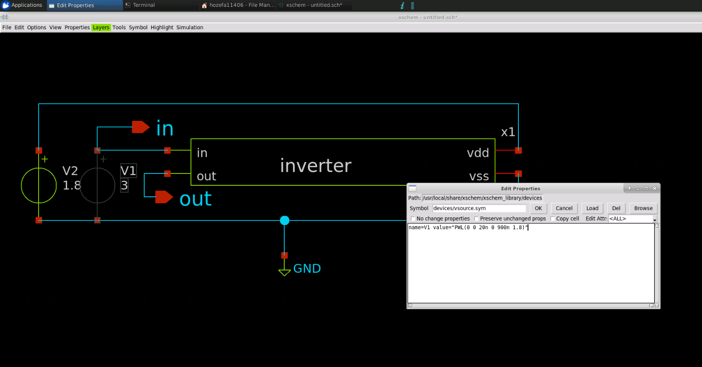

### 3. Attaching SPICE Model Cards & Control Blocks
* Save testbench as `inverter_tb.sch`.
* Attach SPICE model library reference card (`.lib /usr/share/pdk/sky130A/libs.tech/ngspice/sky130.lib.spice tt`).
* Add simulation control block (`.control tran 1n 1u plot V(in) V(out) .endc`).

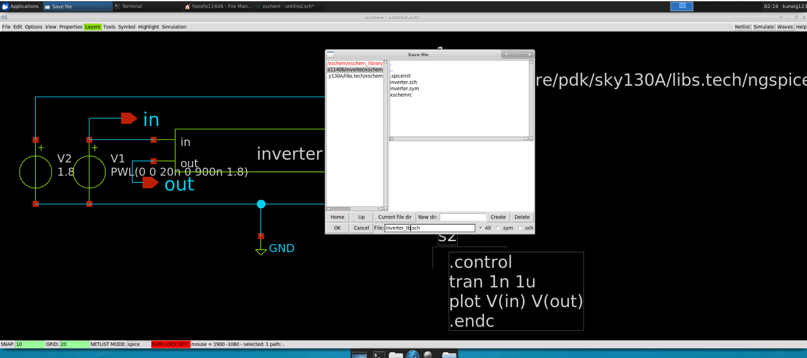

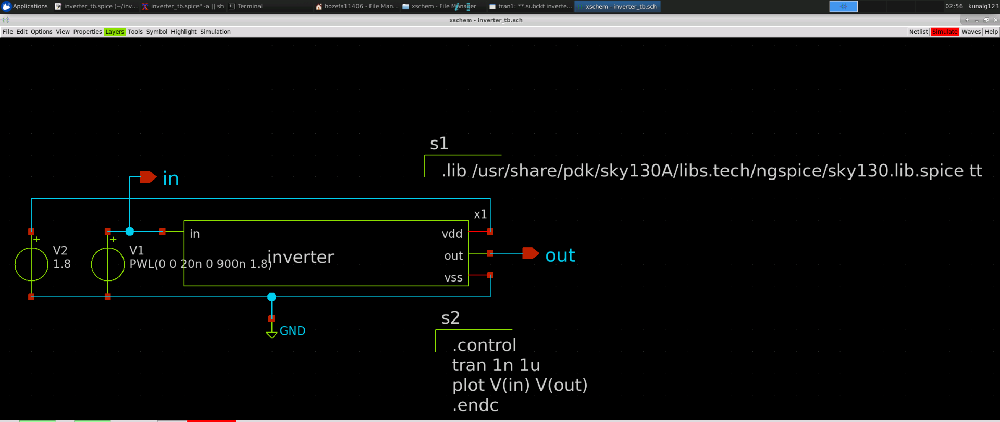

### 4. Ngspice Simulation Execution & Transient Response
* Export SPICE netlist `inverter_tb.spice`.
* Execute Ngspice simulation: observe input signal `v(in)` transition triggering complementary output response `v(out)`.

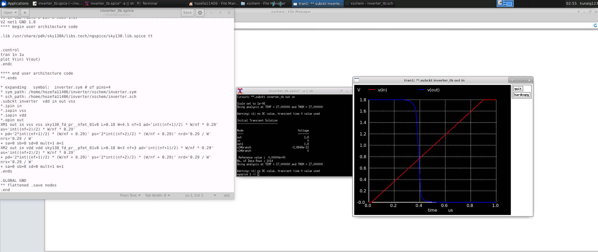

---

## PV_D1SK2_L5: Importing Schematic To Layout & Inverter Layout Steps

1. **Layout Routing & Interconnects:**
   * Route PMOS and NMOS drain terminals using Local Interconnect (`li`) and Metal1 (`met1`) to form the output node `out`.
   * Route PMOS and NMOS gates via `poly` and `li` to form input node `in`.
2. **Power Rails & Bulk Connections:**
   * Draw `met1` power rails at top ($V_{DD}$) and bottom ($V_{SS}$).
   * Connect N-well tap to $V_{DD}$ rail and P-substrate tap to $V_{SS}$ rail using `mcon` and `licon` contacts.

---

## PV_D1SK2_L6: Final DRC/LVS Checks & Post Layout Simulations

1. **Magic DRC Check:**
   * Execute `drc check` in Magic console; verify **DRC = 0 errors**.
2. **Netgen LVS Verification:**
   * Extract layout SPICE netlist in Magic (`extract all`, `ext2spice lvs`, `ext2spice`).
   * Run Netgen comparison (`netgen -batch lvs inverter.spice inverter_layout.spice sky130A_setup.tcl lvs_comp.out`).
   * Confirm **Circuits match uniquely!**
3. **Post-Layout Parasitic Extraction:**
   * Extract parasitic capacitance/resistance (`ext2spice cthresh 0.01`, `ext2spice extresist on`).
   * Run Ngspice simulation to measure extracted propagation delay ($t_{pd}$).
