# DAY 5: Module 3 - PV_D3SK1: Introduction to DRC Rules

## Overview
Day 5 covers **Module 3 (Part 1: PV_D3SK1 - Lectures L1 to L9)**. This theoretical module provides a comprehensive deep-dive into Design Rule Checking (DRC) for physical verification, explaining the silicon fabrication origins of layout rules, backend metal rules, local interconnects, front-end layers, Deep N-Well isolation, device-specific rules, latch-up/antenna stress constraints, density limits, and Electrical Rule Checking (ERC).

---

## Table of Contents
1. [PV_D3SK1_L1: Introduction To Basic Silicon Manufacturing Process](#pv_d3sk1_l1-introduction-to-basic-silicon-manufacturing-process)
2. [PV_D3SK1_L2: Backend Metal Layer Rules](#pv_d3sk1_l2-backend-metal-layer-rules)
3. [PV_D3SK1_L3: Local Interconnect Rules](#pv_d3sk1_l3-local-interconnect-rules)
4. [PV_D3SK1_L4: Front-End Rules, Transistors Implants, ID and Boundary Layers, Wells And Same Net Rules](#pv_d3sk1_l4-front-end-rules-transistors-implants-id-and-boundary-layers-wells-and-same-net-rules)
5. [PV_D3SK1_L5: Deep N-Well And High Voltage Rules](#pv_d3sk1_l5-deep-n-well-and-high-voltage-rules)
6. [PV_D3SK1_L6: Device Rules](#pv_d3sk1_l6-device-rules)
7. [PV_D3SK1_L7: Miscellaneous Rules: Latch-up, Antenna & Stress Rules](#pv_d3sk1_l7-miscellaneous-rules-latch-up-antenna--stress-rules)
8. [PV_D3SK1_L8: Density Rules](#pv_d3sk1_l8-density-rules)
9. [PV_D3SK1_L9: Recommended Rules, Manufacturing Rules and ERC Rules](#pv_d3sk1_l9-recommended-rules-manufacturing-rules-and-erc-rules)

---

## PV_D3SK1_L1: Introduction To Basic Silicon Manufacturing Process

Design rules bridges physical silicon fabrication constraints with digital/analog layout geometries.

* **Key Manufacturing Steps Driving DRC Rules:**
  * **Photolithography:** Optical diffraction and stepper wavelength resolution dictate minimum feature size and pitch.
  * **Etching:** Lateral undercut and plasma over-etching require minimum line width and spacing rules.
  * **Ion Implantation:** Dopant lateral diffusion requires minimum spacing between N-select (`nsdm`) and P-select (`psdm`) regions.
  * **Chemical-Mechanical Planarization (CMP):** Polishing oxide and metal layers requires metal density rules to prevent dishing and erosion.
* **Yield vs. Rules:** DRC enforcement prevents open circuits, short circuits, structural collapse, and parametric failures.

---

## PV_D3SK1_L2: Backend Metal Layer Rules

Back-End-of-Line (BEOL) rules govern metal interconnect layers (`metal1` through `metal5`) and via cuts (`mcon`, `via1` to `via4`).

* **Width & Spacing Rules:**
  * **Minimum Width:** Prevents wire breaking due to necking.
  * **Minimum Spacing:** Prevents bridging shorts between adjacent lines.
  * **Wide Metal Spacing Tables:** Wires exceeding a threshold width (e.g. $> 1.5\,\mu\text{m}$) require larger spacing to adjacent wires to prevent lithographic bridging caused by optical proximity effects.
* **Via Rules:**
  * Fixed via dimensions (e.g. square via cuts).
  * **Via Enclosure (Surround/Overhang):** Metal must extend beyond the via boundary to prevent open circuits due to via misalignment.
  * **Multiple Vias:** High-current paths require parallel multi-via arrays to reduce electromigration (EM).
* **Minimum Area:** Small isolated metal patches that fall below minimum area rules are prone to peeling during CMP.

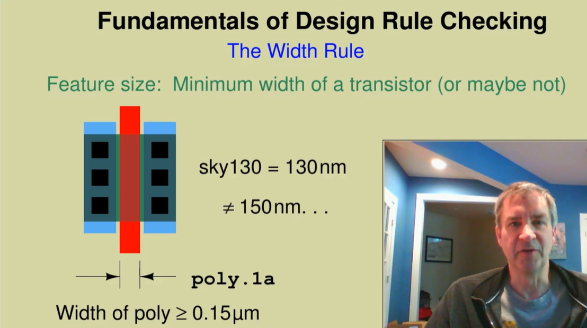
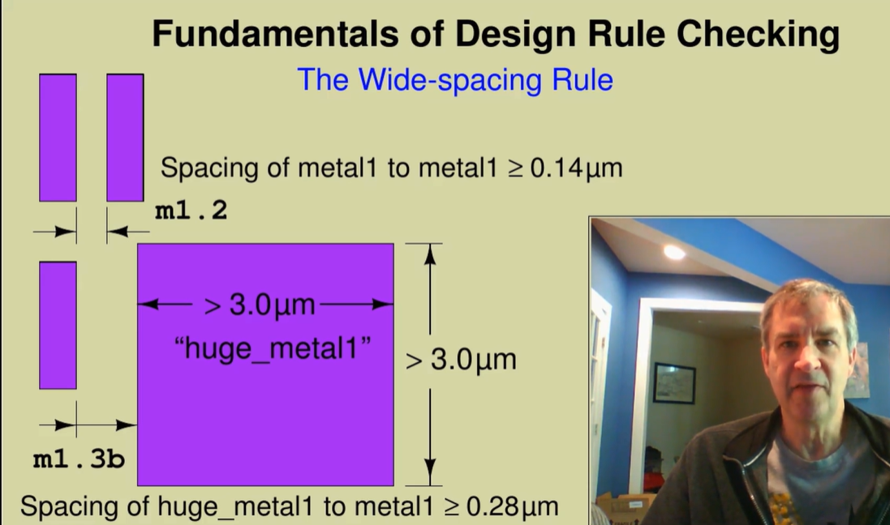
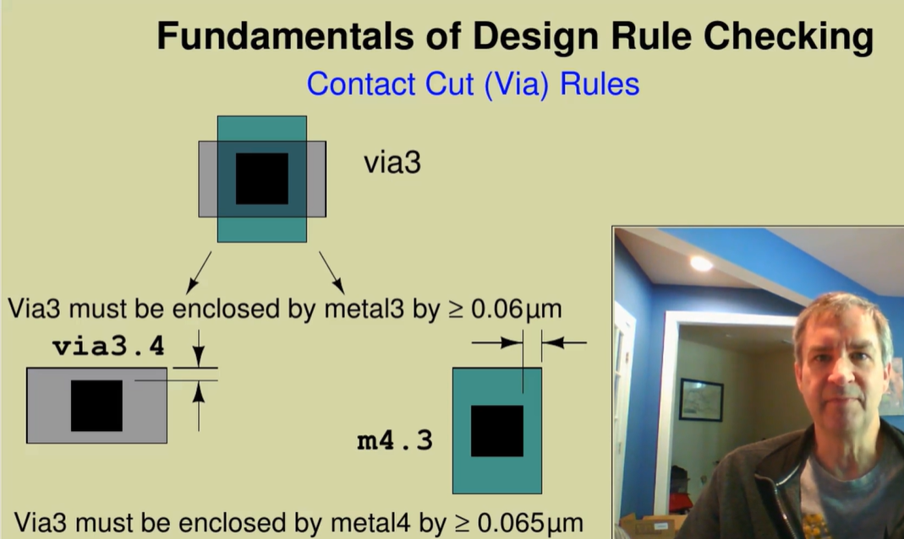
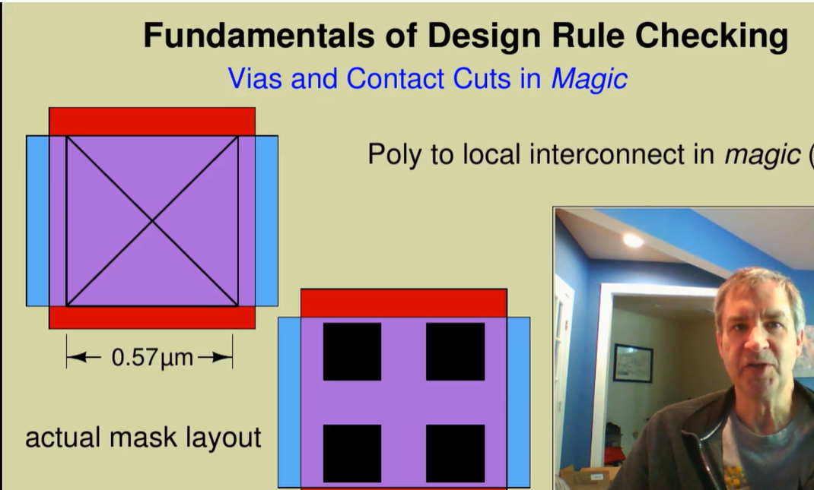

---

## PV_D3SK1_L3: Local Interconnect Rules

SkyWater SKY130 uses a Local Interconnect layer (`li` / Titanium Nitride $TiN$) located directly above diffusion and polysilicon.

* **Local Interconnect (`li`) Specs:**
  * Min width and spacing rules for local routing within standard cells.
* **Contact (`licon`) Rules:**
  * `licon` connects `li` to `diff` or `poly`.
  * **Enclosure Rules:** `li` and `diff`/`poly` must enclose `licon` on at least two opposite sides.
  * Spacing rules between adjacent `licon` contacts.

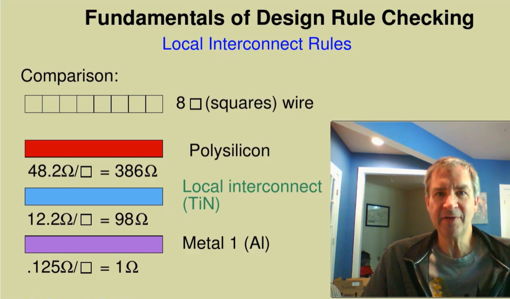
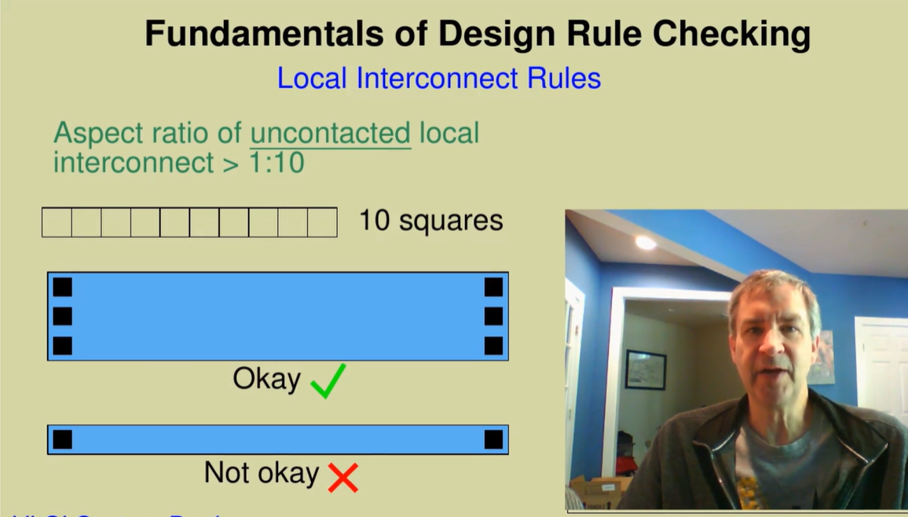
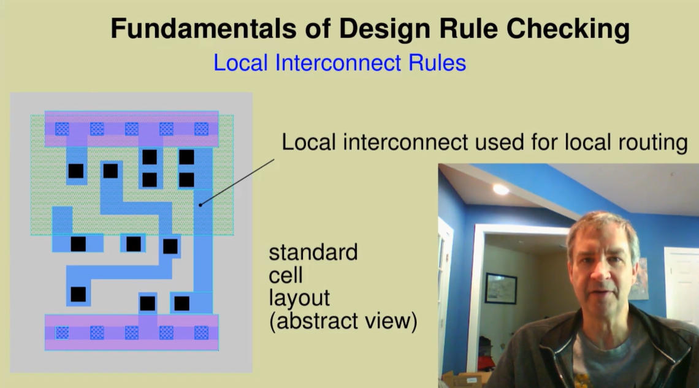
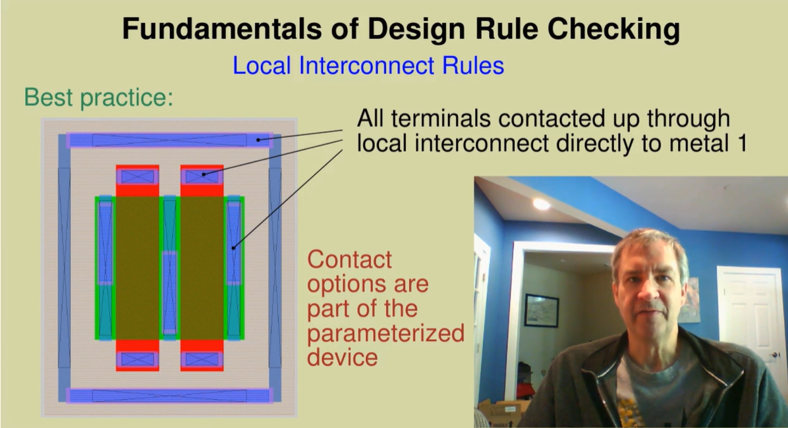

---

## PV_D3SK1_L4: Front-End Rules, Transistors Implants, ID and Boundary Layers, Wells And Same Net Rules

Front-End-of-Line (FEOL) rules govern active device formation:

* **Transistor Geometry Rules:**
  * **Gate Extension (Poly Overhang):** Polysilicon gate must extend beyond diffusion edge by a minimum distance (e.g. $0.13\,\mu\text{m}$) to prevent drain-source shorting.
  * **Diffusion Extension:** Source/Drain diffusion must extend beyond poly gate edge.
* **Implants (`nsdm` / `psdm`):**
  * Minimum overlap over diffusion and minimum spacing to un-implanted regions.
* **Well Rules:**
  * N-well width and spacing (different potential vs. same potential).
  * Tap placement rules: `ntap` inside N-well ($V_{DD}$ tap), `ptap` inside P-substrate ($V_{SS}$ tap).
* **Same-Net Spacing Rules:**
  * Reduced spacing rules allowed between geometries belonging to the exact same electrical net compared to different nets.
* **ID & Boundary Layers:**
  * Standard cell boundary layers (`bound`), cell outline definitions, and area tracking layers.

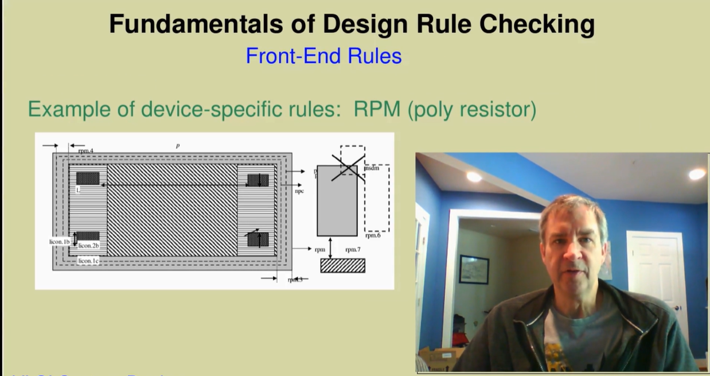
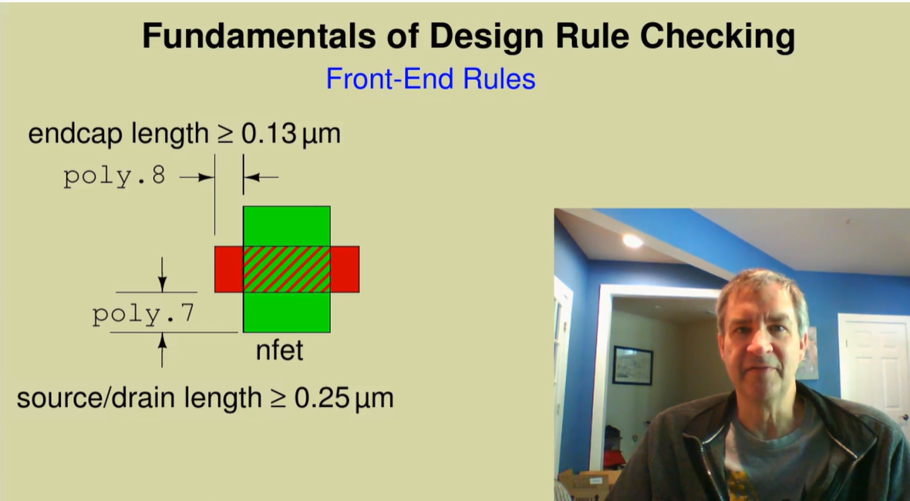
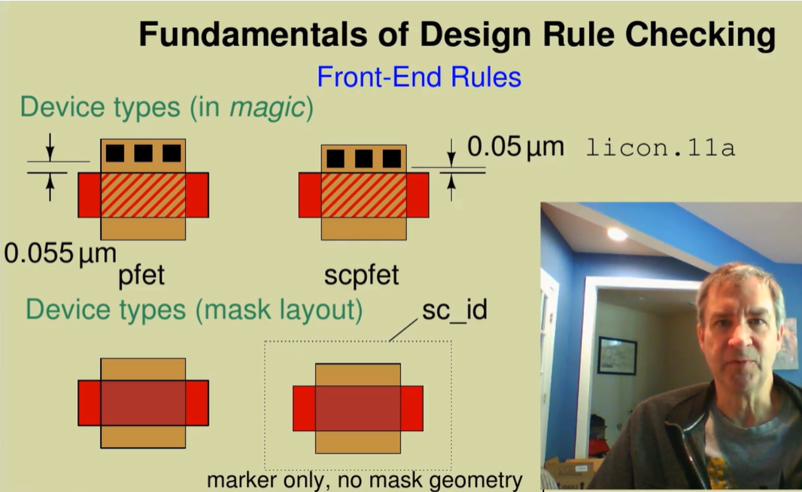
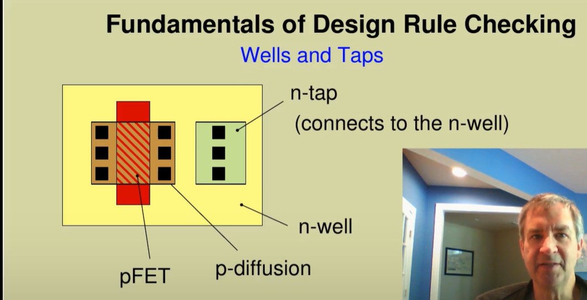

---

## PV_D3SK1_L5: Deep N-Well And High Voltage Rules

### Triple-Well Technology (Deep N-Well / `dnwell`)
* **Purpose:** Creates an isolated P-well inside a Deep N-Well to isolate sensitive analog/RF circuits from digital substrate noise.
* **Rules:**
  * Deep N-Well minimum width and spacing.
  * Enclosure clearance of `dnwell` over isolated P-well.
  * Outer N-well guard ring encircling the Deep N-Well perimeter.

### High-Voltage Transistor Rules (`nfet_03v3`, `pfet_05v0`)
* Requires thicker gate oxide layer (`thickox`).
* Increased gate length $L_{min}$ and larger drain-to-gate spacing to withstand high electric field breakdown.

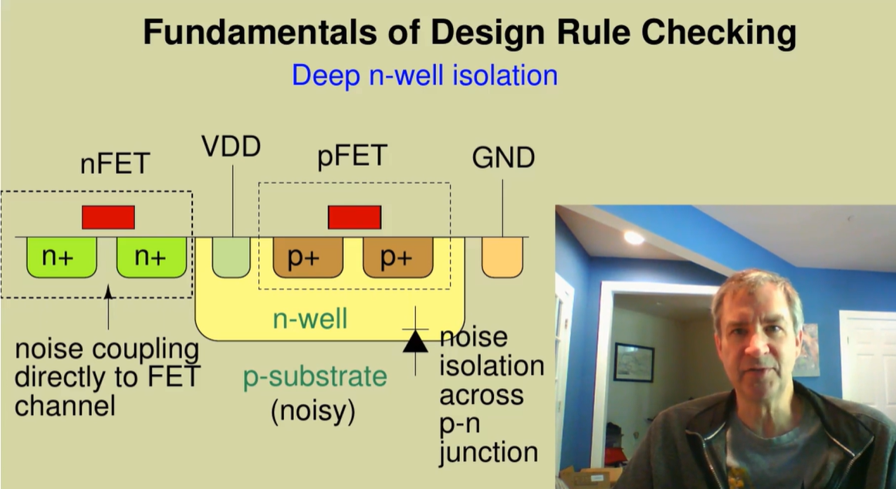
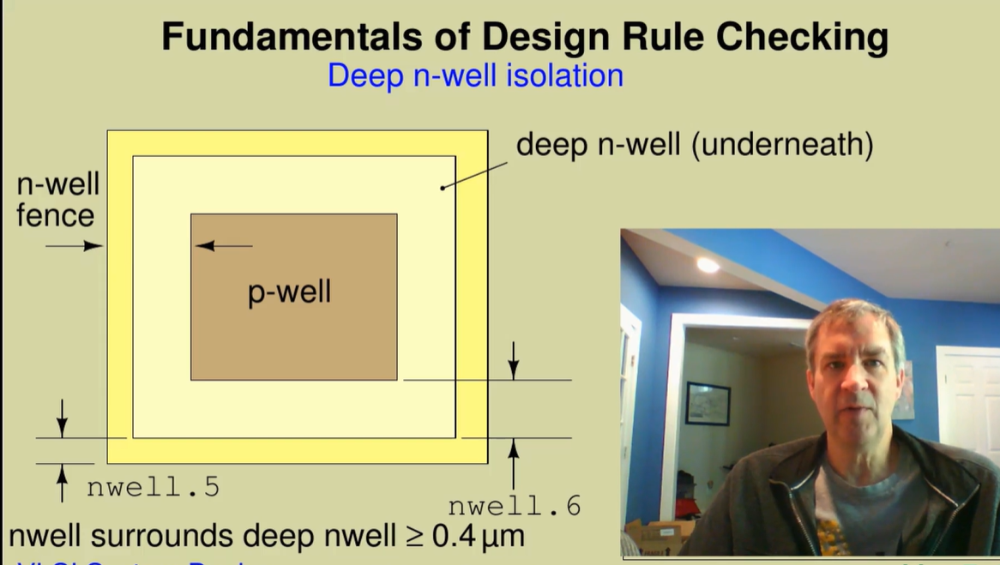
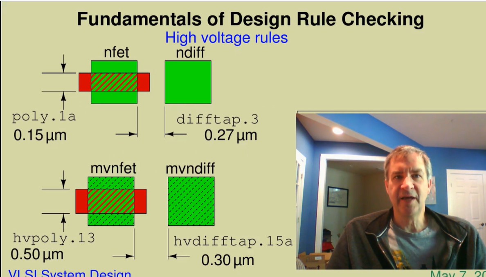

---

## PV_D3SK1_L6: Device Rules

Design rules for passive and specialized PDK primitive devices:

* **Precision Polysilicon Resistors (`res_high_po`):**
  * Fixed resistor width and minimum length constraints.
  * Dummy poly head extensions and poly-to-active diffusion clearance.
  * Shielding layers to prevent silicide formation on resistor body (`nosolicide`).
* **MIM Capacitors (`cap2m`):**
  * Top metal plate (`cap2m`) enclosure over bottom metal plate (`metal4`).
  * Clearance rules to surrounding interconnects.
* **ESD Protection & Diodes:**
  * Guard ring width and multi-contact enclosure around high-current ESD structures.

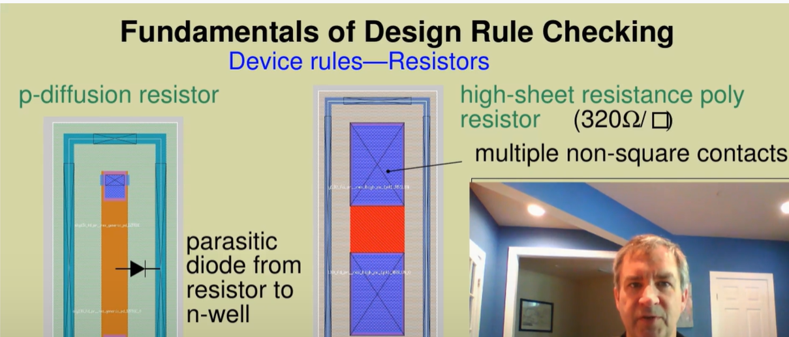
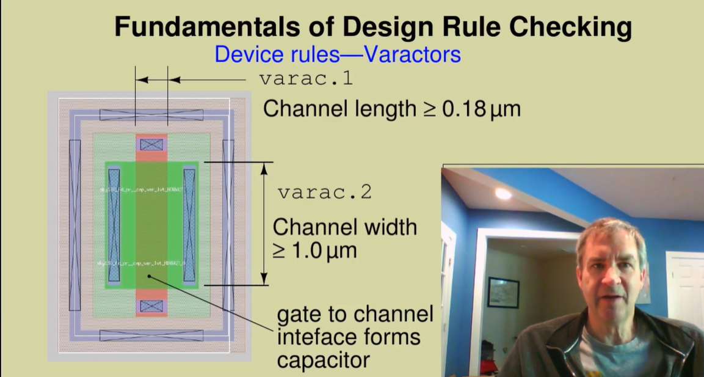
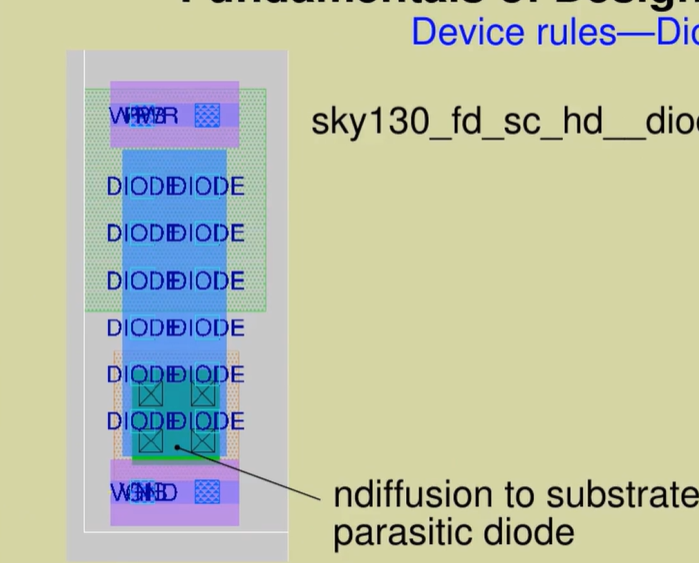
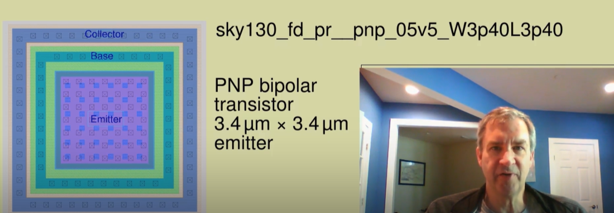

---

## PV_D3SK1_L7: Miscellaneous Rules: Latch-up, Antenna & Stress Rules

### 1. Latch-up Rules
Prevents parasitic PNP-NPN SCR firing in CMOS structures:
* **Rule:** Every point in an N-well or P-substrate must be within a maximum specified distance (e.g. $< 20\,\mu\text{m}$) from the nearest well/substrate tap contact (`ntap`/`ptap`).

### 2. Antenna Effect Rules (Plasma Induced Gate Oxide Damage)
During plasma etching of long metal wires, accumulated charge can discharge through thin transistor gate oxide, damaging the gate dielectric.
* **Antenna Ratio Formula:**
  $$\text{Antenna Ratio} = \frac{\text{Area of Metal Interconnect}}{\text{Area of Transistor Gate Oxide}} \le \text{Max Ratio}$$
* **Fixes:**
  * **Jumper (Metal Hopping):** Routing wire up to a higher metal layer near the gate.
  * **Antenna Diode:** Adding a reverse-biased diode near the gate to bleed off accumulated plasma charge.

### 3. STI Stress Rules (Length of Diffusion - $L_{OD}$)
Mechanical stress induced by Shallow Trench Isolation affects carrier mobility. Layout rules enforce minimum distance between transistor gate and active diffusion edge.

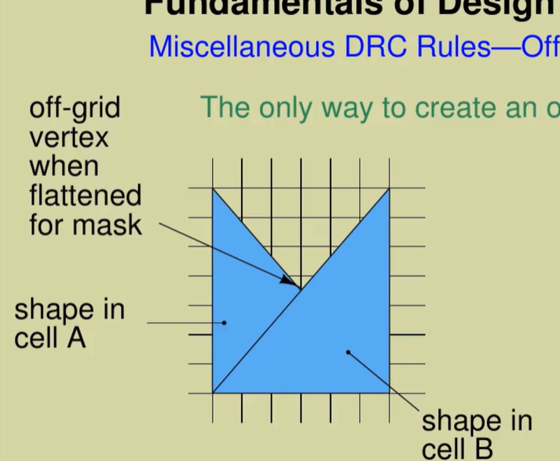
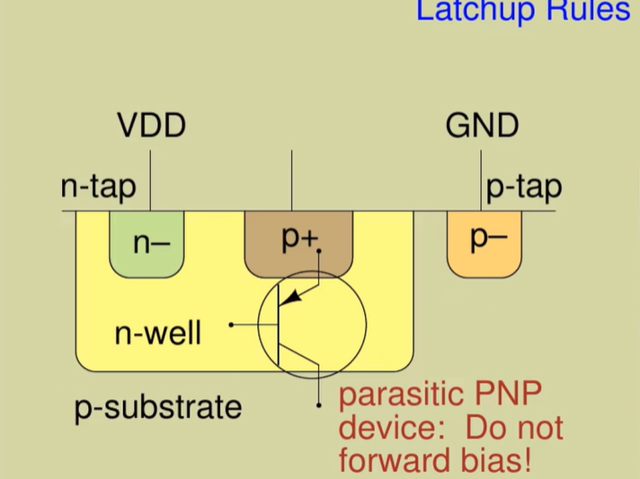
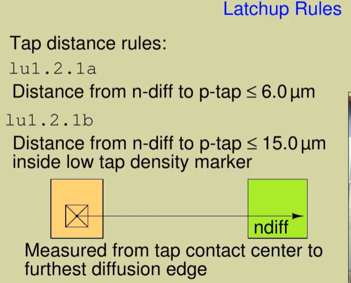
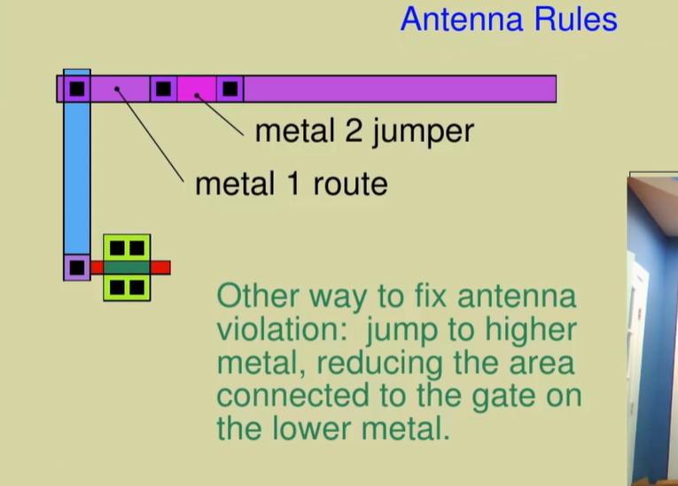
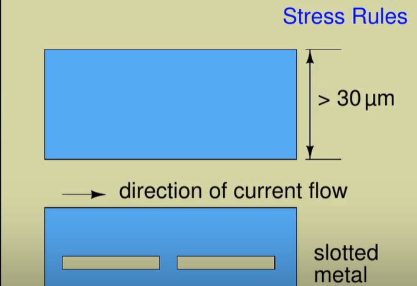

---

## PV_D3SK1_L8: Density Rules

To ensure uniform planarization during Chemical-Mechanical Planarization (CMP), each layer must satisfy minimum and maximum pattern density specifications over a sliding window.

$$\text{Layer Density} = \frac{\text{Total Area of Layer Geometries in Window}}{\text{Total Window Area}} \times 100\%$$

* **Typical Range:** $30\% \le \text{Metal Density} \le 70\%$
* **Dummy Metal Fill:** Automated scripts insert dummy floating or grounded metal tiles into sparse regions to satisfy minimum density rules without creating electrical shorts.

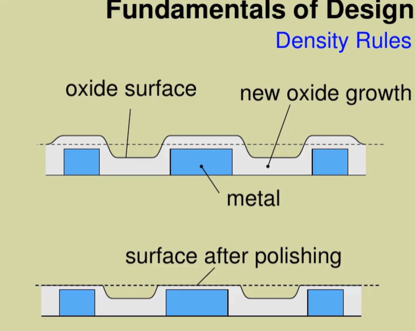
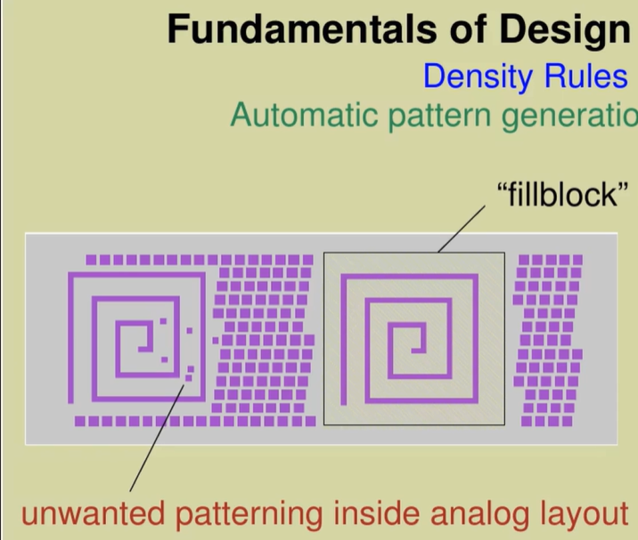
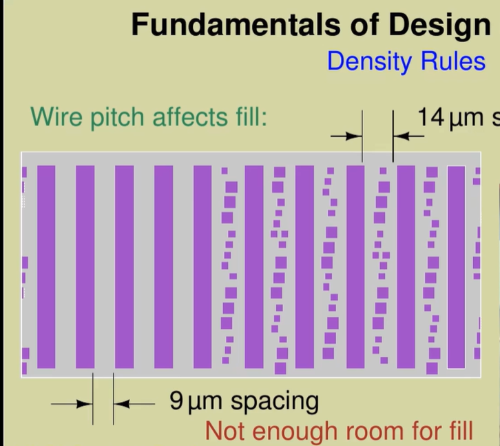
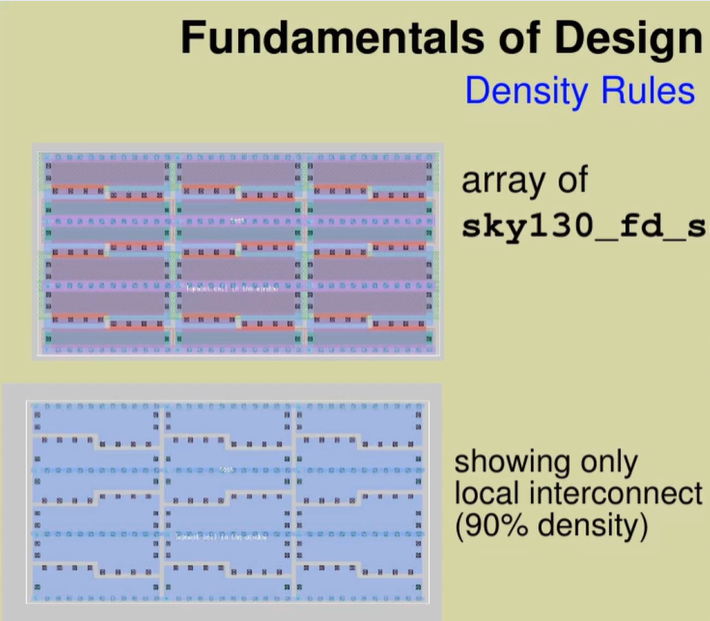

---

## PV_D3SK1_L9: Recommended Rules, Manufacturing Rules and ERC Rules

### 1. Recommended Rules (Design For Manufacturability - DFM)
Optional rules that improve yield and reliability beyond mandatory DRC:
* Double/Redundant Vias at metal transitions.
* Increased via enclosure and wire corner chamfering.

### 2. Manufacturing & Lithography Rules
* Lithography Compliance Checking (LCC) to identify optical hotspots.
* Dummy poly gate placement at memory and standard cell block boundaries.

### 3. Electrical Rule Checking (ERC)
ERC verifies circuit electrical integrity prior to LVS:
* Detecting floating transistor gates.
* Checking for shorted power domains ($V_{DD}$ to $V_{SS}$).
* Verifying proper bulk/well bias connections.

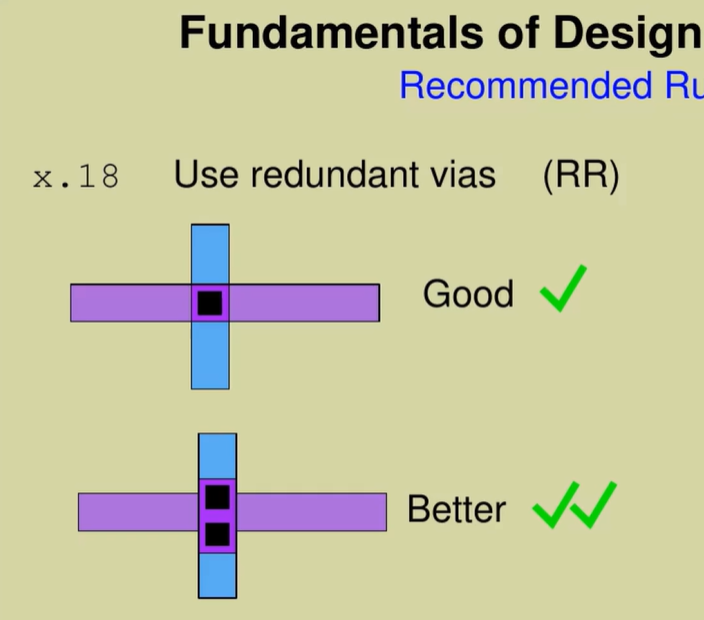
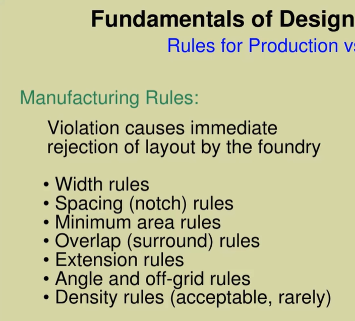
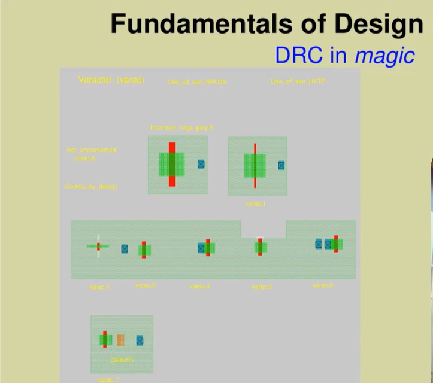
