# DAY 6: Module 3 - PV_D3SK2: Labs for All DRC Rules

## Overview
Day 6 covers **Module 3 (Part 2: PV_D3SK2 - Lectures L1 to L11)**. This practical lab module provides hands-on exercises for writing, debugging, and verifying Design Rule Checking (DRC) rules in Magic and SkyWater SKY130 PDK technology files.

---

## Table of Contents
1. [PV_D3SK2_L1: Lab For Width Rule And Spacing Rule (Exercise 1a & 1b Lab)](#pv_d3sk2_l1-lab-for-width-rule-and-spacing-rule-exercise-1a--1b-lab)
2. [PV_D3SK2_L2: Lab For Wide Spacing Rule And Notch Rule (Exercise 1c & 1d Lab - DRC=0 Final)](#pv_d3sk2_l2-lab-for-wide-spacing-rule-and-notch-rule-exercise-1c--1d-lab---drc0-final)
3. [PV_D3SK2_L3: Lab For Via Size, Multiple Vias, Via Overlap and Autogenerate Vias](#pv_d3sk2_l3-lab-for-via-size-multiple-vias-via-overlap-and-autogenerate-vias)
4. [PV_D3SK2_L4: Lab For Minimum Area Rule And Minimum Hole Rule](#pv_d3sk2_l4-lab-for-minimum-area-rule-and-minimum-hole-rule)
5. [PV_D3SK2_L5: Lab For Wells And Deep N-Well](#pv_d3sk2_l5-lab-for-wells-and-deep-n-well)
6. [PV_D3SK2_L6: Lab For Derived Layers](#pv_d3sk2_l6-lab-for-derived-layers)
7. [PV_D3SK2_L7: Lab For Parameterized And PDK Devices](#pv_d3sk2_l7-lab-for-parameterized-and-pdk-devices)
8. [PV_D3SK2_L8: Lab For Angle Error And Overlap Rule](#pv_d3sk2_l8-lab-for-angle-error-and-overlap-rule)
9. [PV_D3SK2_L9: Lab For Unimplemented Rules](#pv_d3sk2_l9-lab-for-unimplemented-rules)
10. [PV_D3SK2_L10: Latch-up And Antenna Rules](#pv_d3sk2_l10-latch-up-and-antenna-rules)
11. [PV_D3SK2_L11: Lab For Density Rules](#pv_d3sk2_l11-lab-for-density-rules)

---

## PV_D3SK2_L1: Lab For Width Rule And Spacing Rule (Exercise 1a & 1b Lab)

### Overview of Exercise 1 Setup
* **Cell Loaded:** `exercise_1` in Magic with `sky130A` technology file.
* **Exercise Modules Included (4 Sub-Exercises):**
  1. `Exercise_1a: Width_rule`
  2. `Exercise_1b: Spacing_rule`
  3. `Exercise_1c: Wide_spacing_rule`
  4. `Exercise_1d: Notch_rule`
* **Initial State:** Initial layout triggers `DRC=7` violations indicated by white dotted error boxes.

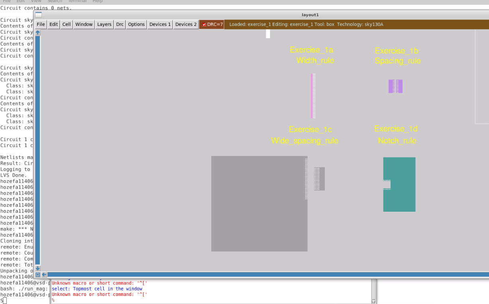

---

### Part 1: Debugging & Fixing Exercise_1a (Width Rule)

1. **DRC Violation Diagnostic (`drc why`):**
   * Hover box over `Exercise_1a` trace and execute `drc why` in tkcon:
     ```text
     Metal2 width < 0.14um (met2.1)
     ```
   * 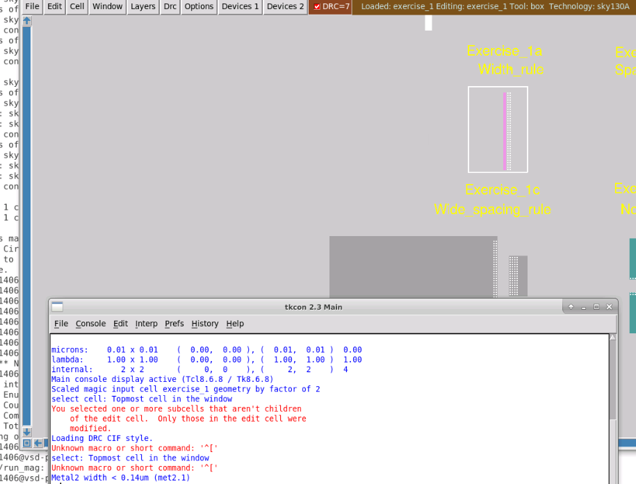
   * 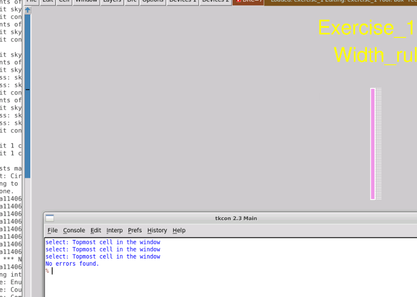
   * 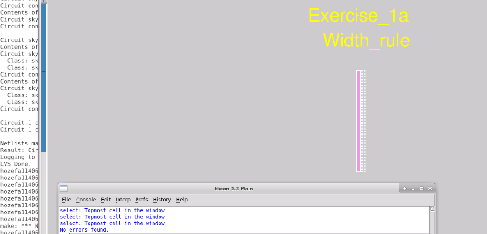

2. **Measuring Polygon Geometry (`box`):**
   * Execute `box` command in tkcon:
     ```text
     microns: 0.06 x 1.53
     ```
   * Current width of $0.06\,\mu\text{m}$ falls below minimum `metal2` width constraint of $0.14\,\mu\text{m}$.
   * 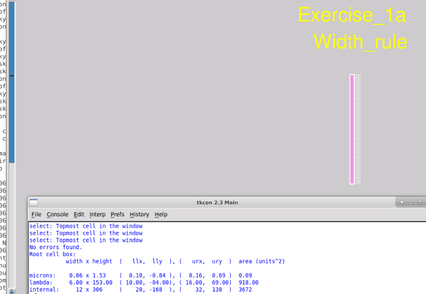

3. **Applying Width Correction Commands:**
   * Set box width to $0.14\,\mu\text{m}$ and paint `metal2`:
     ```tcl
     box width 0.14um
     paint m2
     ```
   * 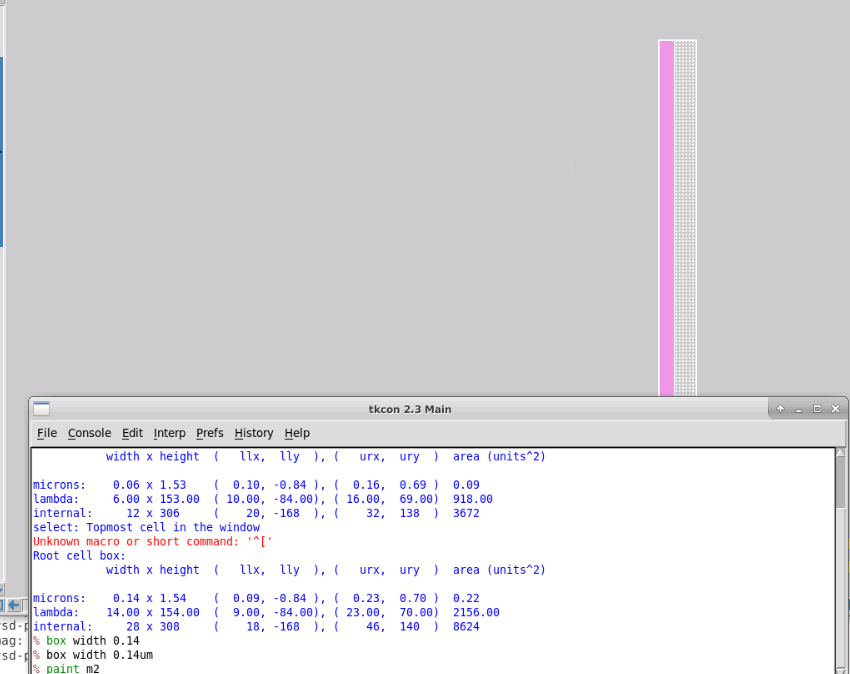
   * 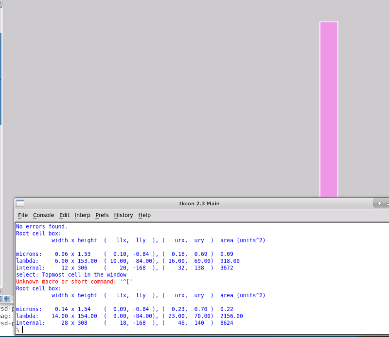

4. **Verification & DRC Clearance:**
   * Expanding trace width to $0.14\,\mu\text{m}$ clears the violation. `drc why` reports `No errors found.` and the white dotted error box vanishes.
   * 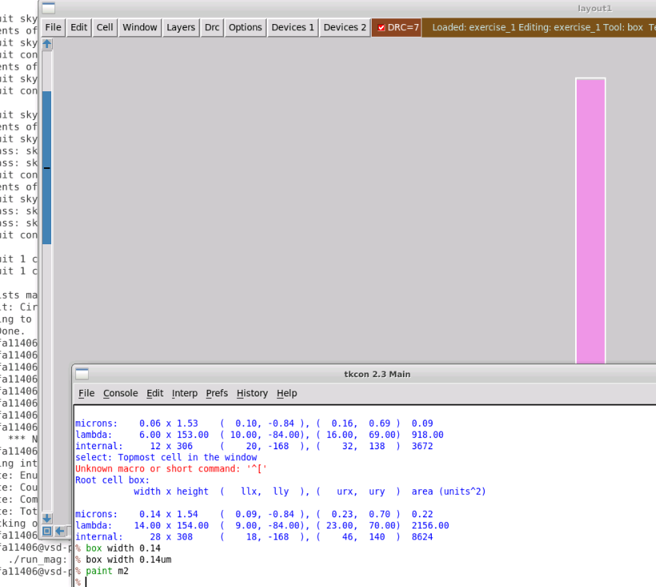

---

### Part 2: Debugging & Fixing Exercise_1b (Spacing Rule)

1. **DRC Violation Diagnostic (`drc why`):**
   * Select error region between adjacent `metal1` traces in `Exercise_1b`.
   * Run `drc why`:
     ```text
     Metal1 spacing < 0.14um (met1.2)
     ```
   * 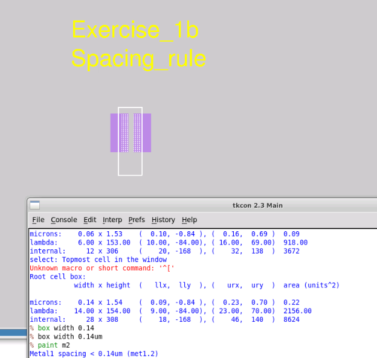
   * 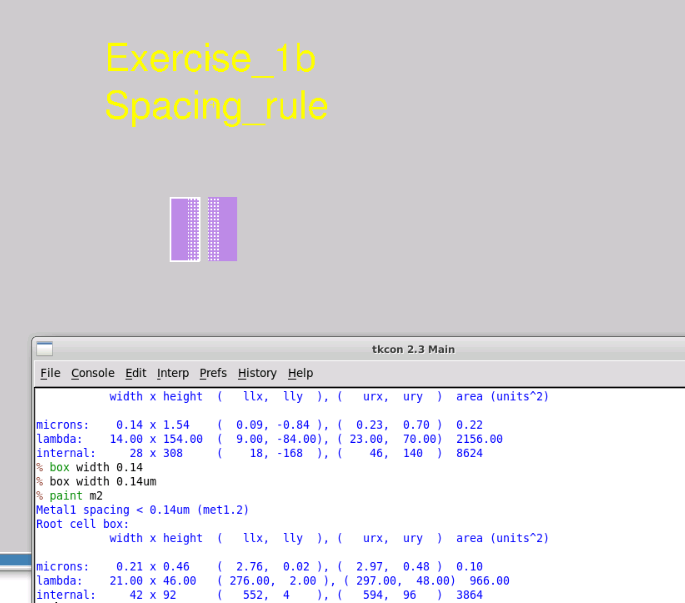

2. **Applying Spacing Correction Commands:**
   * Set minimum clearance gap box to $0.14\,\mu\text{m}$ and adjust layout spacing:
     ```tcl
     box width 0.14um
     paint m2
     ```

3. **Verification & DRC Clearance:**
   * After repainting spacing gap to meet $0.14\,\mu\text{m}$, the white dotted error box disappears and tkcon reports `No errors found.` for Exercise 1b.
   * 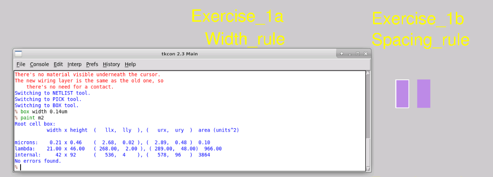

---

## PV_D3SK2_L2: Lab For Wide Spacing Rule And Notch Rule (Exercise 1c & 1d Lab - DRC=0 Final)

### Overview of Selection & Movement Techniques in Magic
To resolve positioning and spacing violations without repainting entire geometries:
1. **Selecting Layout Objects:** Place cursor over target shape and press key **`s`** to select the tile/chunk.
2. **Moving Objects using Numeric Keypad:**
   * **Key `6`:** Move East (Right)
   * **Key `4`:** Move West (Left)
   * **Key `8`:** Move North (Up)
   * **Key `2`:** Move South (Down)
3. **Alternative Movement Command:**
   ```tcl
   move e 0.3um
   ```

---

### Part 1: Debugging & Fixing Exercise_1c (Wide Spacing Rule)

1. **DRC Violation Diagnostic (`drc why`):**
   * Inspect error region adjacent to wide metal plane in `Exercise_1c`.
   * Run `drc why` in tkcon:
     ```text
     Metal3 spacing < 0.3um (met3.2)
     Metal3 > 3um spacing to unrelated m3 < 0.4um (met3.3d)
     ```
   * 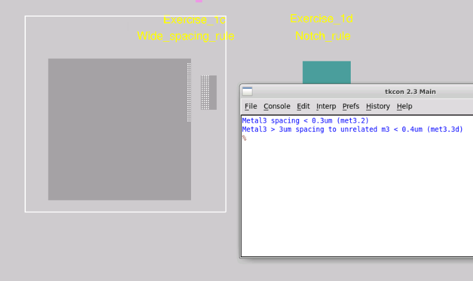

2. **Measuring Wide Plane Dimensions:**
   * Execute `box` command on wide metal plane:
     ```text
     microns: 3.32 x 3.29
     ```
   * Because width exceeds $3.0\,\mu\text{m}$, the required wide metal spacing to unrelated `metal3` increases to $0.40\,\mu\text{m}$.
   * 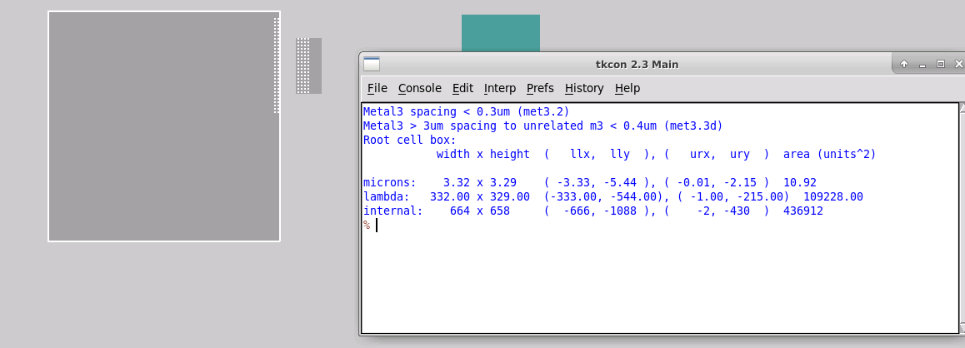

3. **Moving Adjacent Wire using Keypad / Move Command:**
   * Hover cursor over adjacent `metal3` wire segment, press **`s`** to select object, and shift it eastwards using **numeric keypad `6`** or tkcon command:
     ```tcl
     move e 0.3um
     ```
   * Total DRC error count drops from `DRC=7` down to `DRC=2`.
   * 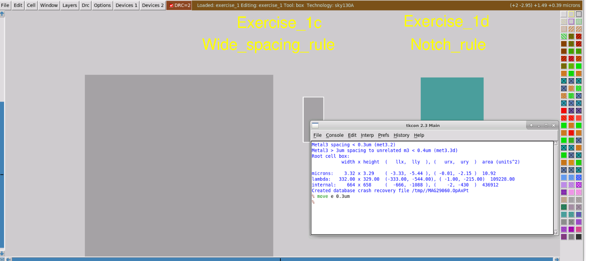

4. **Verification & DRC Clearance:**
   * Once spacing clearance exceeds $0.40\,\mu\text{m}$, `drc why` reports `No errors found.` and the white dotted error box vanishes for Exercise 1c.
   * 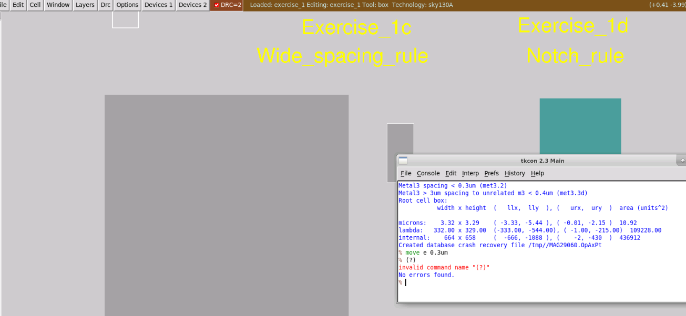

---

### Part 2: Debugging & Fixing Exercise_1d (Notch Rule) to Achieve DRC=0

1. **DRC Violation Diagnostic (`drc why`):**
   * Inspect notch cutout region in `Exercise_1d`.
   * Notch rules enforce minimum fill or clearance gap within a continuous polygon boundary.
   * 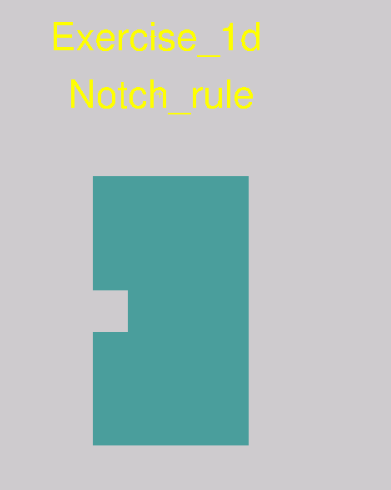

2. **Applying Notch Correction & Keypad Movement:**
   * Select notch boundary segment with key **`s`** and shift shape using numeric keypad or paint command to satisfy minimum notch rule requirement.

3. **Final Status — DRC = 0 Achieved!**
   * Upon resolving Exercise 1d, the top layout title bar updates to:
     ```text
     ✔ DRC=0  Loaded: exercise_1 Editing: exercise_1 Tool: box Technology: sky130A
     ```
   * All 4 sub-exercises (`Exercise_1a`, `Exercise_1b`, `Exercise_1c`, `Exercise_1d`) in `exercise_1` are completely clean with zero DRC errors!
   * 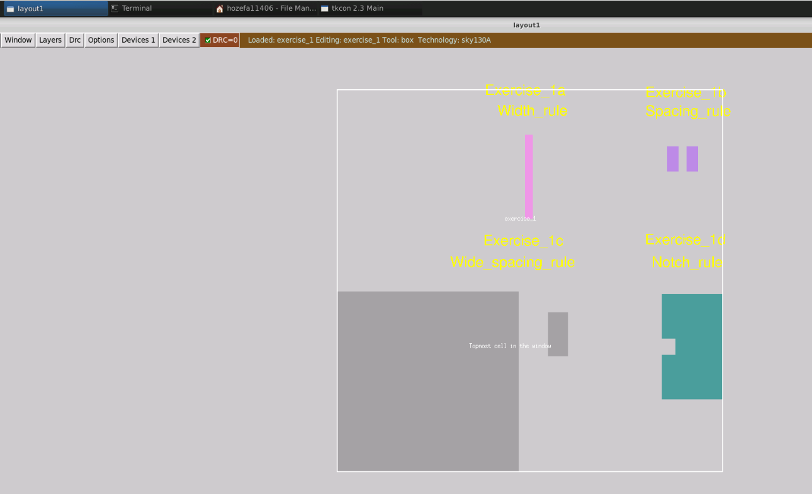

---

## PV_D3SK2_L3: Lab For Via Size, Multiple Vias, Via Overlap and Autogenerate Vias

### Overview of Exercise 2 Setup
This lab focuses on verifying via geometry rules, multiple via cut array handling, via overlap surround constraints, and Magic's automatic via generation features (`exercise_2`).

---

### Sub-Exercise 2a: Via Size (`Exercise_2a`)
1. **Via Geometry Rules:**
   * Single contact cut sizes are strictly fixed by PDK specifications (e.g. `MCON` cut size = $0.17\,\mu\text{m} \times 0.17\,\mu\text{m}$).
   * Magic enforces exact via cut sizes to prevent over-etching or current crowding defects.
2. **Visual Inspection:**
   * 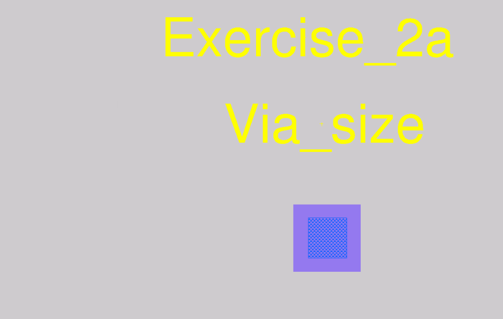

---

### Sub-Exercise 2b: Multiple Vias & CIF Layer Inspection (`Exercise_2b`)
1. **Querying Valid CIF Layer Names (`cif see XXX`):**
   * In Magic tkcon, typing an invalid layer query like `cif see XXX` lists all supported Caltech Intermediate Format (CIF) layer identifiers:
     ```text
     The valid CIF layer names are: CELLBOUND, BOUND, DNWELL, PWRES, SUBCUT, NWELL, WELLTXT, 
     DIFF, TAP, MCON, MET1, VIA1, MET2, VIA2, MET3, VIA3, MET4, VIA4, MET5, etc.
     ```
   * 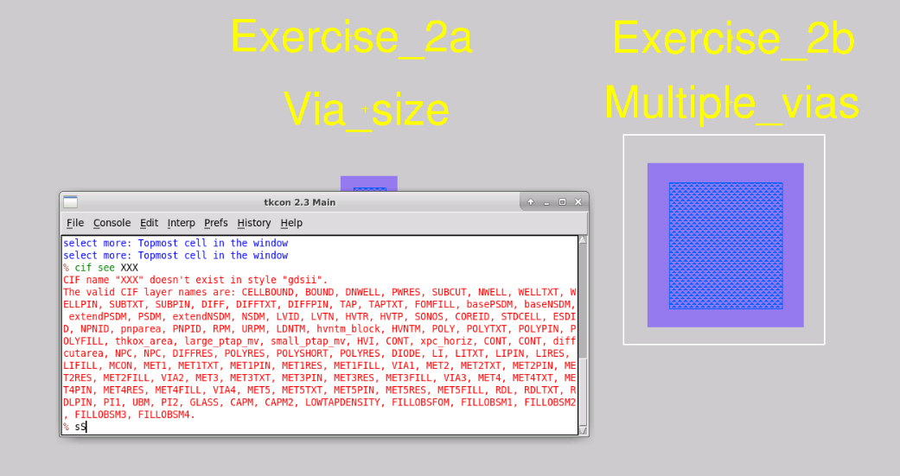

2. **Rendering Contact Cuts (`cif see MCON`):**
   * Executing `cif see MCON` displays individual contact cuts on the layout canvas. Magic renders the $2 \times 2$ array of contact cuts inside the composite contact layer.
   * 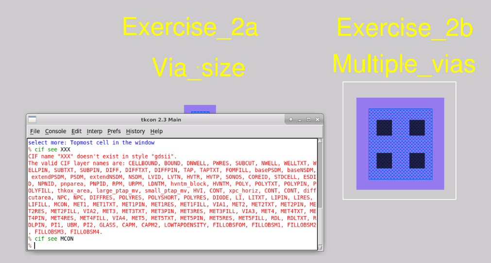

3. **CIF Feedback Diagnostic (`feedback why`):**
   * Running `feedback why` highlights active CIF feedback regions and confirms:
     ```text
     CIF layer "MCON"
     ```
   * 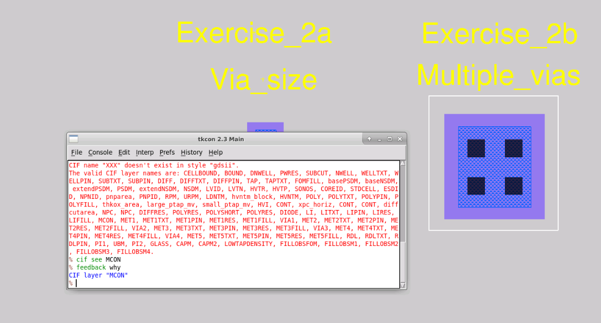

---

### Sub-Exercise 2c: Via Overlap Rules (`Exercise_2c`)
1. **DRC Violation Diagnostic (`drc why`):**
   * Inspecting `Exercise_2c` region triggers a DRC surround violation:
     ```text
     Metal1 overlap of local interconnect contact < 0.03um (met1.4)
     ```
   * 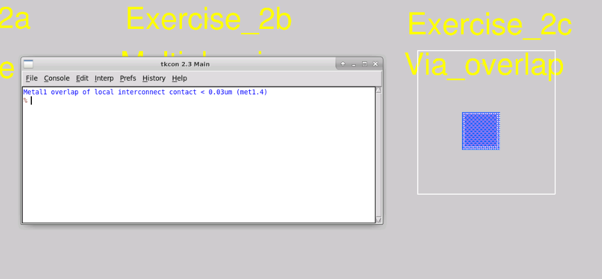

2. **Fixing Surround Overlap via TKCON Commands:**
   * To satisfy the directional surround requirement (`met1.5`), expand box bounds and paint `metal1`:
     ```tcl
     box grow c 0.03um
     paint m1
     box grow e 0.03um
     ```
   * Resulting `metal1` overhang reaches $\ge 0.06\,\mu\text{m}$ in the directional axis, clearing the error (`No errors found.`).
   * 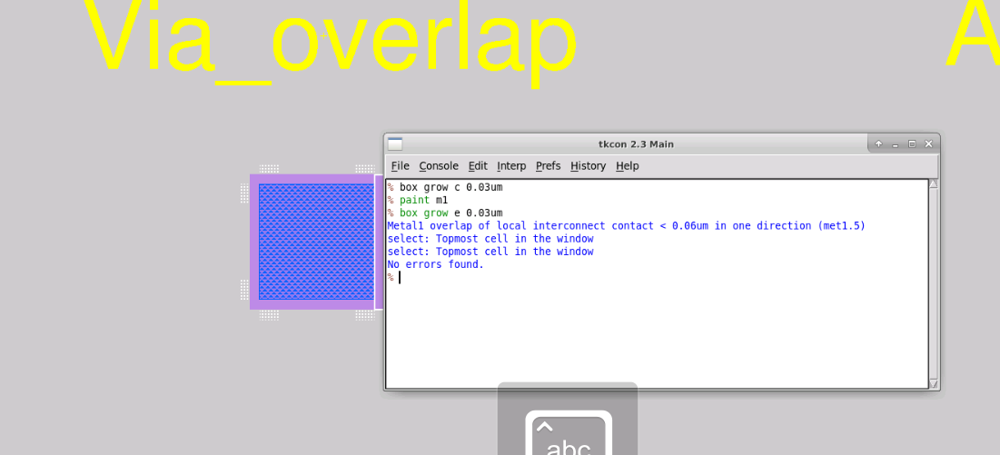

---

### Sub-Exercise 2d: Auto-Generating Vias (`Exercise_2d`)
1. **Initial Interconnect Layout Setup:**
   * Layout shows local interconnect (`li1`) and upper metal layers needing vertical connectivity.
   * 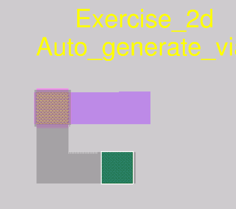

2. **Selecting Area & Auto Via Generation:**
   * Box the overlapping region between layers to construct the via array.
   * 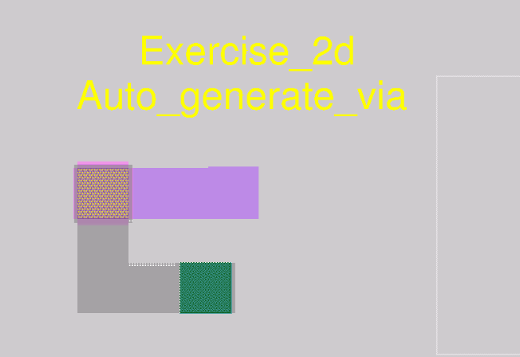

3. **Verifying Autogenerated Cut Arrays (`cif see`):**
   * Verify generated contact cuts across metal stack levels in tkcon:
     ```tcl
     cif see MCON
     cif see VIA1
     cif see VIA2
     ```
   * Magic automatically generates maximum density via cut arrays based on enclosure area and design rules.
   * 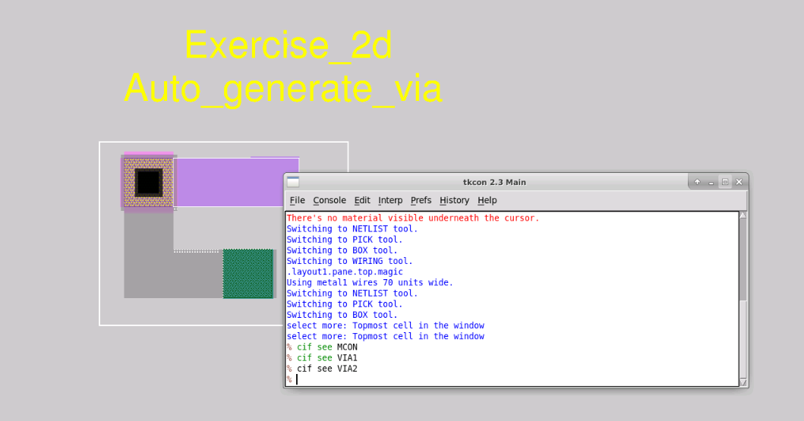

---

## PV_D3SK2_L4: Lab For Minimum Area Rule And Minimum Hole Rule

### Overview of Exercise 3 Setup
This lab (`exercise_3`) covers verifying minimum polygon area constraints (`Exercise_3a: Minimum_area_rule`), minimum enclosed hole rules inside wide metal planes (`Exercise_3b: Minimum_hole_rule`), and substrate/tap contact overlap rules in Magic.

---

### Part 1: Debugging & Fixing Exercise_3a (Minimum Area Rule)

1. **DRC Violation Diagnostic (`drc why`):**
   * Inspecting an undersized `metal4` polygon in `Exercise_3a` triggers a minimum area violation:
     ```text
     Metal4 minimum area < 0.24um^2 (met4.4a)
     Root cell box:
         microns: 0.43 x 0.46 ( 0.08, 2.95 ), ( 0.51, 3.41 ) 0.20
     ```
   * Current polygon area ($0.20\,\mu\text{m}^2$) falls below the minimum required area threshold of $0.24\,\mu\text{m}^2$.
   * 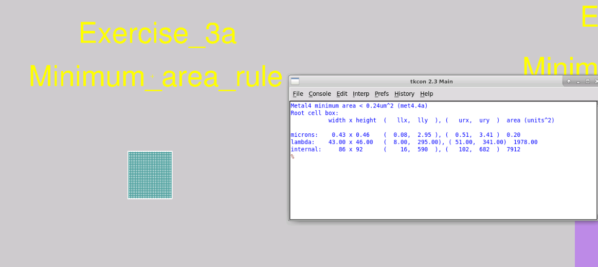

2. **Box Selection & Extending Polygon Area:**
   * Place cursor over polygon boundary, adjust box size, and repaint layer to expand total area beyond $0.24\,\mu\text{m}^2$:
     ```tcl
     box size 0.17um 0.17um
     paint li
     ```
   * 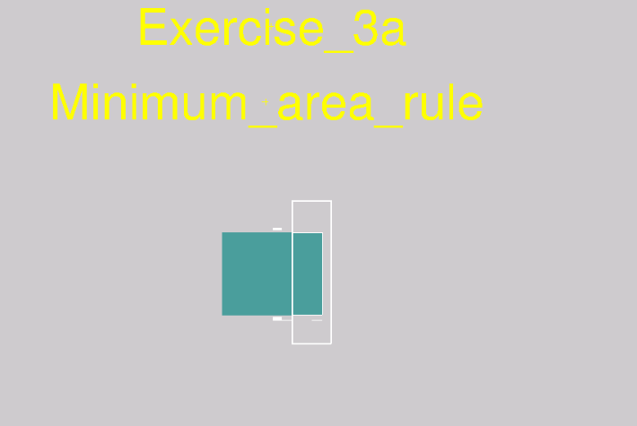
   * 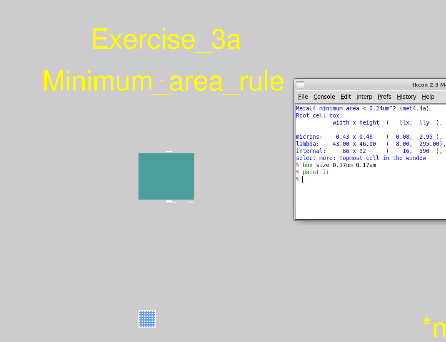

3. **Diffusion Tap Overlap Check:**
   * Evaluating tap overlap constraints (`diff/tap.10` and `licon.7`) in tkcon:
     ```text
     N-well overlap of N-tap < 0.18um (diff/tap.10)
     N-tap overlap of N-tap contact < 0.12um in one direction (licon.7)
     ```
   * 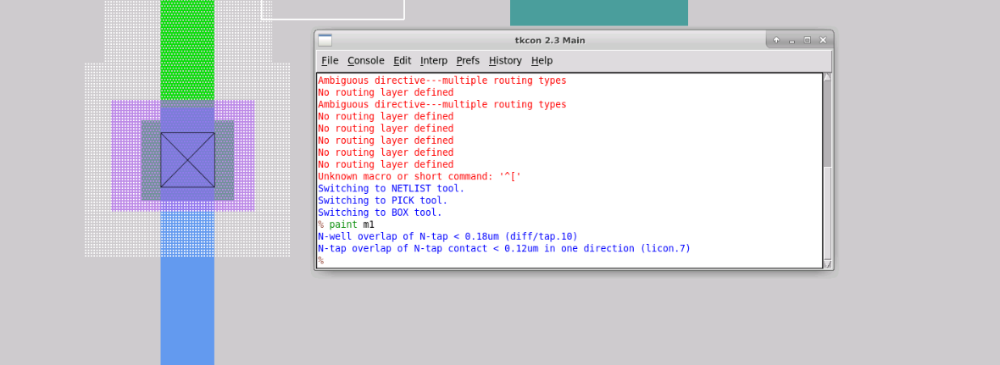

---

### Part 2: Debugging & Fixing Exercise_3b (Minimum Hole Rule)

1. **Rule Concept:**
   * Enclosed void holes inside continuous metal planes must satisfy minimum dimension rules to prevent resist collapse and manufacturing flaws during photolithography.

2. **Removing Enclosed Hole to Clear DRC (`No errors found`):**
   * In `Exercise_3b`, selecting and filling/removing the void hole inside the wide metal plane clears the DRC violation.
   * Executing `drc why` in tkcon verifies clean layout state:
     ```text
     No errors found.
     ```
   * Root cell box dimensions ($0.45\,\mu\text{m} \times 0.35\,\mu\text{m}$, area $0.16\,\mu\text{m}^2$) pass all checks with zero errors!
   * 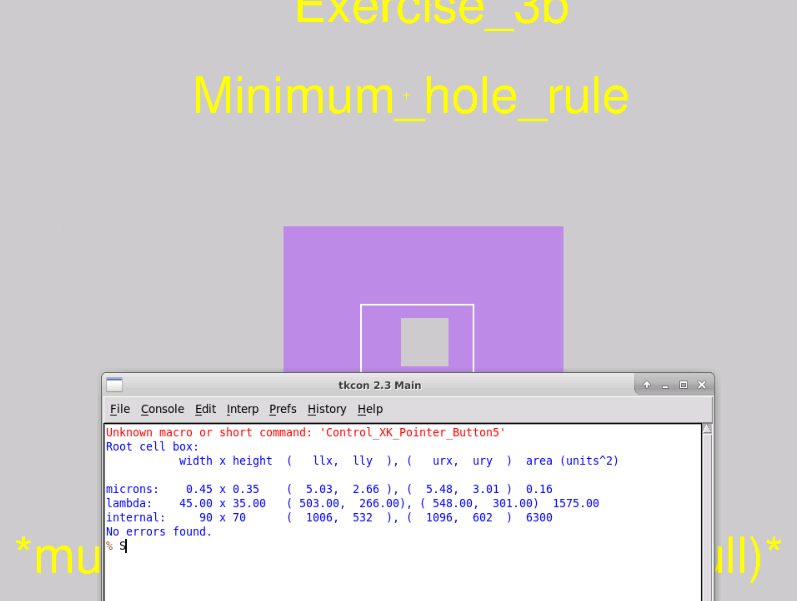

---

## PV_D3SK2_L5: Lab For Wells And Deep N-Well

### Overview of Exercise 4 Setup
This lab (`exercise_4`) focuses on well definitions, substrate tap placement, and well enclosure constraints:
* **Left Region:** P-well (`pwell`) requiring P-substrate tap (`ptap`) connections to `VSS`.
* **Right Region:** N-well (`nwell`) requiring N-substrate tap (`ntap`) connections to `VDD`.

---

### Part 1: Debugging & Fixing Exercise_4a (Wells & Substrate Layer Setup)

1. **Substrate Tap Rule Requirements:**
   * All active CMOS devices inside P-well or N-well must be properly biased to prevent latch-up.
   * To resolve initial DRC errors, construct substrate tap layers directly over the P-well on the left and the N-well on the right.
2. **Visual Inspection & Substrate Layer Placement:**
   * 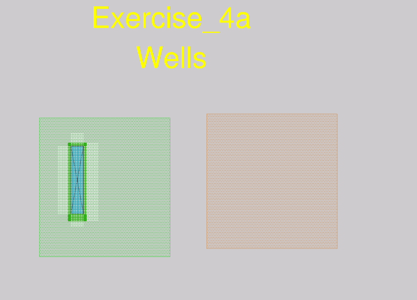

---

### Part 2: Debugging & Fixing Exercise_4b (Substrate Tap Overlap & DRC Clearance)

1. **Adjusting Substrate Tap Enclosure:**
   * Expand the tap contact box and paint local interconnect (`li`) layer to satisfy minimum overlap rules ($0.12\,\mu\text{m}$ surround constraint):
     ```tcl
     box grow c 0.12um
     paint li
     ```
2. **DRC Clearance Verification:**
   * Expanding the interconnect overlay provides valid substrate pick-up contacts across both P-well and N-well regions, completely clearing the well tap DRC violations.
   * 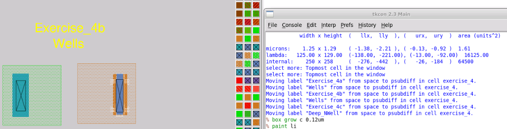

---

## PV_D3SK2_L6: Lab For Derived Layers

### Overview of Exercise 5 Setup
This lab (`exercise_5`) covers inspecting and debugging derived layers created by boolean operations (e.g. `gate = poly AND diff`, `nfet = gate AND nsdm`) within Magic's SkyWater SKY130 technology file:
* **Exercise 5a (`Exercise_5a: Derived_layers`)**: Channel & implant layer definitions.
* **Exercise 5b (`Exercise_5b: Derived_layers`)**: Transistor type identification (`mvnmos`, `mvndiff`, `LVTN`, `HVI`).
* **Exercise 5c (`Exercise_5c: Derived_layers`)**: Derived layer spacing rules between adjacent active channels.

---

### Part 1: Sub-Exercise 5a — Channel & Implant Derived Layers (`Exercise_5a`)

1. **Derived Layer Concept:**
   * Magic computes temporary derived layers on the fly to enforce complex DRC rules without storing redundant geometry data in GDSII.
2. **Querying Diffusion & Polysilicon Layers (`cif see`):**
   * Inspect basic diffusion and gate layers in tkcon:
     ```tcl
     cif see DIFF
     cif see POLY
     ```
   * 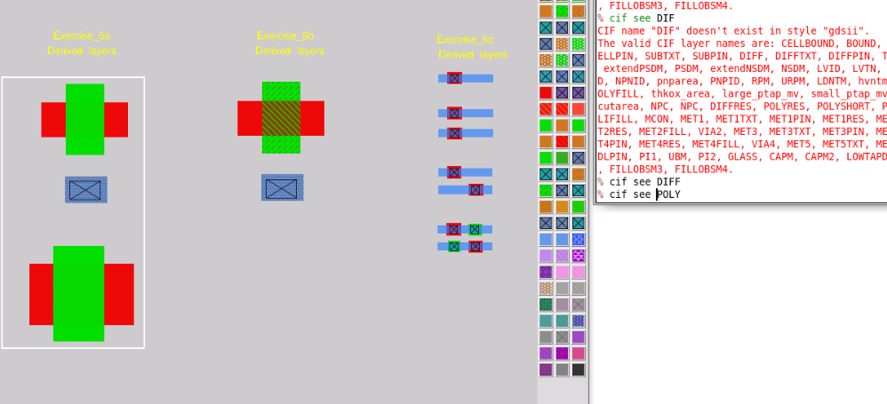
   * 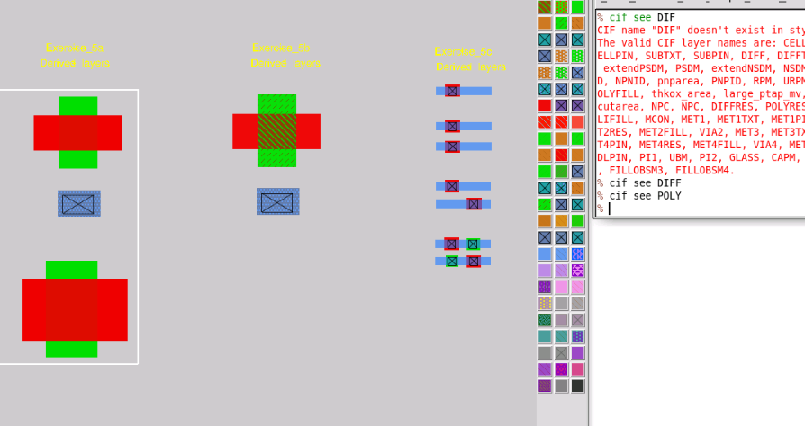

3. **Source/Drain Implant Inspection (`NSDM` / `PSDM`):**
   * Inspect N-diffusion (`NSDM`) and P-diffusion (`PSDM`) implant masks:
     ```tcl
     cif see NSDM
     cif see PSDM
     ```
   * 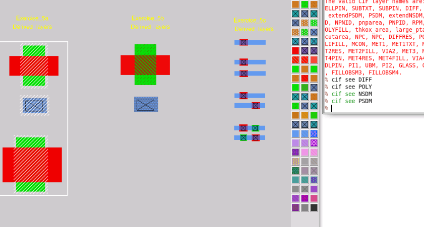

---

### Part 2: Sub-Exercise 5b — Querying Transistor Mask Types (`Exercise_5b`)

1. **Identifying Tile Types (`what` command):**
   * Hover cursor over active transistor regions in `Exercise_5b` and execute `what` in tkcon:
     ```text
     Selected mask layers:
         mvnmos  ( Topmost cell in the window )
         mvndiff ( Topmost cell in the window )
     ```
   * 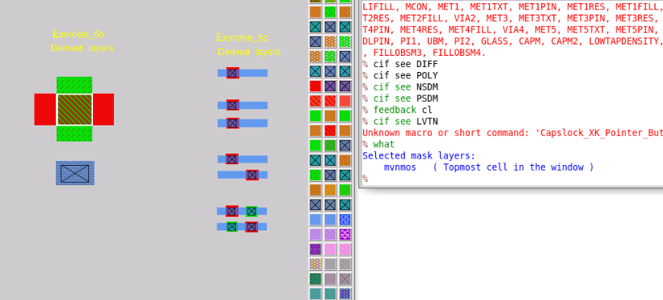
   * 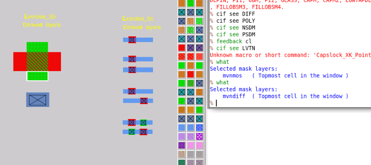

2. **Special Implant & Voltage Layers (`LVTN` & `HVI`):**
   * Clear feedback and query Low Threshold Voltage (`LVTN`) and High Voltage Isolation (`HVI`) layers:
     ```tcl
     feedback cl
     cif see NSDM
     cif see HVI
     ```
   * 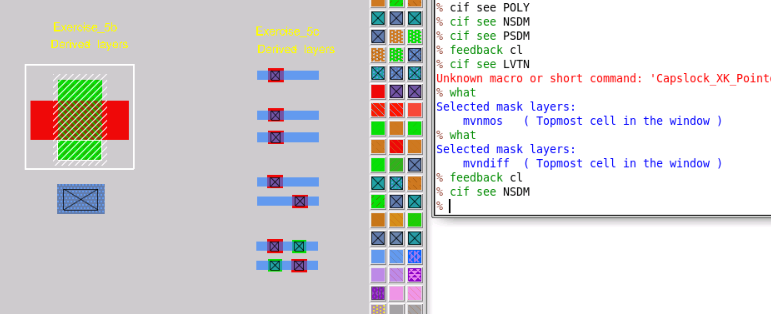
   * 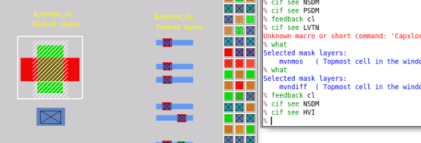

---

### Part 3: Sub-Exercise 5c — Derived Layer Spacing Rules (`Exercise_5c`)

1. **DRC Violation Diagnostic:**
   * In `Exercise_5c`, adjacent channel/contact structures placed within close proximity trigger derived layer spacing violations between opposing implant masks (`NSDM` vs `PSDM`).
   * 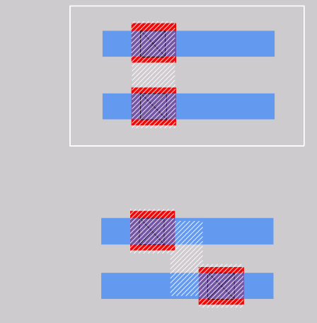

2. **Fixing Derived Spacing Violations:**
   * Adjust contact placement and space out alternating implant tiles to satisfy minimum derived spacing constraints.
   * Executing `drc why` returns clean status for Exercise 5c.
   * 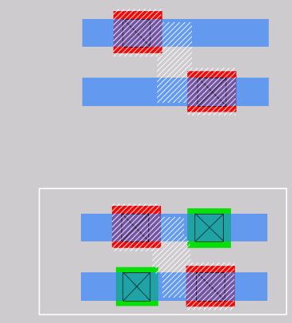

---

## PV_D3SK2_L7: Lab For Parameterized And PDK Devices

### Overview of Exercise 6 Setup
This lab (`exercise_6`) focuses on verifying Parameterized Cells (P-Cells) and foundry PDK library macro blocks (such as ESD and I/O cells) within Magic:
* **Exercise 6a (`Exercise_6a: Parameterized_devices`)**: Variable parameter transistor P-Cells with integrated guard rings.
* **Exercise 6b (`Exercise_6b`)**: PDK I/O signal macro cells (`sky130_fd_io__signal_5_sym_hv_local_5term`).

---

### Part 1: Exercise_6a — Parameterized Transistor Cells (P-Cells)

1. **P-Cell Features in Magic:**
   * Parameterized cells automatically generate correct layout geometries (finger counts, gate width $W$, gate length $L$, and substrate guard ring enclosures) while maintaining DRC compliance.
2. **Visual Inspection:**
   * 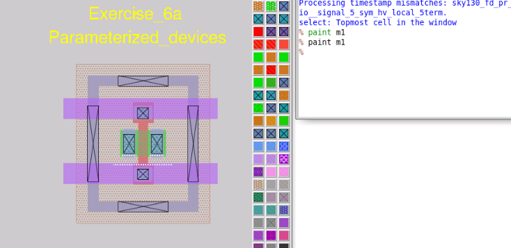
   * 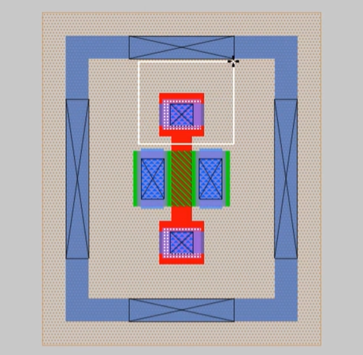

---

### Part 2: Exercise_6b — PDK Library Macro Cells & Subcell Hierarchy

1. **Inspecting PDK Hard Macros:**
   * Foundry PDK macro cells contain complex multi-layer structures and protective boundary warnings (e.g. `DO NOT MERGE WITH PFET NWELL`).
   * 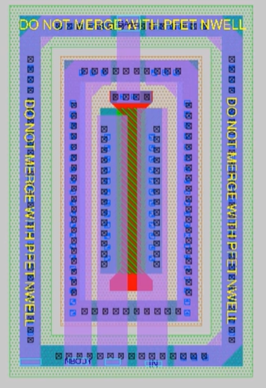

2. **Cell Hierarchy & Filepath Inspector:**
   * Selecting macro cell instances displays the underlying PDK reference file path in tkcon:
     ```text
     cellname filepath sky130_fd_io__signal_5_sym_hv_local_5term
     /usr/share/pdk/sky130A/libs.ref/sky130_fd_io/mag
     ```
   * 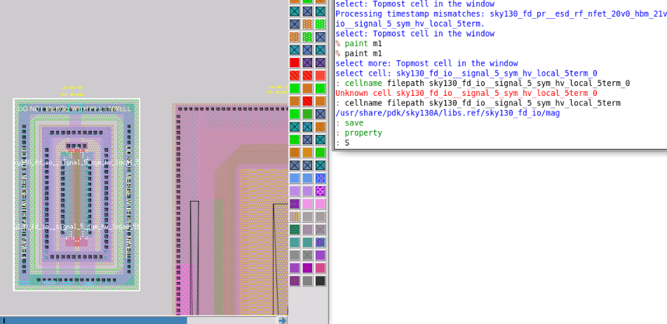

3. **Full Canvas Layout View:**
   * Overview of `exercise_6` combining custom P-Cell transistors and PDK macro blocks:
   * 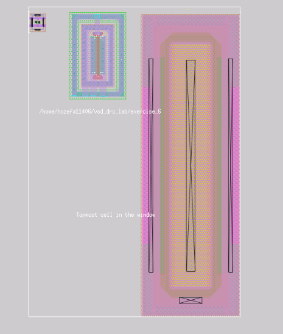

---

## PV_D3SK2_L8: Lab For Angle Error And Overlap Rule

### Overview of Exercise 7 Setup
This lab (`exercise_7`) addresses off-grid geometry alignment (`Exercise_7a Off-grid_error`), non-manhattan angle errors (`Exercise_7b` & `7c Angle_error`), layer splitpainting, and upper metal via overlap rules. Initial cell load starts with `DRC=8`.

---

### Part 1: Exercise_7a — Manufacturing Grid & Off-Grid Angle Errors

1. **Manufacturing Grid Alignment:**
   * Magic enforces manufacturing grid snap limits ($0.005\,\mu\text{m}$). Moving polygons off-grid triggers grid alignment warnings:
     ```text
     This position does not align with the manufacturing grid
     ```
   * Non-manhattan off-grid edges generate white dotted DRC error boxes.
   * 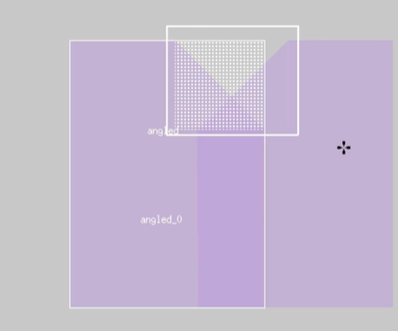
   * 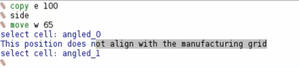

---

### Part 2: Exercise_7b & 7c — Angle Errors & Layer Overlap Checks

1. **Initial DRC Status (`DRC=8`):**
   * Overview of `exercise_7` displaying off-grid and angle errors across sub-exercises 7a, 7b, and 7c.
   * 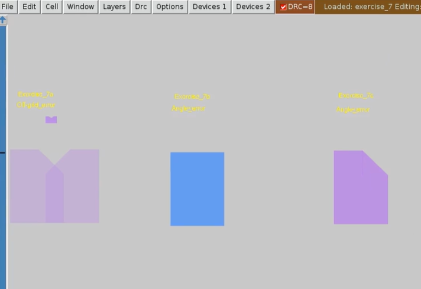

2. **Splitpainting & Overlap Constraints:**
   * Testing splitpaint operations (`splitpaint sw m1`) and verifying layer overlap legality:
     ```text
     Can't overlap those layers
     ```
   * 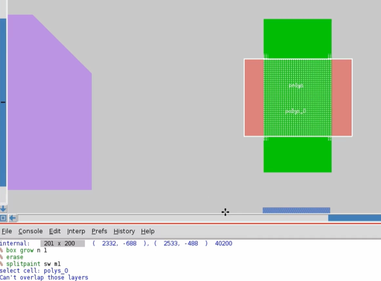

---

### Part 3: Overlap Rules & Via Arrays (`via2`)

1. **Verifying Upper Via Overlaps (`cif see VIA2`):**
   * Inspecting `via2` cut array enclosure over metal interconnect layers:
     ```tcl
     cif see VIA2
     ```
   * 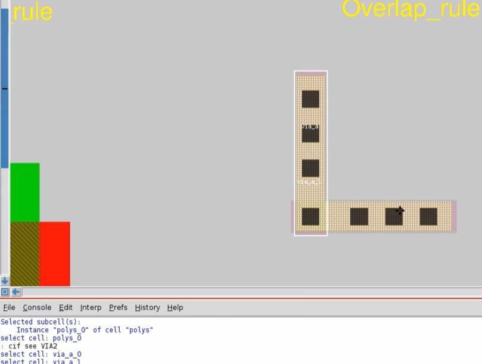

---

## PV_D3SK2_L9: Lab For Unimplemented Rules

### Objective
Identify DRC rules not directly supported by Magic's built-in engine and offload verification to KLayout DRC scripts.

1. **Unimplemented Rule Handling:**
   * Complex 2D contextual rules (e.g. End-of-Line spacing with run length) are exported to KLayout DRC script format (`.drc`).
2. **Executing KLayout DRC Batch:**
   ```bash
   klayout -b -r sky130A_drc.drc -rd input=design.gds
   ```

---

## PV_D3SK2_L10: Latch-up And Antenna Rules

### Objective
Setup and verify latch-up tap distance checks and antenna ratio calculation scripts.

1. **Latch-up Check:**
   * Measure distance from every transistor diffusion edge to nearest `ntap`/`ptap`.
   * If distance $> 20\,\mu\text{m}$, insert substrate tap.
2. **Antenna Rule Check:**
   * Calculate ratio of metal area connected to poly gate.
   * Insert antenna diode (`sky130_fd_pr__diode`) if ratio exceeds PDK limit.

---

## PV_D3SK2_L11: Lab For Density Rules

### Objective
Execute metal density checks and generate dummy metal fill.

1. **Running Density Script:**
   * Calculate metal density over $100\,\mu\text{m} \times 100\,\mu\text{m}$ sliding windows.
2. **Generating Dummy Metal Fill:**
   * Run OpenLane / KLayout dummy fill generation script to insert floating `metal1` through `metal5` tiles in sparse regions.
