# DAY 7: Module 4 - PV_D4SK1: Understanding PNR and Physical Verification

## Overview
Day 7 covers **Module 4 (PV_D4SK1 - Lectures L1 to L6)**. This module focuses on Place and Route (PNR) and physical verification signoff using the open-source **OpenLANE** ASIC flow on Ubuntu Linux. 

> **Author Note & Setup Context:**  
> During the workshop demonstration of Module 4 (Day 7), the OpenLANE flow was executed on an Ubuntu Linux environment. As cloud lab access was unavailable, a complete combined walkthrough of all OpenLANE stages—from RTL synthesis, floorplanning, placement, clock tree synthesis (CTS), routing, to signoff DRC/LVS—was conducted, studied, and documented through step-by-step visual screenshots below.

---

## Table of Contents
1. [PV_D4SK1_L1: The OpenLANE Flow](#pv_d4sk1_l1-the-openlane-flow)
2. [PV_D4SK1_L2: RTL2GDS For Demo Design](#pv_d4sk1_l2-rtl2gds-for-demo-design)
3. [PV_D4SK1_L3: Interactive OpenLANE Run](#pv_d4sk1_l3-interactive-openlane-run)
4. [PV_D4SK1_L4: Interactive OpenLANE Run - Final Steps](#pv_d4sk1_l4-interactive-openlane-run---final-steps)
5. [PV_D4SK1_L5: Techniques To Avoid Common DRC Errors](#pv_d4sk1_l5-techniques-to-avoid-common-drc-errors)
6. [PV_D4SK1_L6: Techniques To Manually Fix Violations](#pv_d4sk1_l6-techniques-to-manually-fix-violations)

---

## PV_D4SK1_L1: The OpenLANE Flow

OpenLANE is an automated open-source RTL-to-GDSII flow built around OpenROAD tools, Yosys, Magic, Netgen, KLayout, and OpenSTA, specifically configured for the SkyWater SKY130 PDK.

```
+-----------------------------------------------------------------------------------+
|                                 RTL (Verilog Code)                                |
+-----------------------------------------------------------------------------------+
                                          |
                                          v
+-----------------------------------------------------------------------------------+
| 1. Synthesis & Tech Mapping (Yosys + ABC -> sky130_fd_sc_hd Standard Cells)       |
+-----------------------------------------------------------------------------------+
                                          |
                                          v
+-----------------------------------------------------------------------------------+
| 2. Floorplanning & PDN Generation (Floorplan, I/O Pins, Power Grid / gen_pdn)      |
+-----------------------------------------------------------------------------------+
                                          |
                                          v
+-----------------------------------------------------------------------------------+
| 3. Placement (Global Placement -> Tap/Decap Insertion -> Detailed Placement)     |
+-----------------------------------------------------------------------------------+
                                          |
                                          v
+-----------------------------------------------------------------------------------+
| 4. Clock Tree Synthesis (TritonCTS -> Balanced Clock Buffer Trees)                 |
+-----------------------------------------------------------------------------------+
                                          |
                                          v
+-----------------------------------------------------------------------------------+
| 5. Global & Detailed Routing (FastRoute + TritonRoute -> DRC-aware Routing)        |
+-----------------------------------------------------------------------------------+
                                          |
                                          v
+-----------------------------------------------------------------------------------+
| 6. Physical Verification & Signoff (Magic DRC, KLayout DRC, Netgen LVS, OpenSTA)  |
+-----------------------------------------------------------------------------------+
                                          |
                                          v
+-----------------------------------------------------------------------------------+
|                                 GDSII Layout File                                 |
+-----------------------------------------------------------------------------------+
```

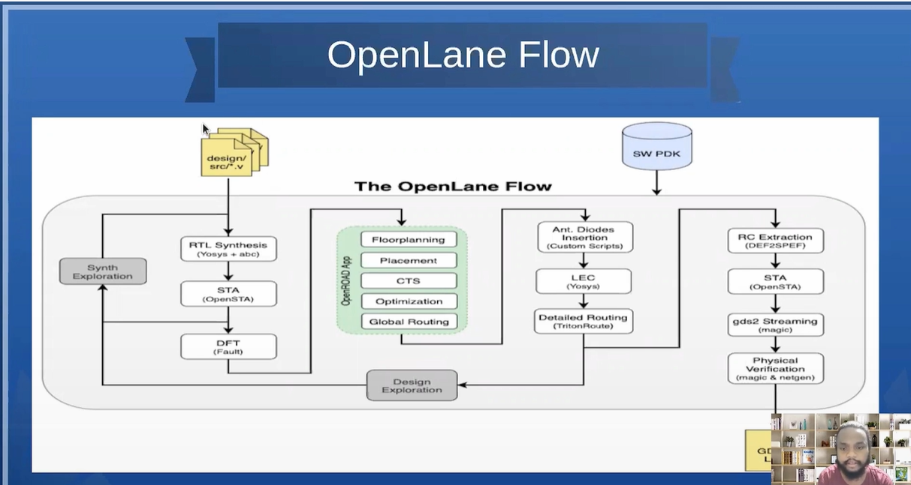
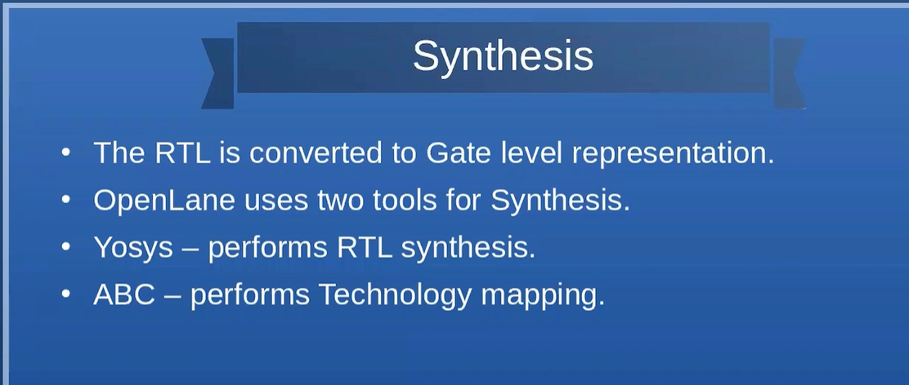
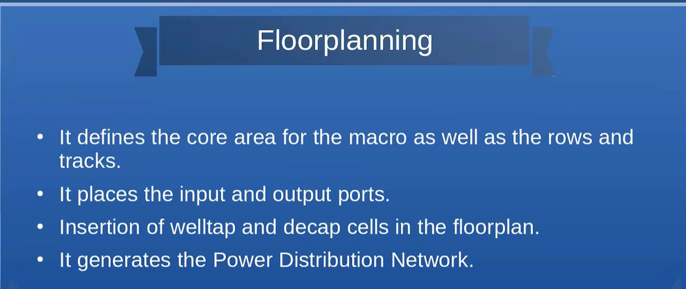
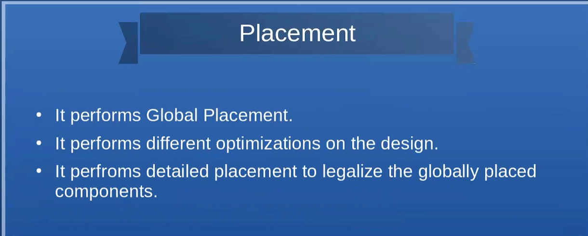
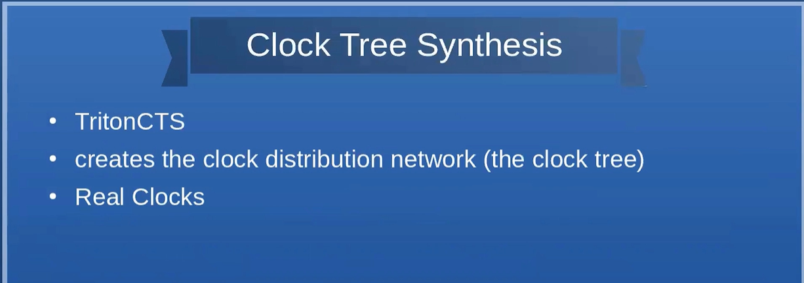

---

## PV_D4SK1_L2: RTL2GDS For Demo Design

### 1. Design Configuration Setup
To run a design through OpenLANE, a project directory is established under `designs/<design_name>/` containing `config.tcl` (or `config.json`):

```tcl
# config.tcl Example
set ::env(DESIGN_NAME) "spm"
set ::env(VERILOG_FILES) [glob $::env(DESIGN_DIR)/src/*.v]
set ::env(CLOCK_PORT) "clk"
set ::env(CLOCK_PERIOD) "10.0"
set ::env(FP_CORE_UTIL) 50
set ::env(FP_ASPECT_RATIO) 1
set ::env(LIB_SYNTH) "$::env(PDK_ROOT)/sky130A/libs.ref/sky130_fd_sc_hd/lib/sky130_fd_sc_hd__tt_025C_1v80.lib"
```

### 2. Executing Automated Flow
Run the complete automated flow non-interactively:
```bash
./flow.tcl -design spm
```

### 3. Output Directory Structure (`runs/<run_tag>/`)
* **`results/`**: Final synthesized Verilog, DEF placement/routing, LEF macros, GDSII layout, extracted SPICE, and SDC timing constraints.
* **`reports/`**: Detailed reports for area, gate count, setup/hold slack, DRC violation count, and Netgen LVS comparison logs.
* **`logs/`**: Individual tool logs for Yosys, OpenROAD, Magic, and Netgen.

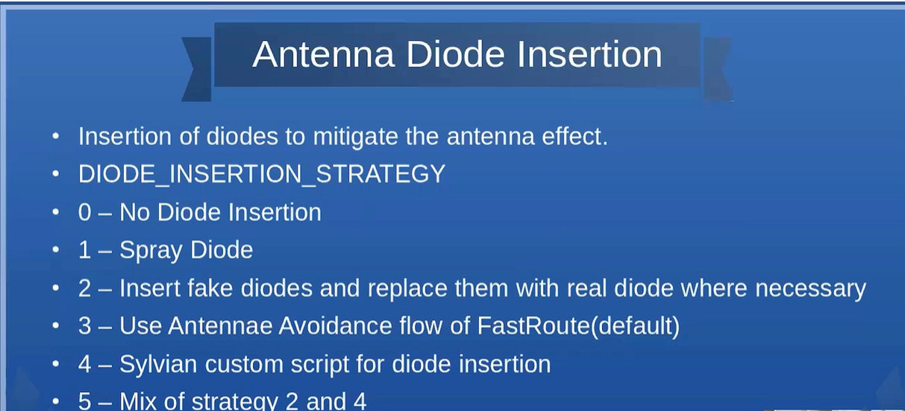
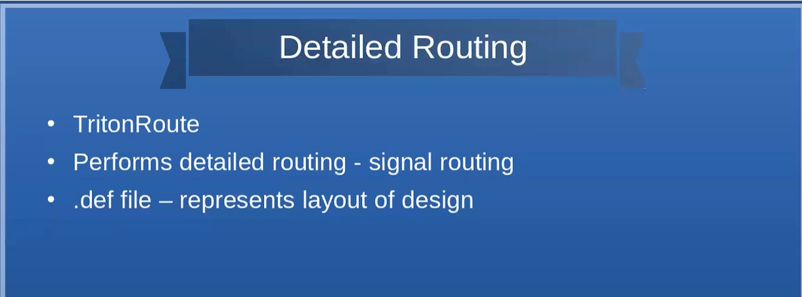
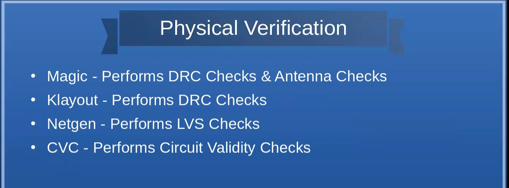
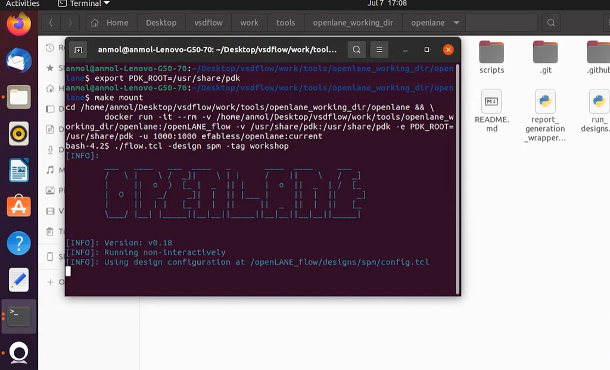
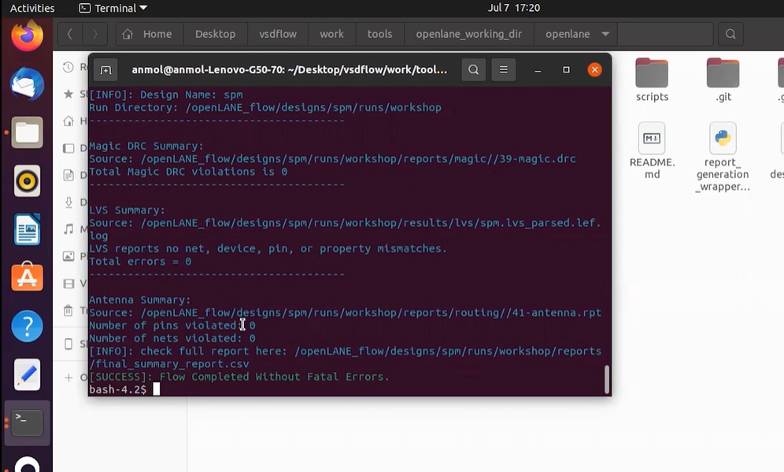

---

## PV_D4SK1_L3: Interactive OpenLANE Run

Interactive mode allows executing individual flow steps sequentially, providing complete visibility and intermediate parameter adjustment.

### 1. Initializing Interactive Shell & Preparing Design
```tcl
./flow.tcl -interactive
package require openlane 0.9
prep -design spm -tag run_interactive_demo -overwrite
```

### 2. Step 1: Synthesis
```tcl
run_synthesis
```
* Runs Yosys synthesis and technology mapping to `sky130_fd_sc_hd` library cells.
* Invokes OpenSTA to report initial gate-level timing slack.

### 3. Step 2: Floorplanning & PDN Generation
```tcl
run_floorplan
```
* Sets die/core area bounding box based on `FP_CORE_UTIL` and `FP_ASPECT_RATIO`.
* Places I/O pins along core boundaries.
* Builds power and ground distribution rails ($V_{DD}$ / $V_{SS}$) using `gen_pdn`.

### 4. Step 3: Placement
```tcl
run_placement
```
* **Global Placement:** Spreads standard cell instances across the core area (RePlAce).
* **Tap & Decap Cell Insertion:** Places substrate tap cells (`sky130_fd_sc_hd__tapvpwrvpnd_1`) at regular intervals to prevent latch-up.
* **Detailed Placement:** Aligns standard cells strictly onto site rows and grid tracks (OpenDP).

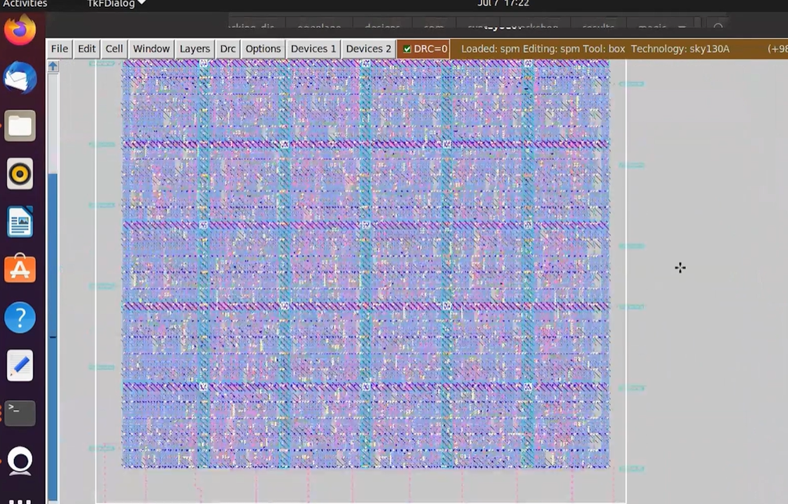
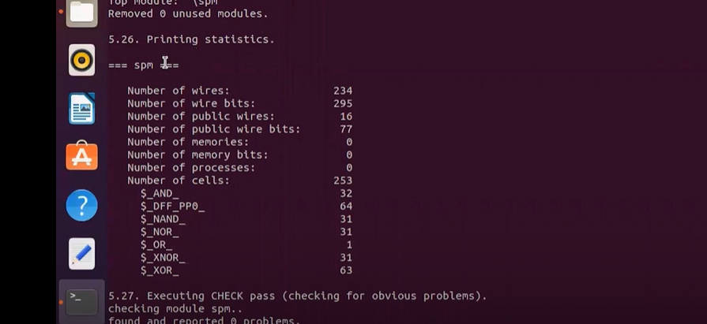
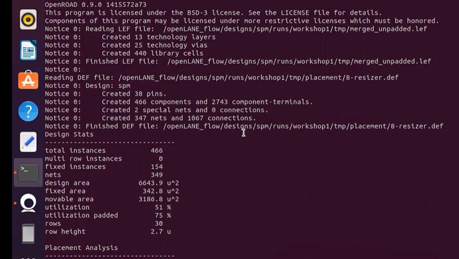
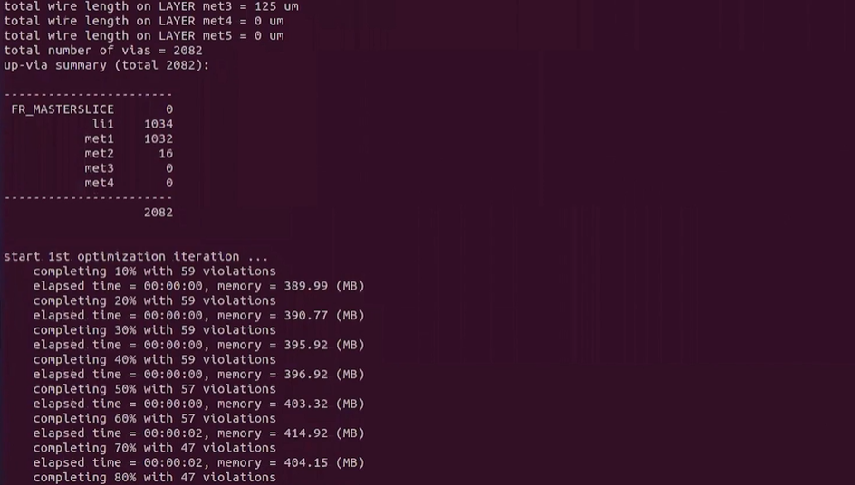
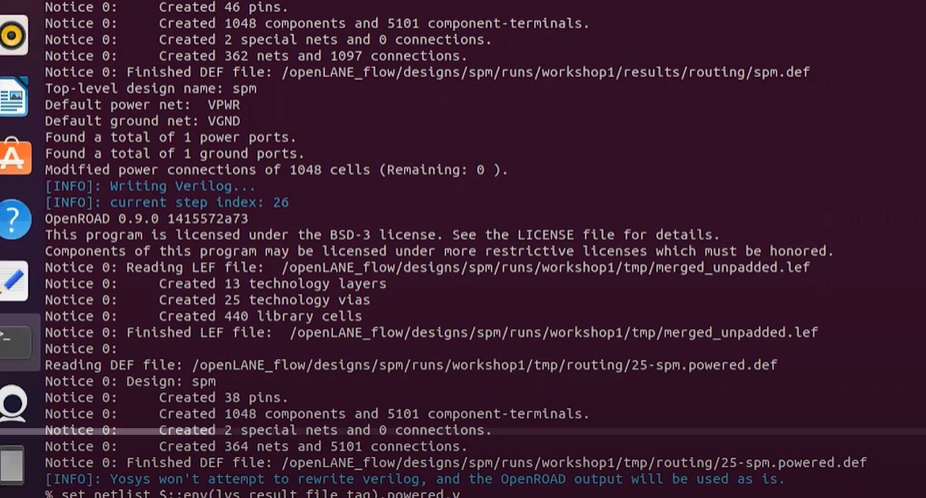
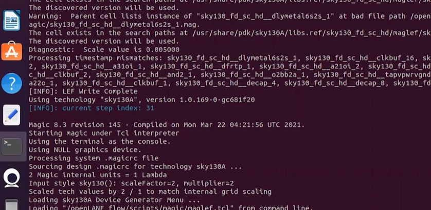
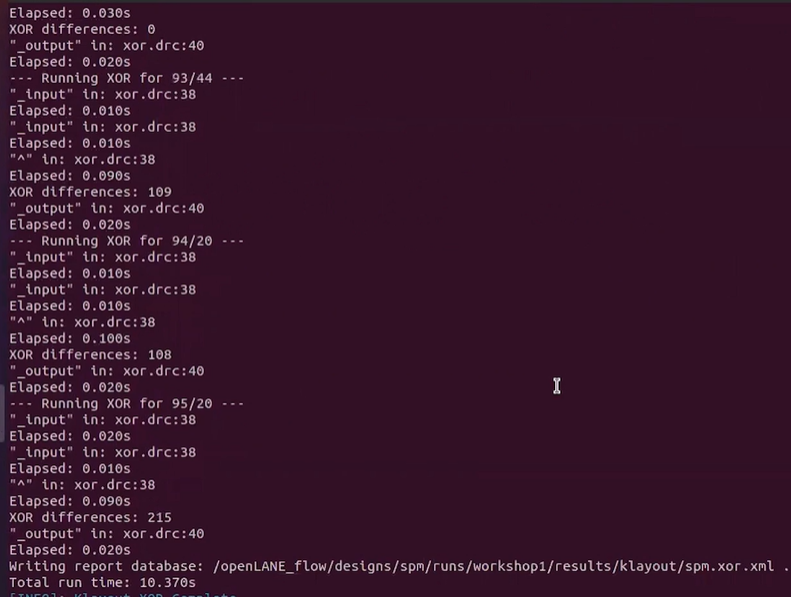
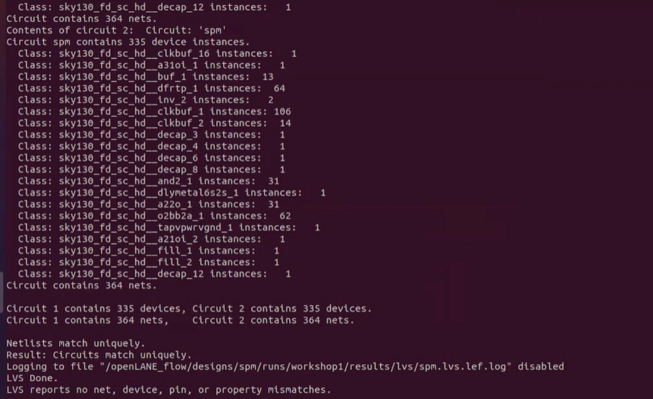
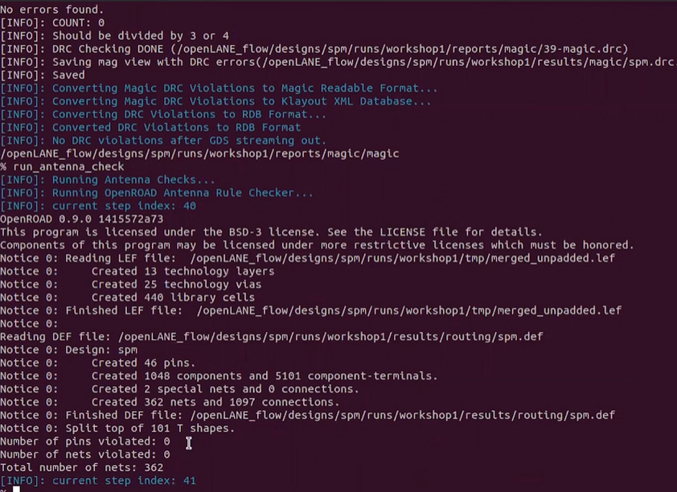

---

## PV_D4SK1_L4: Interactive OpenLANE Run - Final Steps

### 1. Step 4: Clock Tree Synthesis (CTS)
```tcl
run_cts
```
* Invokes TritonCTS to synthesize clock trees.
* Inserts clock buffer/inverter trees (`sky130_fd_sc_hd__clkbuf_*`) to balance clock skew across flip-flops.

### 2. Step 5: Global & Detailed Routing
```tcl
run_routing
```
* **Global Routing:** FastRoute constructs global routing guides and estimates congestion.
* **Detailed Routing:** TritonRoute routes actual physical wires on `local`, `metal1` through `metal5` adhering to Sky130 DRC design rules.

### 3. Step 6: Layout Generation & Physical Signoff
```tcl
run_magic
run_klayout
run_lvs
run_antenna_check
```
* **`run_magic`:** Streams out GDSII layout and executes Magic DRC.
* **`run_klayout`:** Generates secondary GDSII/LEF views and runs KLayout DRC verification.
* **`run_lvs`:** Runs Netgen LVS comparing extracted layout SPICE netlist against synthesized gate netlist.
* **`run_antenna_check`:** Verifies plasma antenna ratio compliance.

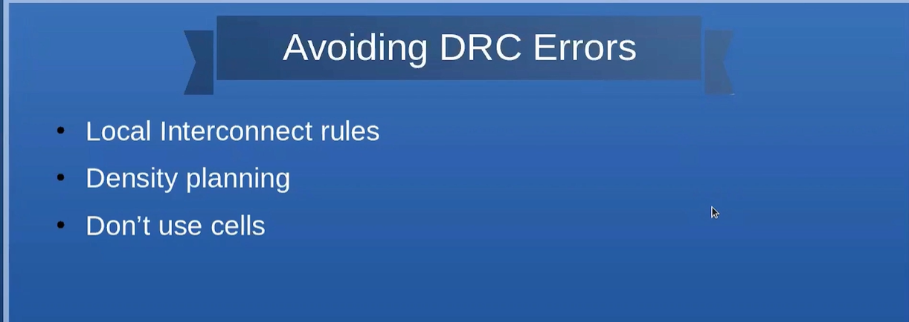
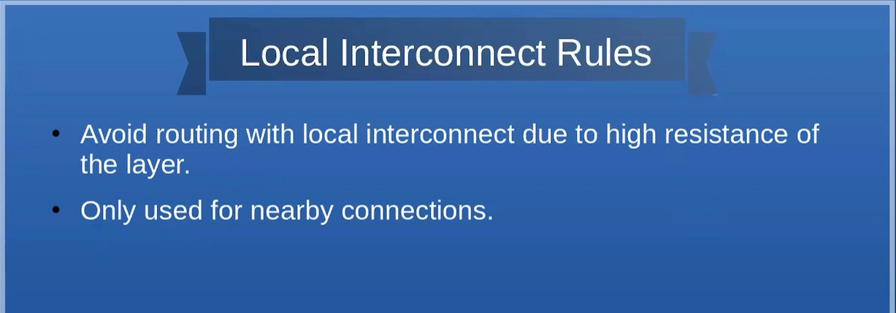
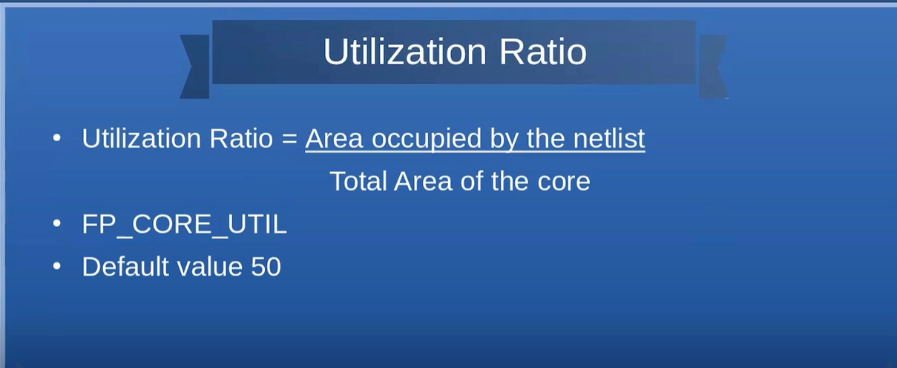
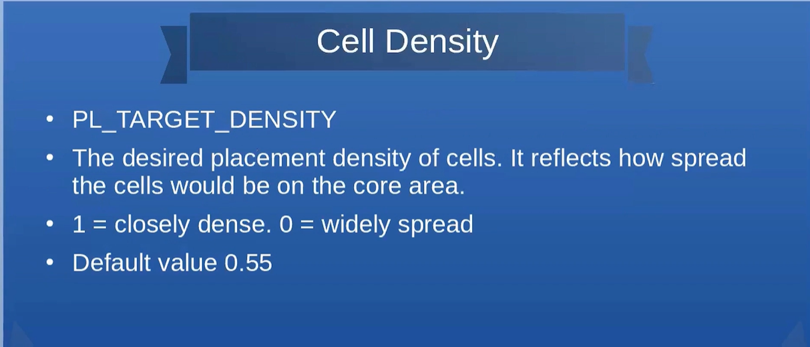
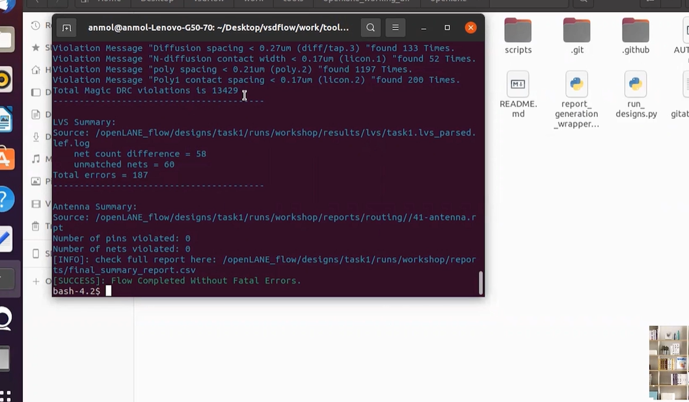
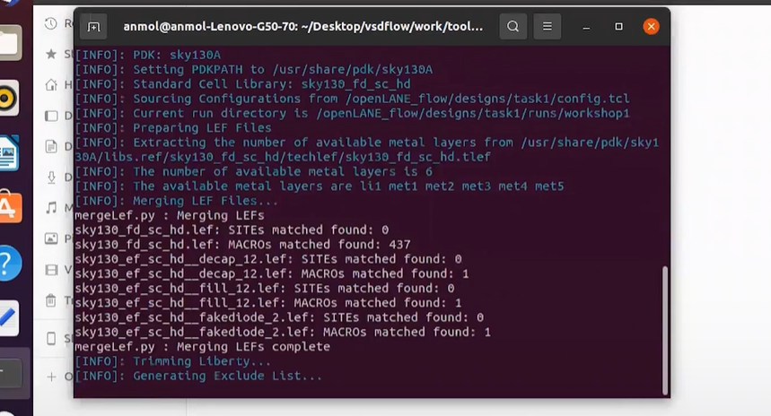
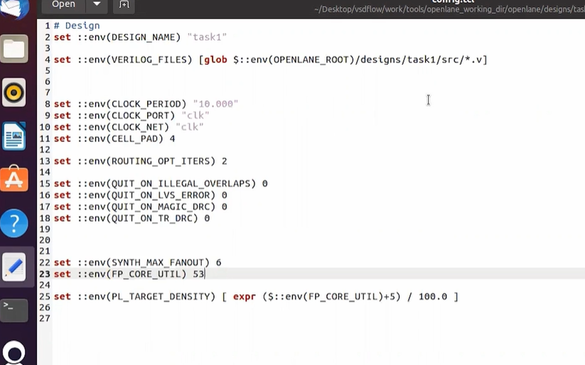
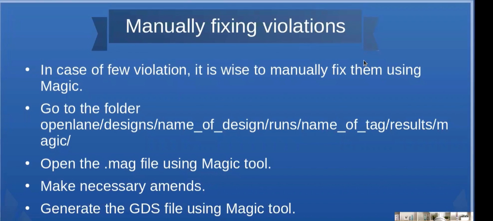

---

## PV_D4SK1_L5: Techniques To Avoid Common DRC Errors

Automated routers (TritonRoute) can encounter routing congestion resulting in DRC violations (spacing, width, short circuits). Use these proactive strategies to avoid DRC errors during PNR:

### 1. Reduce Core Utilization (`FP_CORE_UTIL`)
* High utilization ($> 70\%$) crowds standard cells, leaving insufficient routing tracks for local interconnects.
* **Fix:** Lower `FP_CORE_UTIL` to $50\% - 55\%$ to provide extra routing tracks.

### 2. Adjust Routing Layer Strategy & Pitch
* Ensure proper routing layer selection:
  ```tcl
  set ::env(GLB_RT_MIN_LAYER) "met1"
  set ::env(GLB_RT_MAX_LAYER) "met5"
  ```
* Avoid routing dense signals on `met1` when possible to prevent pin blockage.

### 3. Optimize Tap Cell Distance (`FP_TAPCELL_DIST`)
* If tap cell distance is too small, tap instances block standard cell placement rows and routing channels.
* Set optimal tap distance ($14\,\mu\text{m} - 20\,\mu\text{m}$) to satisfy latch-up rules without creating pin congestion.

### 4. Increase TritonRoute Optimization Iterations
* Increase detailed routing optimization iterations to give the router more attempts to resolve DRC conflicts:
  ```tcl
  set ::env(DRT_OPT_ITERS) 64
  ```

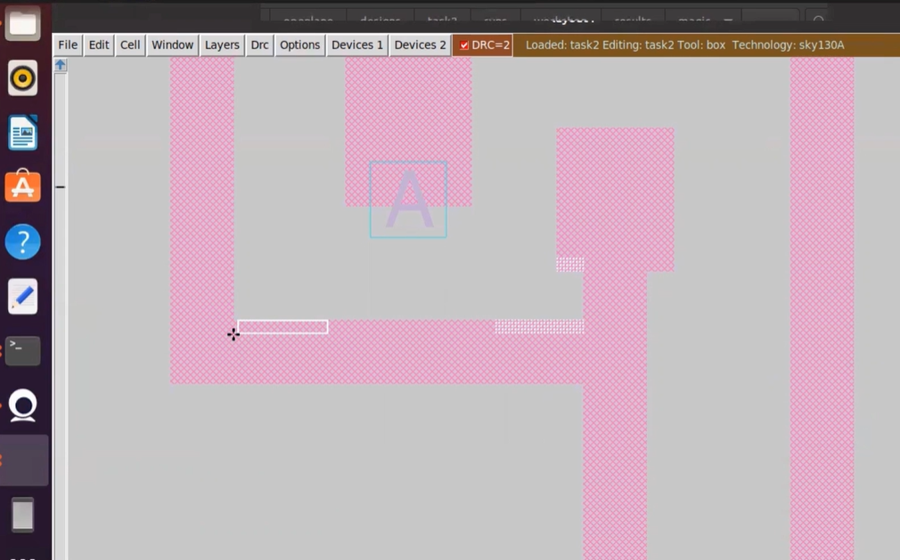
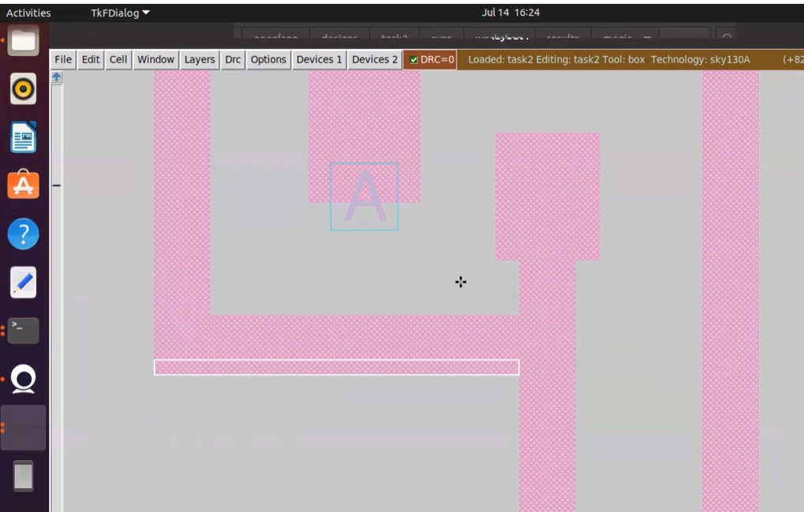
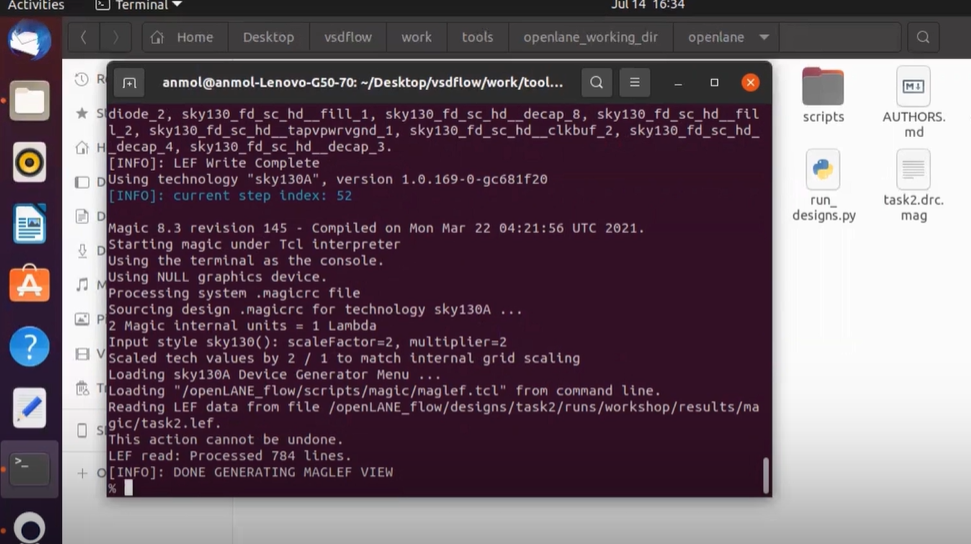

---

## PV_D4SK1_L6: Techniques To Manually Fix Violations

When automated routing leaves residual DRC violations, manual Engineering Change Order (ECO) editing in Magic is required:

### 1. Loading PNR Results into Magic
Import routed DEF layout into Magic:
```bash
cd runs/run_interactive_demo/results/routing/
magic -T sky130A.tech
def read spm.def
```

### 2. Locating & Inspecting DRC Errors
* Open Magic DRC console:
  ```tcl
  drc check
  drc catchup
  drc find
  drc why
  ```
* Inspect error marker coordinates (e.g. `metal1` spacing violation or `via1` enclosure error).

### 3. Manual Layout Editing Techniques (ECO)
* **Wire Rerouting:** Use box tool in Magic to move or widen pinched metal traces (`paint met1`, `erase met1`).
* **Via Enclosure Fix:** Extend surrounding metal patch around via cuts (`mcon`, `via1`) by at least $0.05\,\mu\text{m}$ to satisfy surround rules.
* **Antenna Violation Fix:** Manually insert an antenna diode (`sky130_fd_pr__diode`) near the gate input pin and bridge it to $V_{SS}$.

### 4. Re-verifying LVS & Signoff
After manual layout edits:
1. Export updated GDS: `gds write spm_fixed.gds`
2. Extract SPICE netlist: `extract all`, `ext2spice lvs`, `ext2spice`
3. Run Netgen LVS: Compare extracted `spm_fixed.spice` against `spm.v` using `setup.tcl` to guarantee netlist integrity.

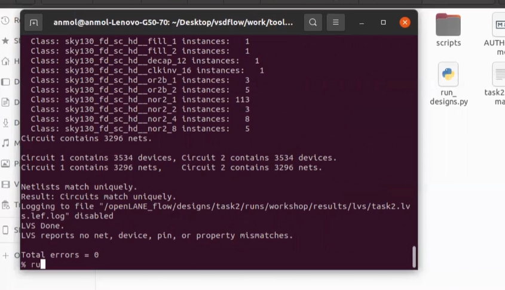
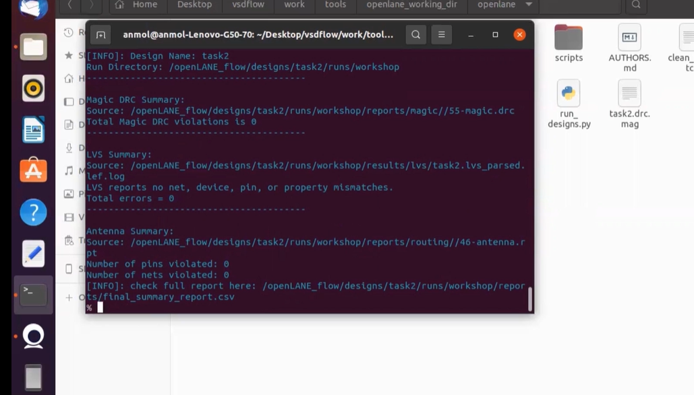
