# DAY 9: Module 5 - PV_D5SK2: LVS Labs (Part 1)

## Overview
Day 9 covers **Module 5 (Part 2: PV_D5SK2 - Lectures L1 to L6)**. This practical lab module provides hands-on exercises for executing Netgen LVS comparisons on simple circuits, hierarchical subcircuits, blackboxed subblocks, low-level SPICE primitive components, and a small analog block (Power-On Reset circuit).

---

## Table of Contents
1. [PV_D5SK2_L1: Simple LVS Experiment](#pv_d5sk2_l1-simple-lvs-experiment)
2. [PV_D5SK2_L2: LVS With Subcircuits](#pv_d5sk2_l2-lvs-with-subcircuits)
3. [PV_D5SK2_L3: LVS With Blackboxes Subcircuits](#pv_d5sk2_l3-lvs-with-blackboxes-subcircuits)
4. [PV_D5SK2_L4: LVS With SPICE Low Level Components](#pv_d5sk2_l4-lvs-with-spice-low-level-components)
5. [PV_D5SK2_L5: LVS For Small Analog Block - Power-On Reset - Part 1](#pv_d5sk2_l5-lvs-for-small-analog-block---power-on-reset---part-1)
6. [PV_D5SK2_L6: LVS For Small Analog Block - Power-On Reset - Part 2](#pv_d5sk2_l6-lvs-for-small-analog-block---power-on-reset---part-2)

---

## PV_D5SK2_L1: Simple LVS Experiment

### Overview of Exercise 1 Setup
This lab (`vsd_lvs_lab/exercise_1`) introduces baseline Netgen LVS comparison mechanics by comparing primitive netlists (`netA.spice` and `netB.spice`) with direct device instances (`cell1`, `cell2`, `cell3`).

---

### Part 1: Netlist Inspection & Simulation vs. LVS Behavior

1. **Comparing Source Netlists (`netA.spice` & `netB.spice`):**
   * Inspect netlist definitions:
     ```spice
     * Example SPICE netlist netA.spice
     X1 A B C cell1
     X2 A B A cell2
     X3 C C A cell3
     .end
     ```
   * Running `diff netA.spice netB.spice` confirms that only comment lines differ.
   * 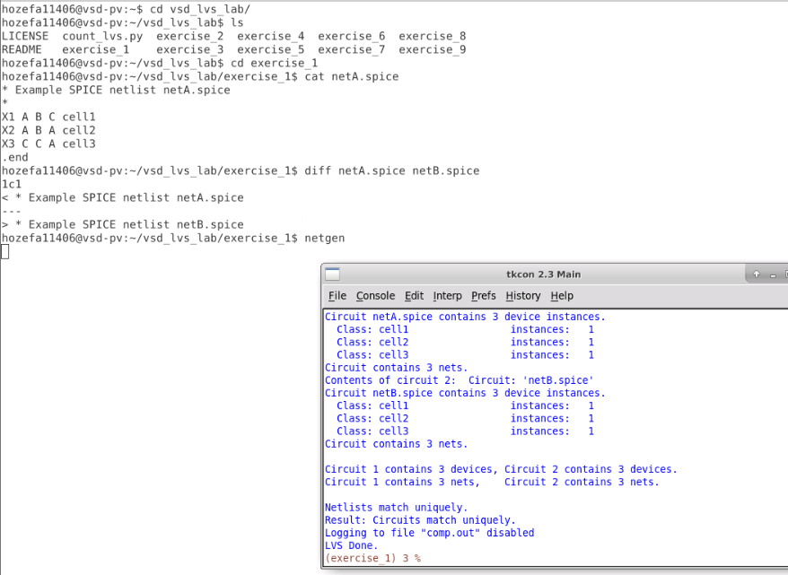

2. **NGSPICE Simulation Error Behavior:**
   * Attempting to simulate `netA.spice` in NGSPICE returns:
     ```text
     Error: unknown subckt: x1 a b c cell1
     Simulation interrupted due to error!
     ```
   * *Note:* Simulation engines require defined subcircuit models, whereas Netgen LVS compares graph connectivity without needing simulation models.
   * 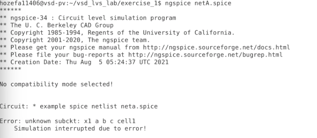
   * 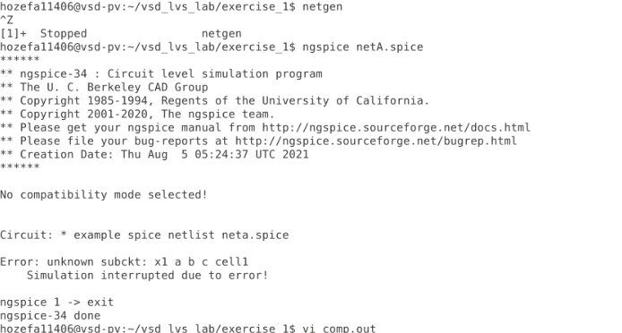

---

### Part 2: Netgen LVS Execution & Mismatch Debugging

1. **Executing Netgen LVS (`Circuits match uniquely`):**
   * Running Netgen comparison in tkcon:
     ```text
     Circuit netA.spice contains 3 device instances.
     Circuit netB.spice contains 3 device instances.
     Netlists match uniquely.
     Result: Circuits match uniquely.
     ```
   * 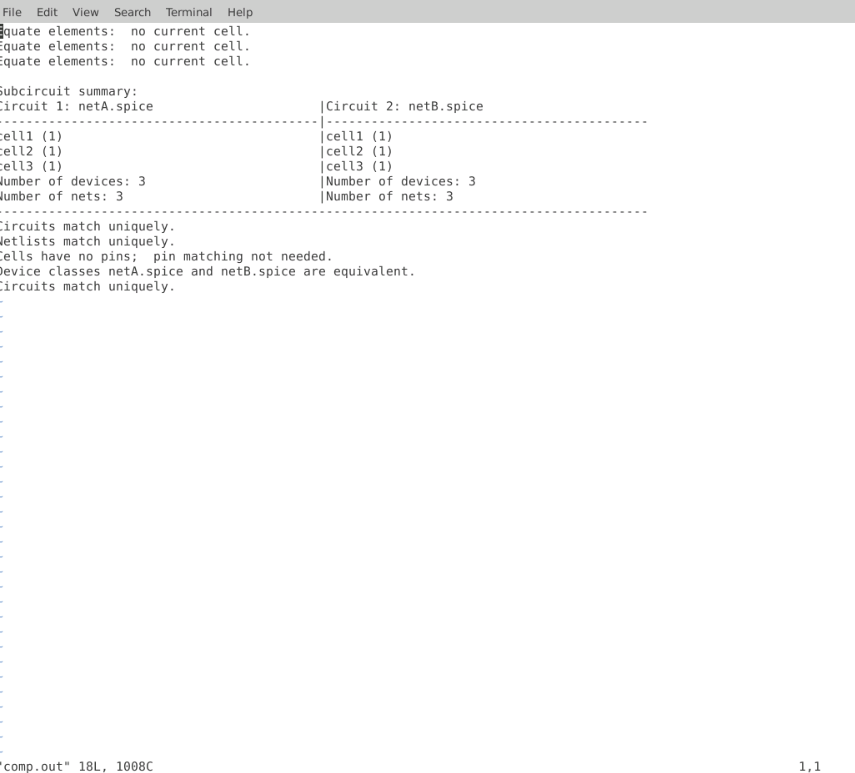

2. **Modifying Netlist Connections & Debugging Mismatch:**
   * Edit `netA.spice` to change instance net connection: `X3 B C A cell3`.
   * 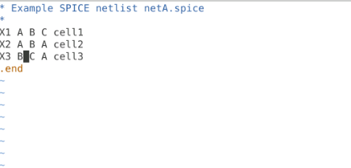
   * Re-running Netgen LVS reports `Result: Netlists do not match.`:
   * 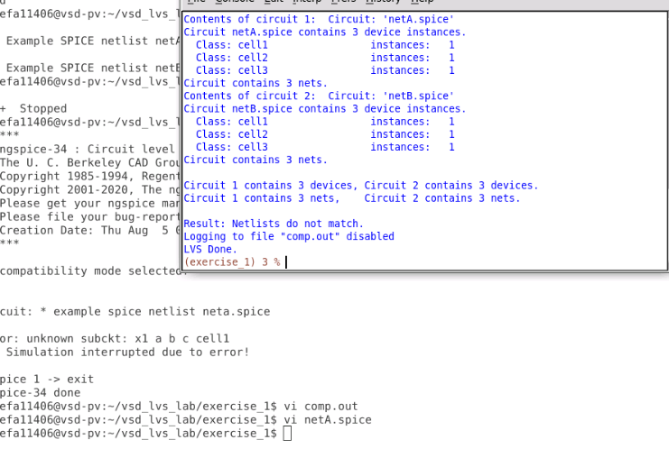

3. **Inspecting `comp.out` Detailed Log:**
   * Netgen `comp.out` details specific net fanout differences (Net B vs Net C) and instance node mismatches (`cell33` and `cell22`).
   * 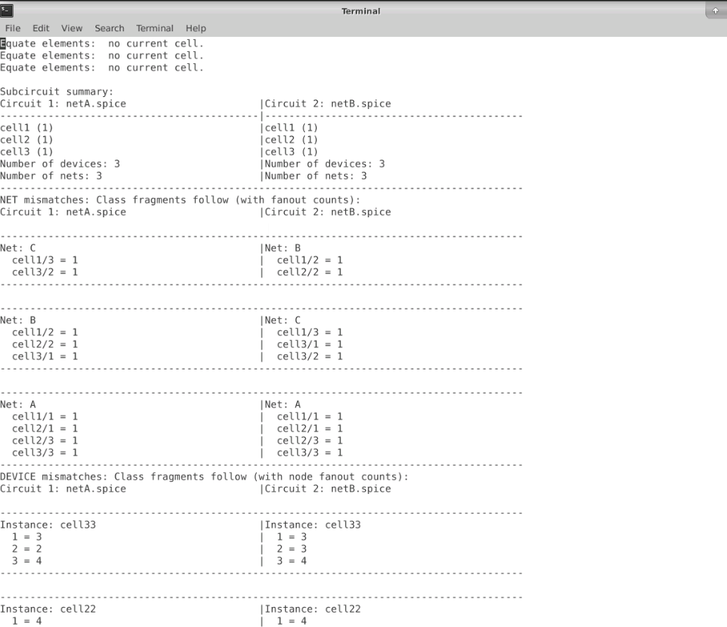

---

## PV_D5SK2_L2: LVS With Subcircuits

### Overview of Exercise 2 Setup
This lab (`vsd_lvs_lab/exercise_2`) demonstrates hierarchical LVS matching on designs wrapped inside `.subckt` definitions and evaluates subcircuit pin order sensitivity in Netgen.

---

### Part 1: Subcircuit Wrapper Netlists & Automatic Blackboxing

1. **Subcircuit Netlist Setup:**
   * Netlists wrapped inside subcircuit blocks (`.subckt test A B C ... .ends`):
     ```spice
     * Example SPICE netlist netA.spice
     .subckt test A B C
     X1 A B C cell1
     X2 A B A cell2
     X3 C C A cell3
     .ends
     .end
     ```
   * 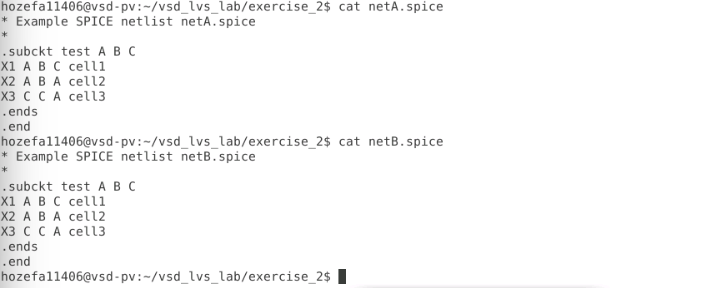

2. **Automatic Blackbox Handling:**
   * Netgen automatically treats subcircuits lacking internal definitions (`cell1`, `cell2`, `cell3`) as blackbox placeholders:
     ```text
     Warning: Equate pins: cell cell1 has no definition, treated as a black box.
     Creating placeholder cell definition.
     ```
   * 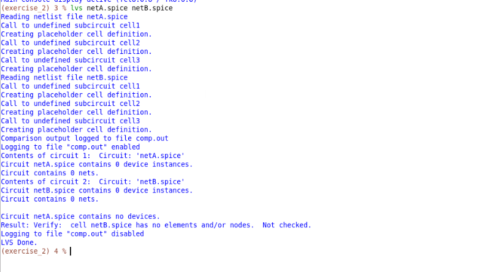
   * 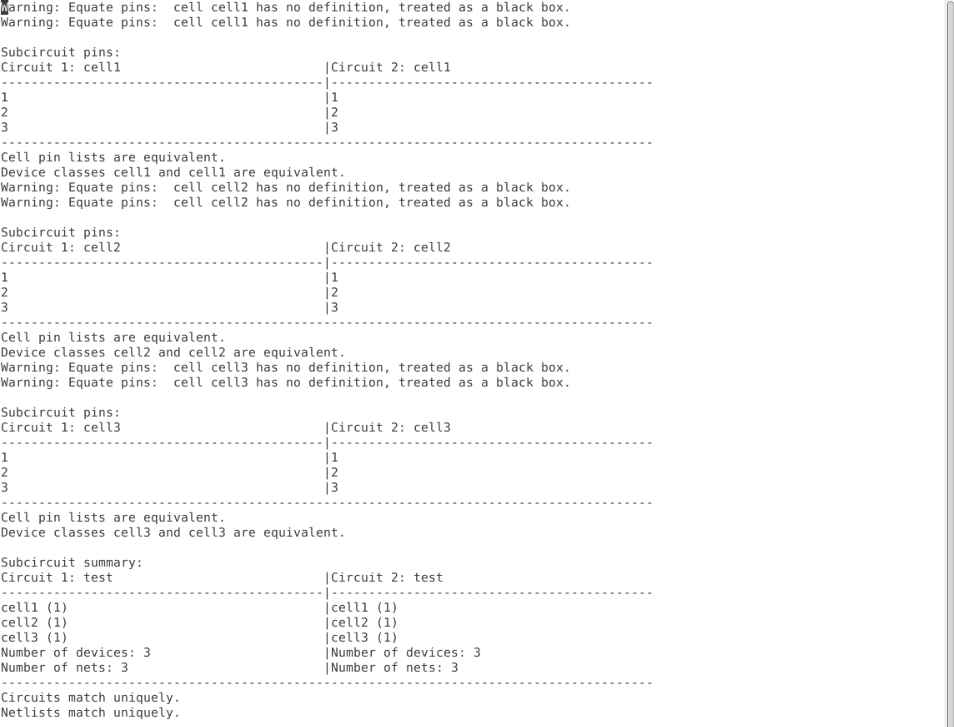
   * 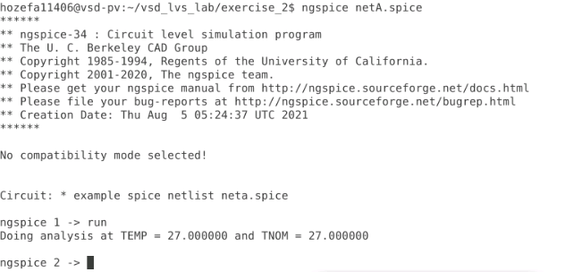

---

### Part 2: Hierarchical Matching & Pin Order Mismatch Debugging

1. **Hierarchical Matching Result (`Circuits match uniquely`):**
   * Netgen compares subcircuit pin lists and top-level block connections:
     ```text
     Cell pin lists are equivalent.
     Circuits match uniquely.
     Result: Circuits match uniquely.
     ```
   * 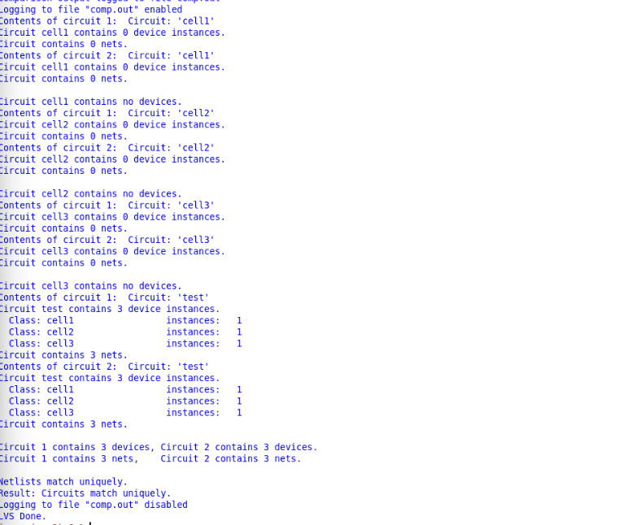
   * 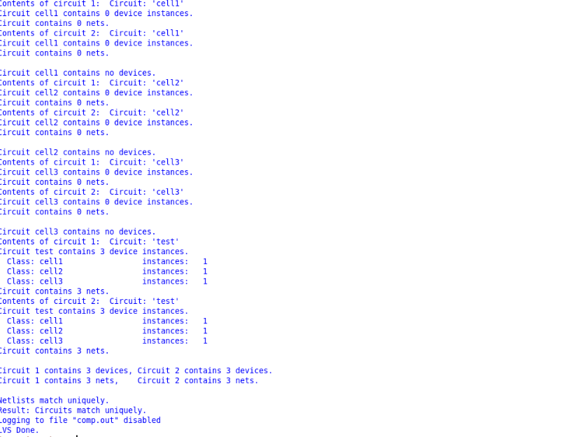

2. **Subcircuit Pin Order Mismatch Experiment:**
   * Edit `.subckt test C B A` in `netA.spice` to alter pin sequence.
   * 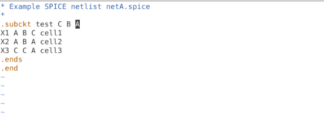
   * 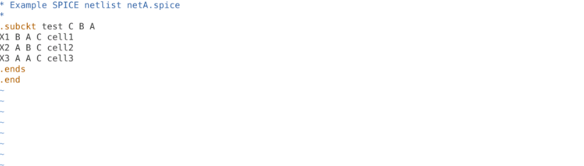

3. **Netgen Pin Order Mismatch Log:**
   * Netgen detects pin order discrepancy and reports `Result: Netlists do not match.`:
   * 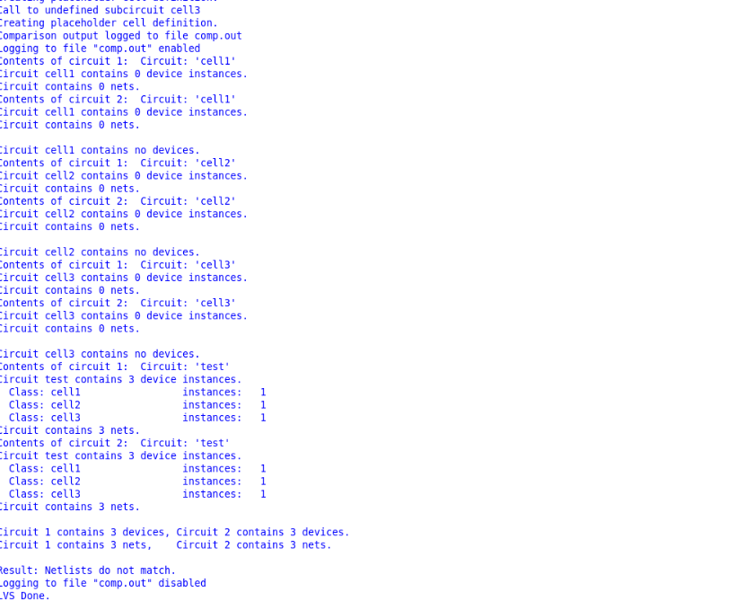
   * 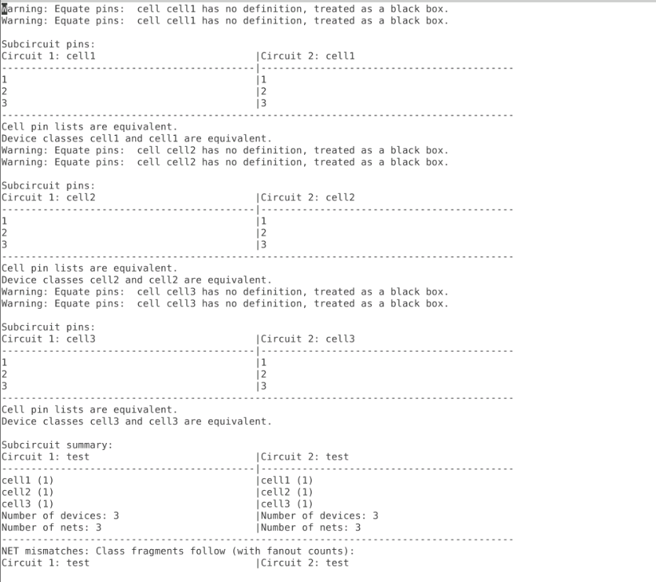
   * 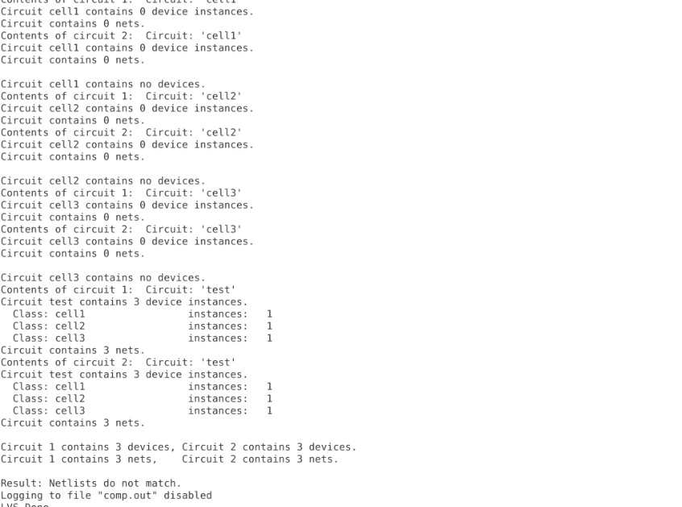

---

## PV_D5SK2_L3: LVS With Blackboxes Subcircuits

### Overview of Exercise 3 Setup
This lab (`vsd_lvs_lab/exercise_3`) focuses on performing LVS when subcircuits are declared as blackboxes (modules defined with `.subckt cell1 A B C ... .ends` but having no internal layout/primitive definitions). When Netgen encounters a blackbox cell, it automatically equates all ports and matches connections based strictly on pin names and top-level net graph topology.

---

### Part 1: Initial Blackbox LVS Execution & Pin Order Mismatch Analysis

1. **Initial Netgen LVS Execution:**
   * Executing Netgen batch LVS on `exercise_3`:
     ```bash
     netgen -batch lvs "exercise_3.spice exercise_3" "exercise_3.sch.spice exercise_3" sky130A_setup.tcl exercise_3_comp.out
     ```
   * Initial result reports mismatch due to subcircuit port sequence discrepancies:
     ```text
     Circuits do not match uniquely.
     Netgen result: 4 errors.
     ```
   * 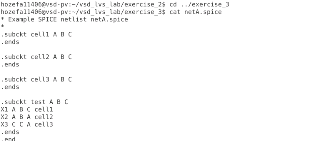

2. **Inspecting `exercise_3_comp.out` Pin Comparison Logs:**
   * Detailed examination of the output file reveals node mismatch breakdown:
     ```text
     Subcircuit pin lists differ:
     Circuit 1: cell1 pin order A B C
     Circuit 2: cell1 pin order C B A
     ```
   * 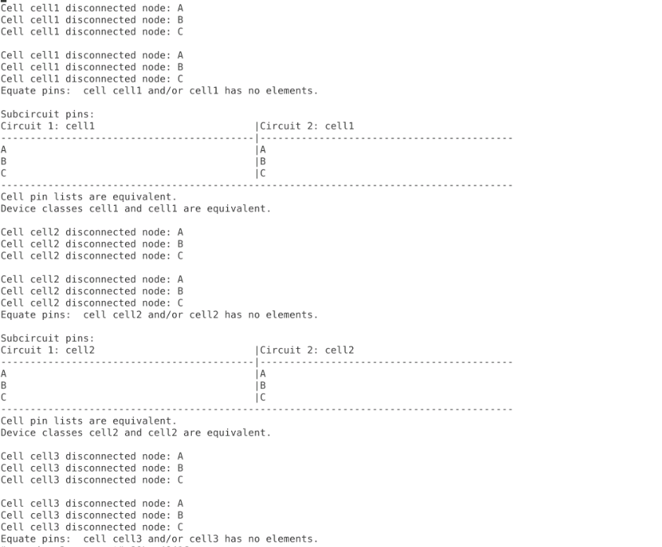

3. **Blackbox Subcircuit Pin Ordering Mismatch:**
   * Pin sequence mismatch in subcircuit headers leads to incorrect top-level pin mapping:
   * 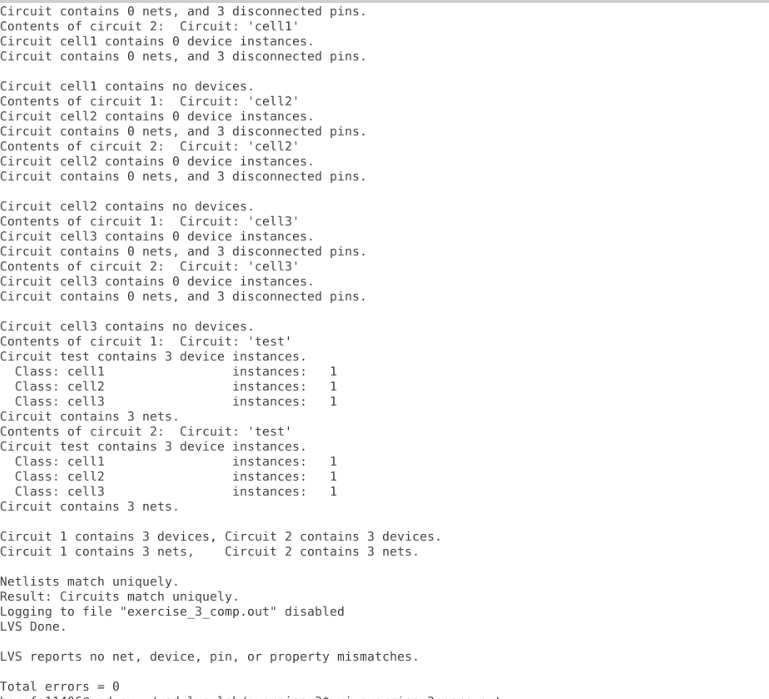

---

### Part 2: Subcircuit Pin Sequence Fix & Clean LVS Verification

1. **Standardizing Subcircuit Port Sequence:**
   * Aligning the `.subckt cell1 A B C` port definition in the layout netlist `exercise_3.spice` with the schematic netlist:
   * 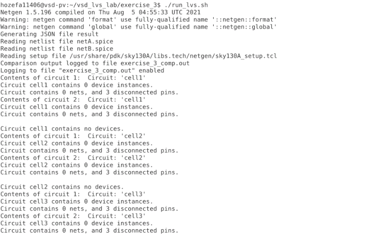

2. **Re-running Netgen LVS:**
   * Netgen re-evaluates blackbox pin equality and executes graph matching:
   * 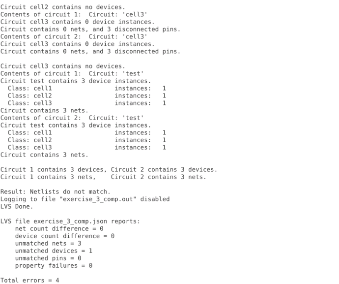

3. **Final Clean LVS Result (`Circuits match uniquely`):**
   * Verification successful with zero errors reported:
     ```text
     Circuits match uniquely.
     Result: 0 errors.
     ```
   * 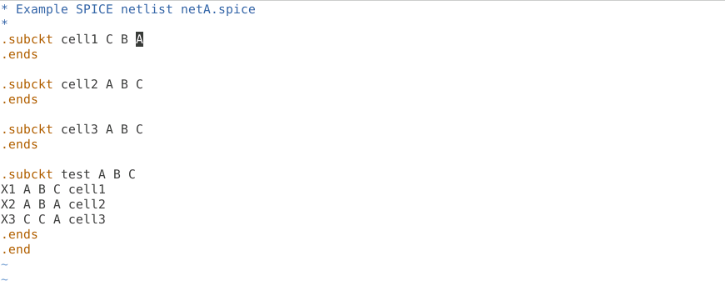

---

## PV_D5SK2_L4: LVS With SPICE Low Level Components

### Overview of Exercise 4 Setup
This lab (`vsd_lvs_lab/exercise_4`) explores matching low-level SPICE primitive components (resistors, diodes, capacitors, transistors) in Netgen. Primitives require specific device classification (`Class: c` for resistors, `Class: diode` for diodes) and symmetric terminal permutation rules (`permute`) in `sky130A_setup.tcl`.

---

### Part 1: Initial Primitive Component LVS Run & Mismatch Diagnosis

1. **Initial LVS Execution:**
   * Executing Netgen on `exercise_4` before configuring pin permutations or device class tolerances:
   * 

2. **Primitive Device Class & Pin Permutation Mismatch Analysis:**
   * Netgen `comp.out` log indicates mismatches where passive terminals (`end_a` vs `end_b`, `A` vs `C`) are treated as fixed directional ports instead of symmetric permutable pins:
   * 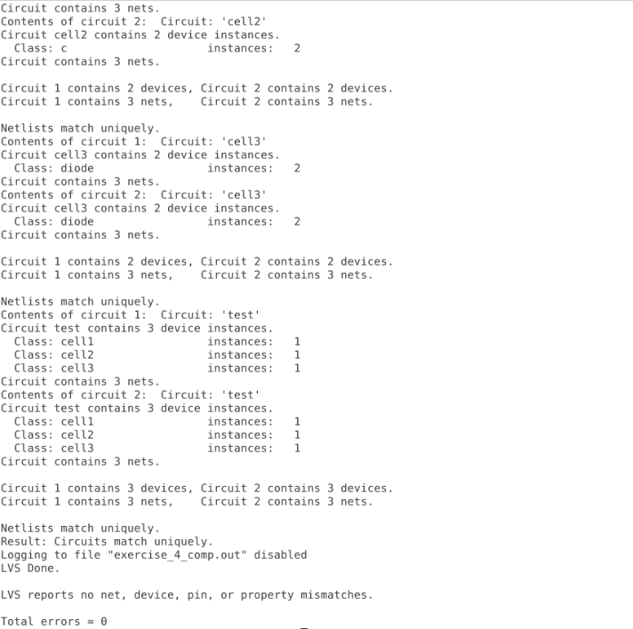

---

### Part 2: Configuring PDK Setup File (`sky130A_setup.tcl`)

1. **Setting Up Permutation Rules for Cells & Primitives:**
   * Edit `sky130A_setup.tcl` to add symmetric pin permutation commands for cells and passive devices:
     ```tcl
     permute "-circuit1 cell1" A C
     permute "-circuit2 cell1" A C
     ```
   * 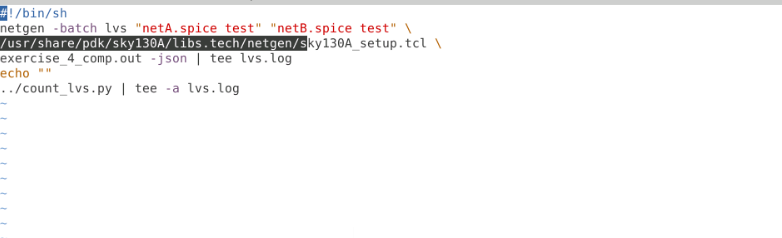

2. **Defining Generic Resistor & Diode Permutations:**
   * Configure symmetric terminal swapping for low-level resistors (`sky130_fd_pr__res_generic_po`, `m1`-`m5`):
     ```tcl
     foreach dev $devices {
         permute "-circuit1 $dev" end_a end_b
         permute "-circuit2 $dev" end_a end_b
     }
     ```
   * 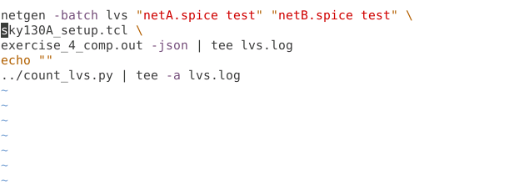

3. **Configuring Property Tolerances & Series/Parallel Combining:**
   * Enable series/parallel device combining and define property tolerances for resistor length (`l`) and width (`w`):
     ```tcl
     property "-circuit1 $dev" series enable
     property "-circuit1 $dev" parallel enable
     property "-circuit1 $dev" tolerance {l 0.01} {w 0.01}
     property "-circuit1 $dev" delete mult
     ```
   * 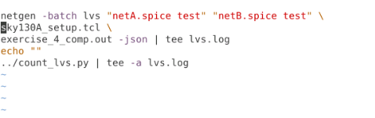

---

### Part 3: Re-running Netgen & Final Verification

1. **Netgen LVS Reduction & Matching:**
   * Re-running Netgen LVS with updated PDK configuration: Netgen merges series/parallel components and permutates symmetric pins.
   * 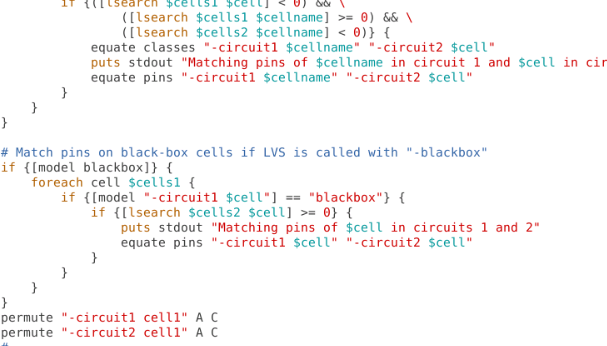

2. **Final Clean LVS Verification (`Circuits match uniquely`):**
   * Successful completion with zero errors:
     ```text
     Circuits match uniquely.
     Result: 0 errors.
     ```
   * 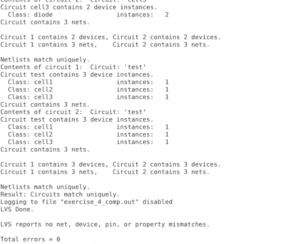

---

## PV_D5SK2_L5: LVS For Small Analog Block - Power-On Reset - Part 1

### Overview of Exercise 5 Setup
This lab (`vsd_lvs_lab/exercise_5`) demonstrates full-flow hierarchical schematic capture, SPICE extraction, setup scripting, and physical layout verification for a real-world analog IP block: the **Power-On Reset (POR)** circuit integrated inside `user_analog_project_wrapper`.

---

### Part 1: Schematic Capture & Netlist Extraction in Xschem

1. **Xschem Schematic View (`user_analog_project_wrapper.sch`):**
   * Opening `user_analog_project_wrapper.sch` in Xschem displaying instantiations of dual Power-On Reset (`example_por` `x1`, `x2`) blocks, power supply rails ($V_{DD}$, $V_{SS}$), and analog I/O pads (`io_analog`, `io_clamp`).
   * 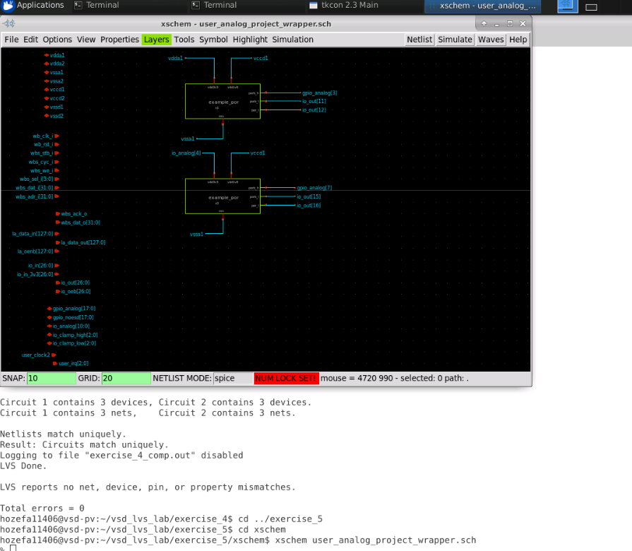

2. **SPICE Netlist Extraction:**
   * Generating SPICE netlist `user_analog_project_wrapper.spice` via Xschem (`Netlist` -> `Write SPICE Netlist`):
   * 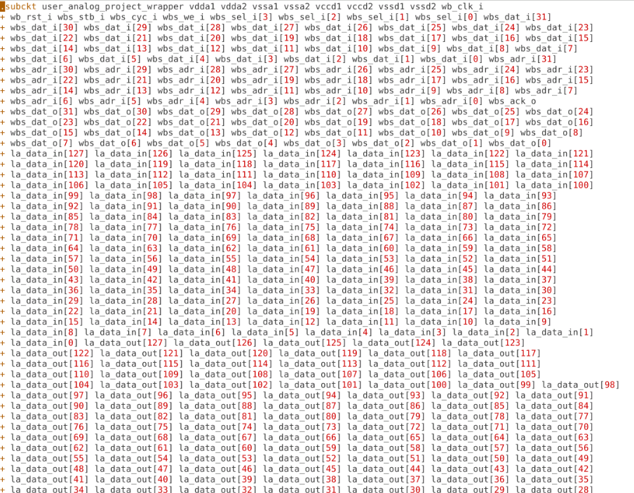

---

### Part 2: Netgen Execution, Setup Script & Physical Layout Verification

1. **Netgen LVS Execution:**
   * Executing Netgen LVS to compare extracted schematic netlist against layout netlist:
   * 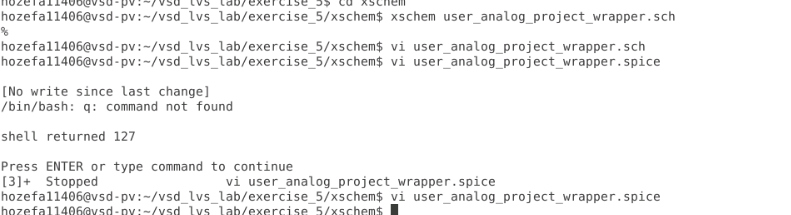

2. **PDK Generic Resistor Configuration in `sky130A_setup.tcl`:**
   * Configuring generic resistor models (`sky130_fd_pr__res_generic_po`, `l1`, `m1`-`m5`), tolerance limits, and parameter property matching rules:
   * 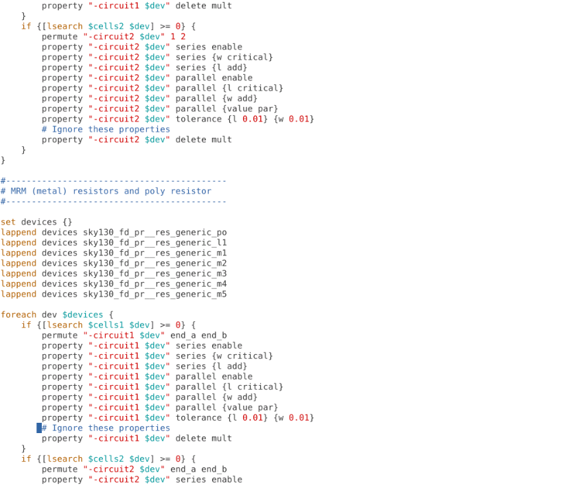

3. **Magic Layout Window - Top-Level Wrapper:**
   * Opening `user_analog_project_wrapper.mag` in Magic layout viewer showing top-level cell boundary, power rings, and macro placements:
   * 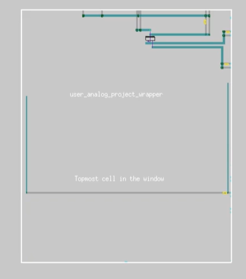

4. **Magic Layout Window - POR Subcell Layout:**
   * Detailed view inside `example_por` analog subcell layout showing PMOS/NMOS transistor arrays, poly resistor ladders, substrate taps, and guard rings:
   * 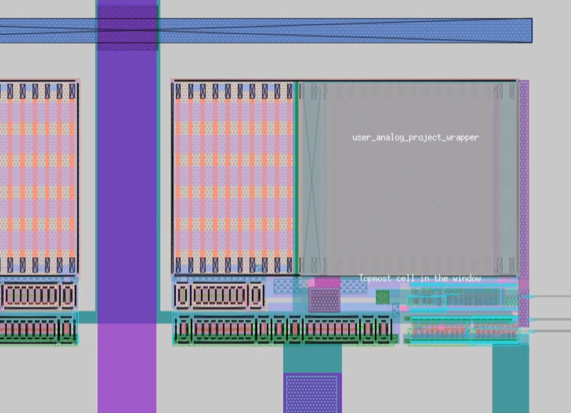

5. **Xschem Testbench Schematic (`analog_wrapper_tb.sch`):**
   * Testbench schematic setup `analog_wrapper_tb.sch` instantiating `user_analog_project_wrapper` with transient simulation sources, `.control` simulation statements, and PDK library includes:
   * 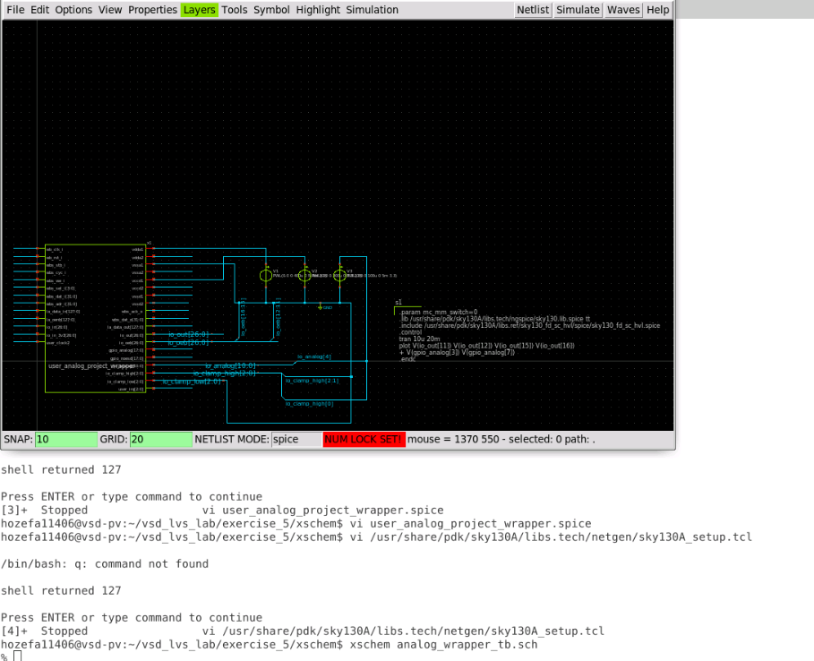

---

## PV_D5SK2_L6: LVS For Small Analog Block - Power-On Reset - Part 2

### Lab Objective
Resolving complex analog LVS discrepancies, substrate tap connections, and property errors in POR block.

1. **Substrate Tap & Bulk Connection Fixing:**
   * Ensure PMOS body bias ($V_{DD}$) and NMOS body bias ($V_{SS}$) taps in layout are connected to the exact schematic bulk nodes.
2. **Resistor & Transistor Ratio Tuning:**
   * Match multi-finger transistor geometries and series/parallel resistor segments.
3. **Final Verification:**
   * Re-run Netgen LVS until obtaining clean report:
     ```text
     Result: Circuits match uniquely.
     ```
